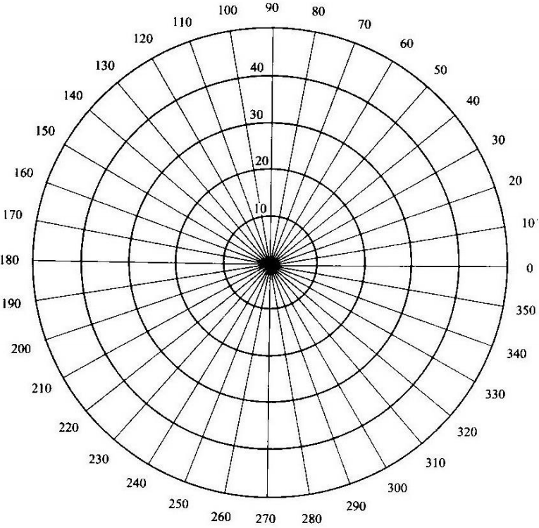
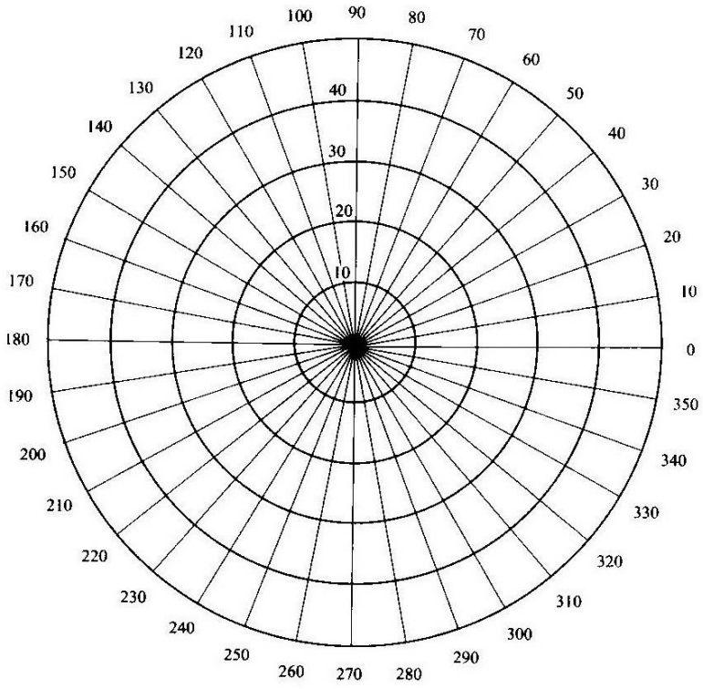

**stuID Name**

# 电磁波的传播特性及极化测量

## 1. 实验目的

1. 了解电磁波传播的基本原理。
2. 观察电磁波在传播过程中遇到障碍物时发生的现象，进一步加深对电磁波的传播特点和规律的认识。
3. 验证电磁波的极化特性，并进行极化的测量。

## 2. 试验系统组成

<image src = "1.png">

1. 信号源

    $DH1121B$型三厘米固态信号源是一种使用体效应管做振荡源的微波信号源，由主机、振荡器和隔离器组成。体效应管装在工作于$TE_{10}$模的波导谐振腔中。调节振荡器的螺旋测微器，可改变调谐杆伸入波导腔的深度，从而连续平滑地改变微波谐振频率；调节位于波导腔前面法兰盘中心处的调配螺钉，可使波导腔与外电路实现最佳耦合。隔离器保证振荡器与负载间的匹配与隔离，使微波输出的频率和功率更加稳定。

    信号源主机包含电源和波形调制系统，通过仪器面板上的按键可方便地选择振荡器的工作方式为连续波或方波调制

    主要技术特性：

    频率范围：$8.6~9.6GHz$

    功率范围（等幅实验状态）：不小于$20mV$

    工作电压：直流$+12V$（典型值）

    工作方式：等幅，方波，内方波调制重复频率：$1000Hz\pm15\%$

    输出电压驻波比：$\ngtr1.20$

2. 喇叭天线：用于微波信号的发射和接收。

    角锥喇叭天线的增益大约为$20dB$，波瓣的理论半功率点宽度大约为：$H$面是$20^o$,$E$
    面是$16^o$

    圆锥喇叭天线是由方圆波导转换、介质圆波导和圆锥喇叭连接而成,介质圆波导可$360^o$旋转。介质面长度L已定在适合于$9370MHz±50MHz$的带宽内工作，其椭圆率$≥0.93$。

3. 可变衰减器：用来改变微波信号幅度的大小，衰减器的度盘指示越大，对微波信号的衰减也越大。
4. 晶体检波器：可将微波信号转换成直流信号或低频信号（当微波信号幅度用低频信号调制时）。

## 3. 实验原理

平面波是指等相位面是平面的电磁波，均匀平面波是指在这个等相位面上电场和磁场的振幅和相位处处保持不变。

平面电磁波的极化是指电磁波传播时，空间某点电场强度矢量$\overrightarrow{E}$随时间变化的规律，若$\overrightarrow{E}$的末端总在一条直线上周期性变化，称为线极化波；若$\overrightarrow{E}$末端的轨迹是圆（或椭圆），称为圆（或椭圆）极化波。若圆极化波$\overrightarrow{E}$末端的运动轨迹与波的传播方向符合右手（或左手）螺旋规则时，则称为右旋（或左旋）圆极化波。

线极化波、圆极化波和椭圆极化波都可由两个同频率的正交线极化波组合而成。

设同频率的两个正交线极化波为：

$E_x = E_{xm}\cos(\omega t - kz + \varphi_1)$

$E_y = E_{ym}\cos(\omega t - kz + \varphi_2)$

其中，$\varphi_1,\varphi_2$为初相位，$k = \frac{2\pi}{\lambda}$

1. 线极化波的合成

    当$\varphi_1 = \varphi_2 = \varphi$,或$\varphi_1与\varphi_2$的相位相差为$2n\pi$时，在固定点$Z$处（如$Z=0$）其合成电场大小为:

    $E = \sqrt{E_x^2+E_y^2} = \sqrt{E_{xm}^2+E_{ym}^2}\cos(\omega t+\varphi)$

    电场矢量与$x$轴的夹角$α$（合成电场的方向）为:

    $\alpha = \tan^{-1}\frac{E_y}{E_x} = \tan^{-1}\frac{E_ym}{E_{xm}} = 常数$

    由以上两式看出，合成电场的大小随时间作周期性变化，电场矢量始终在一条直线上，合成场为线极化波。如下图所示：

    
<image src = "2.png">

    

2. 圆极化波的合成

    当$E_{xm} = E_{ym} = E_m$，相位相差$\pm\frac{\pi}{2}$时，则：

    $E_x = E_m\cos(\omega t - kz + \varphi_1)$

    $E_y = E_m\cos(\omega t - kz + \varphi_1 \pm \frac{\pi}{2}) = \mp E_m\sin(\omega t + \varphi_1)$

    其合成电场大小为：

    $E = \sqrt{E_x^2 + E_y^2} = E_m = 常数$

    电场分量与$x$轴的夹角$\alpha$的正切为：

    $\tan\alpha = \frac{E_y}{E_x} = \mp\tan(\omega t - \varphi_1)$

    $\alpha = \mp(\omega t - \varphi_1)$

    由以上两式看出，合成电厂的大小不变，但方向随时间改变，合成电场矢量的末端在一圈以上以减速度$\omega$旋转，合成场为圆极化波。

3. 椭圆极化波的合成

    如果$E_{xm}\neq E_{ym}$，其相位差不为$0^o,180^o$，也不是$90^o,270^o$，则合成波为椭圆极化波。

## 4. 工作原理

1. 发射与接收天线均为矩形口径喇叭天线。

    图1-4是实现各种极化波的装置示意图。金属丝栅$P_{r1}和P_{r2}$的作用是分别反射垂直分量和水平分量的波，两反射波在接收喇叭$P_{r3}$内实现迭加，为使辐射喇叭同时产生$E_{i\perp},E_{i\parallel}$两个入射波，只需将$P_{r0}$转动一个角度$\alpha$，使入射场E𝑖分成同频率的两个正交场，调整$\alpha$，即可实现两个线极化波幅度相等的要求，作为相位条件，通过改变$P_{r2}$的位置即可实现两反射波相位相差$\pm \frac{\pi}{2}$，可以方便的获得圆极化波。

    
<image src = "3.png">

    

2. 发射天线为圆锥口径喇叭天线，接收天线为矩形口径喇叭天线。

    电磁波在插入介质片的圆波导内被分成两个分量的波，即垂直介质片平面的一个分量$E_n$和平行于介质片平面的一个分量$E_t$，这两个分量的速度不同，$V_c = V_n > V_t = \frac{V_c}{\sqrt{\epsilon_r}}$，当介质片的长度$L$取值合适时，使$E_n$波的相位超前$E_t$波的相位$90^o$，这就实现了圆极化波相位条件的要求；为使$E_n$与$E_t$的幅度相等，可使介质片的$\widehat{n}$方向跟$Y$轴之间夹角为$\alpha = \pm45^o$，若忽略介质片的损耗，则有$E_{tm} = E_{nm} = \frac{1}{\sqrt{2}}E_{rm}$，实现了圆极化波幅度条件的要求。

## 5. 实验的内容及步骤

1. 实验系统调试：

    1. 校整分光仪，保证收、发喇叭天线的机械轴与电磁波传播的方向要完全重合，这样才能保证测量精度。利用分光仪上的圆盘刻度，首先旋转工作平台，使$0^o$刻线与固定臂上指针对正，再转动活动臂使活动臂上的指针对正在工作平台$180^o$刻线上，这样装有两个喇叭的支架便处于一直线上；调整两个喇叭口，使喇叭口对正工作平台中心且平行于工作平台，将固定喇叭的螺钉拧紧。
    2. 接通电源，信号源的工作状态选“方波”，此时内方波调制的重复频率为$1000Hz$。
    3. 调整接收天线位置，找出使微安表指示最大的位置，调整可变衰减器旋钮，使微安表的指示有一适当值（达到满量程的三分之二以上），保持接收天线臂位置不动。
2. 观察并记录不同的媒质对电磁波的影响并解释实验现象。
    1. 在两喇叭之间分别放置铝合金板、有机玻璃板、普通玻璃板、硬纸板等物品，记录接收信号的变化情况。
    2. 在两喇叭之间放置疏密有致的金属栅条，分别进行水平放置、垂直放置、疏的部分挡住喇叭、密的部分挡住喇叭，记录接收信号的变化情况。
    3. 当发射天线作线极化波发射时，观察接收喇叭旋转不同角度时微安表指示的变化。
    4. 完成圆极化波的调试与测量。

## 6. 实验结果

1. 原始数据：

   1. 线极化波时，接收天线的数据：

    | $角度/(^o)$ | $90$  | $80$  | $70$  | $60$  | $50$  | $40$  | $30$  | $20$  | $10$  |  $0$  | $10$  | $20$  | $30$  | $40$  | $50$  | $60$  | $70$  | $80$  | $90$  |
    | :---------: | :---: | :---: | :---: | :---: | :---: | :---: | :---: | :---: | :---: | :---: | :---: | :---: | :---: | :---: | :---: | :---: | :---: | :---: | :---: |
    |   $读数$    |

   2. 圆极化波时，接收天线的数据：

    | $角度/(^o)$ |  $0$  | $10$  | $20$  | $30$  | $40$  | $50$  | $60$  | $70$  | $80$  | $90$  | $100$ | $110$ | $120$ | $130$ | $140$ | $150$ | $160$ | $170$ | $180$ |
    | :---------: | :---: | :---: | :---: | :---: | :---: | :---: | :---: | :---: | :---: | :---: | :---: | :---: | :---: | :---: | :---: | :---: | :---: | :---: | :---: |
    |   $读数$    |

2. 数据处理：

    1. 根据测试数据，画出二种极化方式随接收天线角度变化而变化的轨迹图。
    2. 验证波的极化特性，计算出圆极化波椭圆度$e$。

        由于$E_{xm}与E_{ym}$总有差别，我们用圆极化波的椭圆度$e$来表示，$e = \sqrt{\frac{I_{min}}{I_{max}}}$，它的取值范围在$0∽1$之间。
    
3. 实验讨论及分析

    1. 分析这些不同的介质对电磁波的影响；要求用课本上学过的知识对实验现象进行合理解释。
    2. 分析金属栅条对电磁波透射的影响效果，简要说明其原理。
    3. 用金属丝栅实现圆极化波时，为什么在其后加微波吸收材料？

