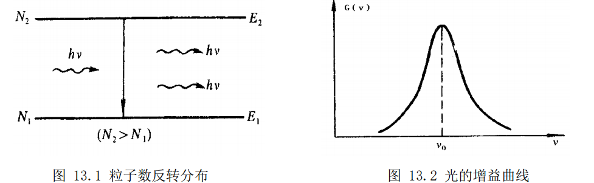
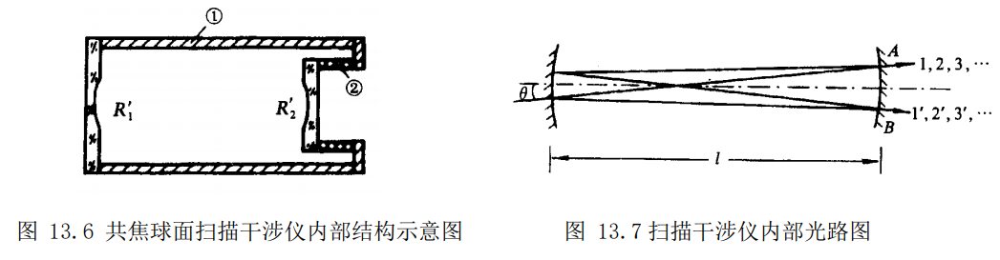
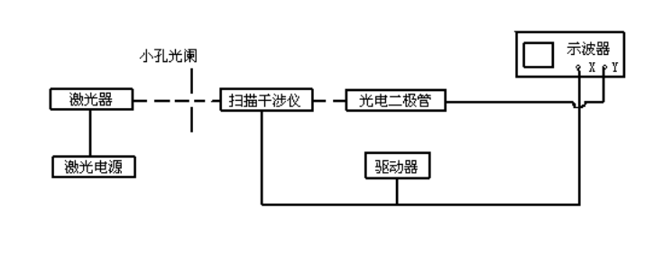
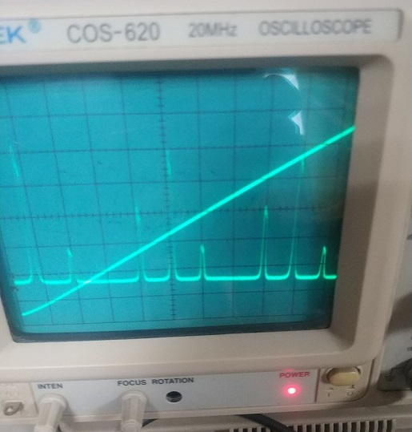

**stuID Name**

# $He-Ne$ 激光器的模式分析
*指导老师：yyy*
## 实验目的

1. 了解激光器的模式结构，加深对模式概念的理解。
2. 通过测试分析，掌握模式分析的基本方法。
3. 对本实验使用的分光仪器—共焦球面扫描干涉仪，了解其原理、性能，学会正确使用。

## 实验原理

1. 激光器模的形成
   
   激光器的三个基本组成部分是增益介质、谐振腔和激励能源。如果用某种激励方式，在介质的某一对能级间形成粒子数反转分布，由于自发辐射和受激辐射的作用，将有一定频率的光波产生，在腔内传播，并被增益介质逐渐增强、放大，如图 13.1 所示。实际上，由于能级总有一定的宽度以及其它因素的影响，增益介质的增益有一个频率分布，如图 13.2 所示，图中$G(\nu)$ 为光的增益系数。只有频率落在这个范围内的光在介质中传播时，光强才能获得不同程度的放大。但只有单程放大，还不足以产生激光，要产生激光还需要有谐振腔对其进行光学反馈，使光在多次往返传播中形成稳定、持续的振荡。形成持续振荡的条件是，光在谐振腔内往返一周的光程差应是波长的整数倍，即$2\mu L=1\lambda_q$
   式中， $\mu$ 为折射率，对气体 $\mu ≈1$； $L$ 为腔长； $q$ 为正整数。这正是光波相干的极大条件，满足此条件的光将获得极大增强。每一个 $q$ 对应纵向一种稳定的电磁场分布，叫作一个纵模，$q$ 称作纵模序数。$q$ 是一个很大的数，通常我们不需要知道它的数值，而关心的是有几个不同的 $q$ 值，即激光器有几个不同的纵模。从（13.1）式中，我们还看出，这也是驻波形成的条件，腔内的纵模是以驻波形式存在的， $q$ 值反映的恰是驻波波腹的数目，纵模的频率为$\nu_q=q\frac{c}{2\mu L}$相邻两个纵模的频率间隔$\Delta \nu_{\Delta q=1}=\frac{c}{2\mu L}\approx\frac{c}{2L}$从中看出，相邻纵模频率间隔和激光器的腔长成反比，即腔越长，相邻纵模频率间隔越小，满足振荡条件的纵模个数越多；相反，腔越短，相邻纵模频率间隔越大，在同样的增益曲线范围内，纵模个数就越少。因而用缩短腔长的办法是获得单纵模运行激光器的方法之一。
2. 共焦球面扫描干涉仪
   共焦球面扫描干涉仪是一种分辨率很高的分光仪器，它已成为激光技术中一种重要的测量设备。本实验就是通过它将彼此频率差异甚小（几十至几百 $MHz$），用一般光谱仪器无法分辨的各个不同的纵模、横模展现成频谱图来进行观测的。在本实验中，它起着关键作用。
   共焦球面扫描干涉仪是一个无源谐振腔，它由两块球形凹面反射镜构成共焦腔，即两块反射镜的曲率半径和腔长$l$ 相等$(R_1^{'}=R_2^{'}=l)$反射镜镀有高反射率膜。两块反射镜中的一块是固定不变的，另一块固定在可随外加电压而变化的压电陶瓷环上，如图 13.6 所示。图中，$①$为由低膨胀系数材料制成的间隔圈，用以保持两球形凹面反射镜 $R_1^{'}$ 和 $R_2^{'}$ 总是处在共焦状态。$②$为压电陶瓷环，其特性是若在环的内外壁上加一定数值的电压，环的长度将随之发生变化，而且长度的变化量与外加电压的幅度成线性关系，这是扫描干涉仪被用来扫描的基本条件。由于长度的变化量很小，仅为波长数量级，所以，外加电压不会改变腔的共焦状态。但是当线性关系不好时，会给测量带来一定误差。
   
## 实验装置和操作方法
1. 实验装置
   
   1. 待测 $He-Ne$ 激光器。
   2. 激光电源。
   3. 小孔光阑。
   4. 共焦球面扫描干涉仪。使激光器的各个模按波长（或频率）展开，其透射光中心波长为 $632.8nm$。仪器上有四个鼓轮，其中两个鼓轮用于调节腔的上下、左右位置，另外两个鼓轮用于调节腔的方位。
   5. 驱动器。驱动器电压除了加在扫描干涉仪的压电陶瓷上，还同时输出到示波器的 $X$ 轴作同步扫描。为了便于观察，我们希望能够移动干涉序的中心波长在频谱图中的位置，以使每个序中所有的模式能完整地展现在示波器的荧光屏上。为此，驱动器还增设了一个直流偏置电路，用以改变扫描的电压起点。
   6. 光电二极管。将扫描干涉仪输出的光信号转变成电信号，并输入到示波器 $Y$ 轴。
   7. 示波器。用于观测 $He-Ne$ 激光器的频谱图。
2. 实验步骤
   1. 按实验装置图连接线路。经检查无误，方可进行实验。
   2. 开启激光电源。
   3. 用直尺测量扫描干涉仪光孔的高度。调节 $He-Ne$ 激光管的高低、仰俯，使激光束与光学平台的表面平行，且与扫描干涉仪的光孔大致等高。
   4. 使激光束通过小孔光阑。调节扫描干涉仪的上下、左右位置，使激光束正入射到扫描干涉仪中，再细调干涉仪上的四个鼓轮，使干涉仪腔镜反射回来的光点回到光阑的小孔附近（注意：不要使光点回到光阑的小孔中），且使反射光斑的中心与光阑的小孔大致重合，这时入射光束与扫描干涉仪的光轴基本平行。
   5. 开启扫描干涉仪驱动器和示波器的电源开关。调节驱动器输出电压的大小（即调节“幅度”旋钮）和频率，在光屏上可以看到激光经过扫描干涉仪后形成的光斑。（注意：如果在光屏上形成两个光斑，要在保持反射光斑的中心与光阑的小孔大致重合的条件下，调节扫描干涉仪的鼓轮，使经过扫描干涉仪后形成的两个光斑重合。）
   6. 降低驱动器的频率，观察光屏上的干涉条纹,调节干涉仪上的四个鼓轮，使干涉条纹最宽。注意：调节过程中，要保持反射光斑的中心与光阑的小孔大致重合
   7. 将光电二极管对准扫描干涉仪输出光斑的中心，调高驱动器的频率，观察示波器上展现的频谱图。进一步细调扫描干涉仪的鼓轮及光电二极管的位置，使谱线尽量强。
   8. 根据干涉序个数和频谱的周性期，确定哪些模属于同一个干涉序。
   9. 改变驱动器的输出电压（即调节“幅度”旋钮），观察示波器上干涉序数目的变化。改变驱动器的扫描电压起点（即调节“直流偏置”旋钮），可使某一个干涉序或某几个干涉序的所有模式完整地展现在示波器的荧光屏上。
   10. 根据自由光谱范围的定义，确定哪两条谱线之间对应着自由光谱范围 $\Delta\nu_{S.R.}$. (本实验使用的扫描干涉仪的自由光谱范围$\Delta\nu_{S.R.} = 3.75GHz$)。测出示波器荧光屏上与$\Delta\nu_{S.R.}$ 相对应的标尺长度，计算出二者的比值，既示波器荧光屏上 1 毫米对应的频率间隔值。
   11. 在同一干涉序内，根据纵模定义，测出纵模频率间隔 $\Delta\nu_{\Delta q=1}$。将测量值与理论值相比较 (注：待测激光器的腔长 $L$ 由实验室给出)。
   12. 确定示波器荧光屏上频率增加的方向，以便确定在同一纵模序数内哪个模是基横模，哪些模是高阶横模。
   13. 测出不同横模的频率间隔 $\Delta\nu_{\Delta m+\Delta n}$ ，并与理论值相比较，检查辨认是否正确，确定$\Delta m+\Delta n$ 的数值。（注：谐振腔两个反射镜的曲率半径 $R_1、 R_2$ 由实验室给出）。
   14. 观察激光束在远处光屏上的光斑形状。这时看到的应是所有横模的叠加图，需结合图1.4 中单一横模的形状加以辨认，确定出每个横模的模序,既每个横模的 $m$ 、 $n$ 值。
## 实验数据
   
   实验测得两种波峰的间隔比例为$1:4$，$\Delta \nu_{\Delta q = 1}=3.75GHz/4 = 937.5MHz$，与理论值$750MHz$有一定差距。
   分析误差可能来自示波器读数误差，同时实验设备也可能与标称值有一定差距。

