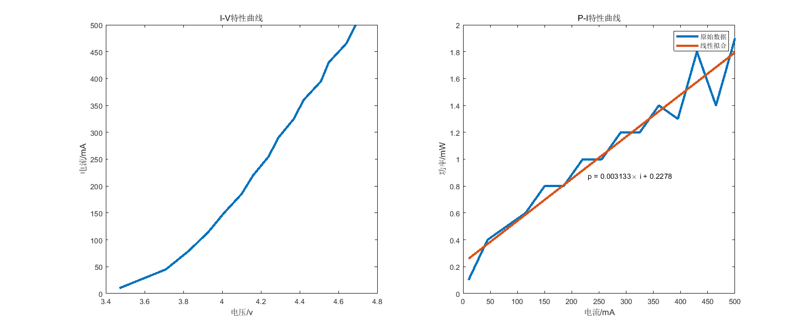
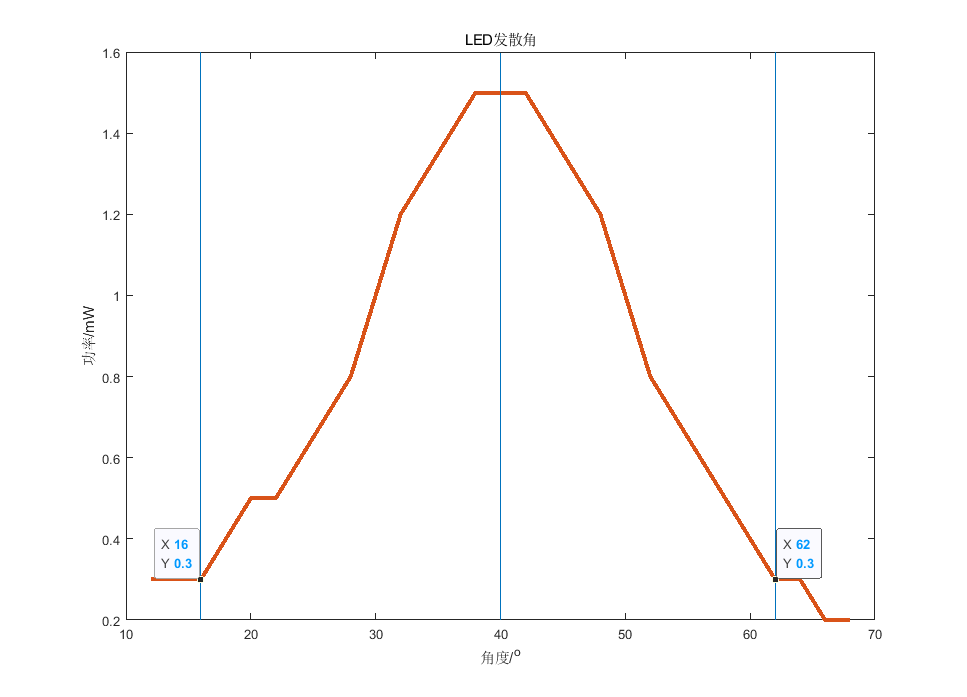
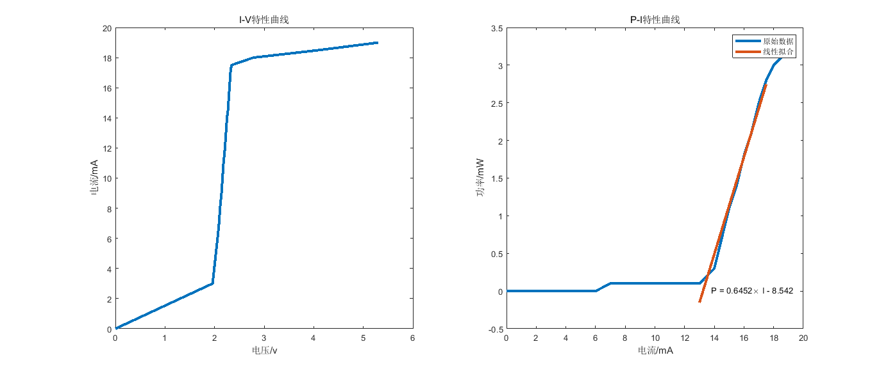
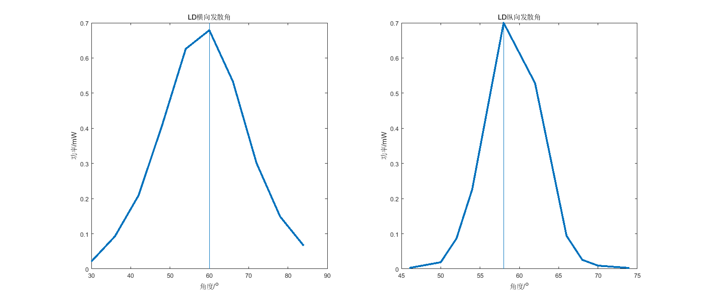

**stuID Name**

# LD/LED光电特性实验
*指导老师：yyy*
## 实验目的

1. 掌握LED/LD的工作原理。
2. 掌握LED/LD的电学特性（P-I特性和V-I特性）和光学特性（发射光谱、发射角、发散角）。
3. 了解LED/LD的热学特性（温度对阈值电流和输出照度的影响）和色度学特性（发光体的单色性及颜色分布）。

## 实验原理

1. LED工作原理
   发光二极管大多是由Ⅲ-Ⅳ族化合物，如$GaAs$（砷化镓）、$GaP$（磷化镓）、$GaAsP$（磷砷化镓）等半导体制成的，其核心是$PN$结。因此它具有一般$PN$结的$I-V$特性，即正向导通，反向截止、击穿特性。此外，在一定条件下，它还具有发光特性。在正向电压下，电子由$N$区注入$P$区，空穴由$P$区注入$N$区。进入对方区域的少数载流子（少子）一部分与多数载流子（多子）复合而发光。由于复合是在少子扩散区内进行的，所以光仅在靠近PN结面数微米以内产生。
2. LD工作原理
   从激光物理学中我们知道，半导体激光器的粒子数反转分布是指载流子的反转分布。正常条件下，电子总是从低能态的价带填充起，填满价带后才能填充到高能态的导带；而空穴则相反。如果我们用电注入等方法，使$PN$结附近区域形成大量的非平衡载流子，即在小于复合寿命的时间内，电子在导带，空穴在价带分别达到平衡，那么在此注入区内，这些简并化分布的导带电子和价带空穴就处于相对反转分布，称之为载流子反转分布。注入区称为载流子分布反转区或作用区。
3. $LED/LD$的$V-I$特性
   $LED$和$LD$都是半导体光电子器件，其核心部分都是$PN$结。因此其具有与普通二极管相类似的$V-I$特性曲线。当所加正向电压小于某一值时，电流极小，不发光；当电压超过某一值后，正向电流随电压迅速增加，发光。我们将这一电压称为阈值电压或开门电压。
4. LED/LD的P-I特性
   在结构上，由于$LED$与$LD$相比没有光学谐振腔。因此，$LD$和$LED$的照度与电流的$P-I$关系特性曲线则有很大的差别。$LED$的$P-I$曲线基本上是一条近似的线性直线，只有当电流过大时，由于$PN$结发热产生饱和现象，使$P-I$曲线的斜率减小。
5. LD的温度特性
   由于光电子器件是由半导体材料制成，因此温度对其光电特性影响也很大。随着温度的增加，$LD$的阈值逐渐增大，光照度逐渐减小，外微分量子效率逐渐减小，输出光功率明显下降，达到一定温度时，激光器就不激射了。阈值与温度的近似关系可以表示为：
   $$I_{th}(T)=I_{th}(T_r)\exp[(T-T_r)/T_0]$$
   式中，$T_r$室温，$I_{th}(T_r)$为室温下的阈值电流，$T_0$为特征温度。
6. $LED/LD$的辐射强度空间分布
   $LED$的辐射强度空间分布是指在规定的正向工作电流下，垂直和平行于$PN$结方向，辐射强度随空间角度的分布图，通常采用半值角$θ_{1/2}$或视角来描述，它的分布影响到与光纤之间的耦合效率等。$θ_{1/2}$是指发光强度值为轴向强度值一半的方向与发光轴向（法向）的夹角，半值角的2倍称为视角（或称半功率角）。对于高指向性的$LED$，半值角为$5°～20°$或更小；标准型的半值角为$20°～45°$；而散射型的半值角为$45°～90°$或更大，与光纤的耦合效率较低，可以作为中短距离、中小容量的光纤通信系统的光源。
   对于半导体激光器输出的光场分布，人们通常用近场和远场特性来描述。近场分布是指光强在解理面上的分布，它往往和激光器的侧向模式联系在一起。远场特性是指光束在距输出腔面一定距离处空间上的强度分布，它常常与光束的发散角联系在一起。由于半导体激光器有源层截面的不对称性和有源区很薄，其谐振腔长与辐射波长可以比拟，因此中心层截面的作用类似于一个狭缝，它使光束受到折射并发散。输出光束发散角度很大，光强分布（光斑形状）也不对称。垂直结平面的发散角度 很大，平行结平面的发散角度 较小。由于受激辐射与自发辐射的本质不同，所以导致半导体激光器输出的光发散角窄（垂直发散角为$30～50°$，水平发散角为$0～30°$），与单模光纤的耦合效率高（约$30％～50％$），非常适合于作高速长距离光纤通信系统的光源。

## 实验装置

该实验装置主要有：LED光源、LD光源、专用电源、调节支座、固定套、旋转台、照度计、光谱仪、计算机一台等。

## 实验内容和操作方法

1. 测量$LED/LD$的$I-V-E$曲线及照度和光通量（电学特性）
   1. 连接线路，光源选用$LED$，连接时注意不要强行对接。
   2. 开机以前必须检查电箱的“限流”开关是否拔至最小档、电压调节旋钮是否逆时针调到最小位置。
   3. 开启$LED$的驱动电源，缓慢调节电流旋纽逐渐增加工作电流，通过电流显示记录电流值，电压显示记录电压值。每隔一定电流间隔，记录$LED$的电压值和光照度值。绘制$LED$的$I-P$曲线和$V-I$曲线。
   4. 更换不同波长的$LED$重复第$3$步；
   5. 将$LED$换成$LD$，开启电源前，重复第2步，缓慢调节电流旋纽逐渐增加工作电流，通过电流显示记录电流，电压显示记录电压值。每隔一定电流间隔，记录$LD$的电压值和光照度值。绘制$LD$的$I-E$曲线和$V-I$曲线。
   6. 从特性曲线中求出阈值电压、阈值照度、量子效率等。
2. 测量$LED/LD$的发散角/散射角（光学特性）
   1. 通过支杆和调节支座将$LED$光源安装在旋转台上，并首先确保光束垂直照射功率计。
   2. 按同一个方向转动旋转台，并记录功率计数值
   3. 将$LED$旋转$90$度，重复以上步骤。通过实验数据分析$LED$在空间上发散特性。
   4. 将光源更换为$LD$，重复1-3项内容。总结$LD$的发射角性质，并与$LED$相比较。
## 实验数据

1. LED电学特性
   | $I/mA$ | $P/mW$ | $V/v$  |
   | ------ | ------ | ------ |
   | $10$   | $0.1$  | $3.47$ |
   | $45$   | $0.4$  | $3.71$ |
   | $80$   | $0.5$  | $3.83$ |
   | $115$  | $0.6$  | $3.93$ |
   | $150$  | $0.8$  | $4.01$ |
   | $185$  | $0.8$  | $4.1$  |
   | $220$  | $1.0$  | $4.16$ |
   | $255$  | $1.0$  | $4.24$ |
   | $290$  | $1.2$  | $4.29$ |
   | $325$  | $1.2$  | $4.37$ |
   | $360$  | $1.4$  | $4.42$ |
   | $395$  | $1.3$  | $4.51$ |
   | $430$  | $1.8$  | $4.55$ |
   | $465$  | $1.4$  | $4.64$ |
   | $500$  | $1.9$  | $4.69$ |

   

   如图可看出$LED$的截止电压约为$3.43V$，量子效率为$0.003133$

2. LED发散角
   | 角度/$^o$ | 功率$/mW$ |      |       |
   | --------- | --------- | ---- | ----- |
   | $12$      | $0.3$     | $42$ | $1.5$ |
   | $14$      | $0.3$     | $44$ | $1.4$ |
   | $16$      | $0.3$     | $46$ | $1.3$ |
   | $18$      | $0.4$     | $48$ | $1.2$ |
   | $20$      | $0.5$     | $50$ | $1.0$ |
   | $22$      | $0.5$     | $52$ | $0.8$ |
   | $24$      | $0.6$     | $54$ | $0.7$ |
   | $26$      | $0.7$     | $56$ | $0.6$ |
   | $28$      | $0.8$     | $58$ | $0.5$ |
   | $30$      | $1.0$     | $60$ | $0.4$ |
   | $32$      | $1.2$     | $62$ | $0.3$ |
   | $34$      | $1.3$     | $64$ | $0.3$ |
   | $36$      | $1.4$     | $66$ | $0.2$ |
   | $38$      | $1.5$     | $68$ | $0.2$ |
   | $40$      | $1.5$     |

   

   可见LED的发散角约为$24^o$

3. LD电学特性
   | $I/mA$ | $P/mW$ | $V/v$  | $I/mA$ | $P/mW$ | $V/v$  |
   | ------ | ------ | ------ | ------ | ------ | ------ |
   | $0$    | $0$    | $0$    | $14.5$ | $0.7$  | $2.27$ |
   | $3$    | $0$    | $1.96$ | $15$   | $1.1$  | $2.28$ |
   | $6$    | $0$    | $2.06$ | $15.5$ | $1.4$  | $2.29$ |
   | $7$    | $0.1$  | $2.09$ | $16$   | $1.8$  | $2.3$  |
   | $8$    | $0.1$  | $2.11$ | $16.5$ | $2.1$  | $2.31$ |
   | $9$    | $0.1$  | $2.14$ | $17$   | $2.5$  | $2.32$ |
   | $10$   | $0.1$  | $2.16$ | $17.5$ | $2.8$  | $2.34$ |
   | $11$   | $0.1$  | $2.18$ | $18$   | $3.0$  | $2.78$ |
   | $12$   | $0.1$  | $2.21$ | $18.5$ | $3.1$  | $4.11$ |
   | $13$   | $0.1$  | $2.23$ | $19$   | $3.2$  | $5.3$  |
   | $14$   | $0.3$  | $2.25$ |

   

   $LD$的截止电压为$2V$，量子效率为$0.6452$

4. LD 横/纵向发散角
   | 横向      |           | 纵向      |           |
   | --------- | --------- | --------- | --------- |
   | 角度/$^o$ | 功率/$mW$ | 角度/$^o$ | 功率/$mW$ |
   | $30$      | $0.0211$  | $46$      | $0.00271$ |
   | $36$      | $0.0928$  | $50$      | $0.01893$ |
   | $42$      | $0.209$   | $52$      | $0.0864$  |
   | $48$      | $0.409$   | $54$      | $0.226$   |
   | $54$      | $0.626$   | $58$      | $0.7$     |
   | $60$      | $0.679$   | $62$      | $0.528$   |
   | $66$      | $0.533$   | $66$      | $0.0941$  |
   | $72$      | $0.301$   | $68$      | $0.0258$  |
   | $78$      | $0.149$   | $70$      | $0.00929$ |
   | $84$      | $0.066$   | $74$      | $0.00264$ |

   

   可以看出LD的横向发散角为$30^o$，纵向发散角为$14^o$