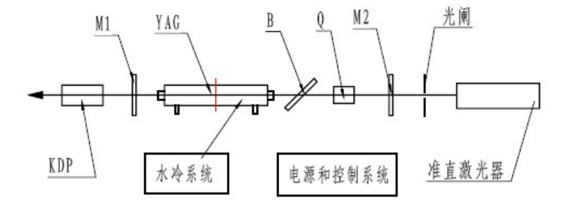
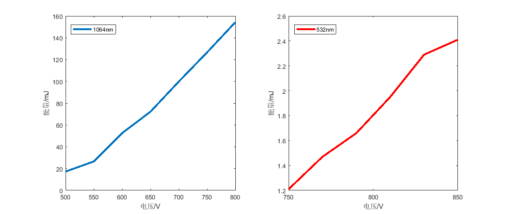

**stuID Name**

# $Nd^{3＋}:YAG$ 脉冲激光器电光调 $Q$ 与倍频实验
*指导老师：王吉明*
## 实验目的

1. 掌握电光 $Q$ 开关的原理及调试方法。
2. 学会电光 $Q$ 开关装置的调试及主要参数的测试。
3. 掌握倍频的基本原理和调试技能。
4. 了解影响倍频效率的主要因素。
5. 测量二倍频转换效率。

## 实验原理
1. $Nd^{3＋}:YAG$ 激光器的电光调 $Q$ 实验
    1. 激光器工作原理及装置结构
    本实验所使用主要实验装置为 $XGL-1$ 型脉冲 $Nd^{3＋}:YAG$ 激光器，主要采用了闪光灯泵浦、开关电源、电光调 $Q$、腔外倍频技术。利用具有连续光谱的闪光灯照射 $Nd^{3+}：YAG$ 晶体，$Nd$离子就从基态 $E_1$跃迁至激发态 $E_4$的一系列能级，其中最低的两个能级为$^4F_{5/2}$和$^4F_{7/2}$，相应于中心波长为 $0.81μm$ 和 $0.75μm$ 的两个光谱吸收带。由于 $E_4$的寿命仅约为 $1ns$，所以受激的$Nd^{3+}$离子绝大部分都经过无辐射跃迁转移到了 $E_3$态。$E_3$是一个亚稳态，寿命长达 $250—500μs$，很容易获得粒子数积累。$E_2$态的寿命为 $50ns$，即使有粒子处在 $E_2$，也会很快地弛豫到 $E_1$。因此，相对 $E_3$而言，$E_2$态上几乎没有粒子。这样，就在 $E_3$和 $E_2$之间造成了粒子数反转。正是 $E_3—E_2$的受激辐射在激光谐振腔中得到增益而形成了激光，其波长为 $1.064μm$。只要泵浦光存在，$Nd^{3+}$离子的能态就总是处在 $E_1-E_4-E_3-E_2-E_1$的循环之中，这是一个典型的四能级系统。
    2. 激光调 $Q$ 原理
    调 $Q$ 基本概念：用品质因数 $Q$ 值来衡量激光器光学谐振腔的质量优劣，是对腔内损耗的一个量度。调 $Q$ 技术中，品质因数 $Q$ 定义为腔内贮存的能量与每秒钟损耗的能量之比，可表达为：$Q=2\pi\nu_0\frac{每秒损耗的激光能量}{腔内贮存的激光能量}$式中$\nu_0$ 为激光的中心频率。
    如用 $E$ 表示腔内贮存的激光能量，$γ$为光在腔内走一个单程能量的损耗率．那么光在这一单程中对应的损耗能量为$γE$。用 $L$ 表示腔长；$n$ 为折射率；$c$ 为光速。则光在腔内走一个单程所用时间为 $nL／c$。由此，光在腔内每秒钟损耗的能量为$γEc/nL$。这样 $Q$ 值可表示为$Q=2\pi\nu_0\frac{E}{\gamma Ec/nL}=\frac{2\pi nL}{\gamma\lambda_0}$式中$λ$为真空中激光波长。可见 $Q$ 值与损耗率总是成反比变化的，即损耗大 $Q$ 值就低；损耗小 $Q$ 值就高。
    固体激光器由于存在弛豫振荡现象，产生了功率在阈值附近起伏的尖蜂脉冲序列，从而阻碍了激光脉冲峰值功率的提高。如果我们设法在泵浦开始时使谐振腔内的损耗增大，即提高振荡阈值，振荡不能形成，使激光工作物质上能级的粒子数大量积累。当积累到最大值(饱和值时)，突然使腔内损耗变小，$Q$ 值突增。这时，腔内会象雪崩一样以飞快的速度建立起极强的振荡，在短时间内反转粒子数大量被消耗，转变为腔内的光能量，并在透反镜端面耦合输出一个极强的激光脉冲。通常把这种光脉冲称为巨脉冲。调节腔内的损耗实际上是调节$Q$ 值，调 $Q$ 技术即由此而得名。也称为 $Q$ 突变技术或 $Q$ 开关技术。
2. $Nd^{3＋}:YAG$ 激光器的倍频实验
   原子是由原子核和核外电子构成。当频率为$ω$的光入射介质后，引起介质中原子的极化，即负电中心相对正电中心发生位移 $r$ 形成电偶极矩 $m＝er$ ，其中 $e$ 是负电中心的电量．我们定义单位体积内原子偶极矩的总和为极化强度矢量 $P＝Nm$，$N$ 是单位体积内的原子数。极化强度矢量和入射场的关系式为$P(r,t)=\chi^{(1)}E+\chi^{(2)}E^2+\chi^{(3)}E^3+\cdot\cdot\cdot$
   其中$χ^{(1)},χ^{(2)},χ^{(3)}…$分别称为线性极化率、二级非线性极化率、三级非线性极化率…。并且在一般情况下, $χ^{(1)},χ^{(2)},χ^{(3)}…$每增加一次极化,$χ$值减小七八个数量级。由于入射光是变化的，其振幅为 $E= E_0 sinωt$，所以极化强度也是变化的。根据电磁理论，变化的极化场可作为辐射源产生电磁波—新的光波．在入射光的电场比较小时(比原子内的场强还小)，$χ^{(1)},χ^{(2)},χ^{(3)}$等极小，$P$ 与 $E$ 成线性关系为 $P =\chi^{(1)} E$ ， 新的光波与入射光具有相同的频率，这就是通常的线性光学现象。但当入射光的电场较强时，不仅有线性现象，而且非线性现象也不同程度地表现出来。新的光波中不仅含有入射的基波频率，还有二次谐波、三次谐波等频率产生，形成能量转移，频率变换。这就是只有在高强度的激光出现以后，非线性光学才得到迅速发展的原因。
   设有下列两波同时作用于介质，介质产生的极化强度应为二列光波的叠加。有
   $$\begin{aligned}
       P&=\chi^{(2)}[A_1\cos(\omega_1t+k_1z)+A_2\cos(\omega_2t+k_2z)]^2\\
       &=\chi^{(2)}[A_1^2\cos^2(\omega_1t+k_1z)+A_2^2\cos^2(\omega_2t+k_2z)+2A_1A_2\cos(\omega_1t+k_1z)\cos(\omega_2t+k_2z)]
   \end{aligned}$$
   经推导得出，二级非线性极化波应包含下面几种不同频率成分：
   $$\begin{aligned}
       &P_{2\omega_1}=\frac{\chi^{(2)}}{2}A_1^2\cos[2(\omega_1t+k_1z)],\\
       &P_{2\omega_2}=\frac{\chi^{(2)}}{2}A_2^2\cos[2(\omega_2t+k_2z)],\\
       &P_{\omega_1+\omega_2}=\chi^{(2)}A_1A_2\cos[(\omega_1+\omega_2)t+(k_1+k_2)z],\\
       &P_{\omega_1-\omega_2}=\chi^{(2)}A_1A_2\cos[(\omega_1-\omega_2)t+(k_1-k_2)z],\\
       &P_{直流}=\frac{\chi^{(2)}}{2}(A_1^2+A_2^2)
   \end{aligned}$$
   从以上看出，二级效应中含有基频波的倍频分量($2ω_1$)、($2ω_2$)、和频分量($ω_1+ω_2$)、差频分量($ω_1-ω_2$)和直流分量。故二级效应可用于实现倍频、和频、差频及参量振荡等过程。当只有一种频率为$ω$的光人射介质时，那么二级非线性效应就只有除基频外的一种频率($2ω$)的光波产生，称为二倍频或二次谐波。
## 实验装置和操作方法
1. $Nd^{3＋}:YAG$ 激光器的电光调 $Q$ 实验
    
    - $KDP$: 倍频晶体（或 $KTP$）
    - $M_1$:输出镜（输出透过率 $T=80\%$）
    - $YAG$:闪光灯、聚光腔和 $YAG$ 棒组件
    - $B$:布氏角偏振片
    - $Q$:调 $Q$ 晶体（布氏角偏振片与调 $Q$ 晶体组成调 $Q$ 单元）
    - $M_2$:全反射镜（$M_1$ 和 $M_2$ 组成激光谐振腔）
  
    实验步骤：

    1. 用 $He-Ne$ 激光束或自准直平行光管，调整激光器各光学元件的高低水平位置，使各光学元件的对称中心基本位于同一直线上。再调整各光学元件的俯仰方位，使介质膜反射镜、偏振器、电光晶体的通光面与激光工作物质端面相互平行，不平行度小于一弧分。
    2. 打开水循环控制开关，观察水冷系统的水流流速是否正常，如正常按照以下步骤进行实验；如流速不正常，要检查水冷装置或仪器各连接开关查出并解决问题，水流流速正常后再按照以下步骤进行。
    3. 水流正常情况下，依次打开电钥匙开关、预燃开关、工作开关，启动激光器的工作电源。在不加$λ/4$ 晶体电压情况下，工作电压取 $550V$，反复调整两块谐振腔片，使静态激光输出最强，记下输出激光能量。对 $1.06$ 微米不可见的红外激光先用烧斑纸对光的有无和能量的大小进行粗略捡查，然后用能量计准确测定其能量值。一般称不加调 $Q$ 元件的激光输出为静态激光，而加调 $Q$ 元件的激光输出为动态激光或巨脉冲激光。注意：能量计使用前调到正确的波长，并调零。
    4. 关门试验，加上偏振片及调 $Q$ 晶体，给电光晶体加上恒定的$λ/4$ 电压($Vλ/4$)，光轴绕转动 $KD*P$ 晶体，充电并打激光，反复微调电光晶体，直至其 $x$、$y$ 轴有偏振器的起偏方向平行。同时适当微调电压 $Vλ/4$，直到激光器几乎不能振荡为止(出光明显比静态激光能量低)。此即说明电光 $Q$ 开关已处于关闭状态(低 $Q$ 值状态)。
    5. 接通电光晶体的退压电路，打动态激光，微调闪光灯开始泵浦至退去 $Vλ/4$ 电压之间的延迟时间电位器，一面观察激光强弱，一面微调延迟电位器旋钮，直到激光输出最强。记下巨脉冲能量值。
    6. 改变脉冲泵浦能量，每增加工作电压 $50V$ 测量一次，用能量计分别测出几组静、动态输出能量。一直测到 $800V$，计 $6$ 组数据。利用以下公式，分别计算出在同一泵浦能量下的动态与静态激光输出能量之比$η$，$η$称为动静比。$\eta=动态激光输出能量/静态激光输出能量$
    7. 按照与打开激光器相反的顺序，依次关闭各控制开关，关闭激光器。
2. $Nd^{3＋}:YAG$ 激光器的倍频实验
   1. 调整激光器出射光方向，使其和基座导轨同方向并与导轨上各光学器件处于等高的水平方向，这样便于接收调节．检测 $YAG$ 激光器输出光能量是否正常。微调 $YAG$ 放大器基座，与激光器保持共轴，使输出能量最佳．对 $1.06$ 微米不可见的红外激光除可用能量计准确测定其能量值外．还可用烧斑纸对光的有无和能量的大小进行粗略捡查。
   2. 由于静态激光输出峰值功率很低，很难得到较高效率的倍频光输出，我们采用动态光下的倍频光作为测量对象，因此按照调 Q 的实验步骤调整好动态激光。
   3. 将倍频晶体、平面分光镜、能量计放置在同一水平高度上。使 $KTP$ 晶体处于 $o+o->e$ 的第一类相位匹配方式。
   4. 由于晶体切割时，截面的法线与晶体的光轴夹角即为该晶体的相位匹配角，入射光只要垂直射到晶体上，就可获得最好的倍频效果。转动倍频晶体，使 $1.06$ 微米的基频光以不同角度入射于晶体。从光强的变化中也可看出，当倍频光由弱的圆环或散开的光斑缩为一耀眼的光点时，即达到了最佳匹配状态。鉴于光束的发散，能量计与倍频晶体一般保持在 $10cm$ 处。在测量的过程中，能量计放置的角度也会随着出射光方向的改变稍有变化。
   5. 将倍频晶体固定在最佳倍频位置，用能量计分别测出 $1.06$ 微米的输人光强及 $0．53$ 微米的倍频光强、计算出倍频效率$\eta=\frac{I_{2\omega}}{I_{\omega}}$。反复测三遍．取平均结果。注意：由输出镜输出的 $1064nm$ 基频光通过 $KTP$ 倍频晶体后输出包含$32nm$ 和 $1064nm$ 两种光。为了测得$532nm$ 激光能量，可以使用滤光片滤除 $1064nm$ 的光。或使用一个 $60°$等边色散棱镜将其分光，分别测得各自的能量：$I_{2ω}$ ($532nm$ 的能量)， $I_ω$（$1064nm$ 的能量），则倍频效率$\eta=\frac{I_{2\omega}}{I_{2\omega+I_{\omega}}}$
   6. $YAG$ 激光器电源电压，即改变 $1.06$ 微米基频输入光强，用能量计分别测出有 $KTP$ 倍频和无 $KTP$ 基频的能量，画出光强的关系曲线$I_{2\omega}=I_{\omega}$ ，工作电压从 $500V$ 开始，每 $50V$ 测一组数据，测到 $800V$ 为止。
   7. 可选实验：利用倍频晶体上的量角器，旋转倍频晶体 $KTP$ 改变角度，选取一定的角度范围，以 $KTP$ 架子上的箭头为基准，以 $0$ 度为中心，每隔 $2$ 度测量一个输出能量，可测量$10$ 组以上数据，并做 $I-θ$曲线，找出最佳匹配角度。
## 实验数据
1. $Nd^{3＋}:YAG$ 激光器的电光调 $Q$ 实验
   1. 调$Q$前阈值电压$V_{th}=470V$，调$Q$后阈值电压$V_{th}=498V$
      | $电压/V$ | $静态能量/mJ$ | $动态能量/mJ$ | $动静比$ |
      | -------- | ------------- | ------------- | -------- |
      | $500$    | $17.3$        | $8$           | $0.4624$ |
      | $550$    | $26.6$        | $12.7$        | $0.4774$ |
      | $600$    | $52.6$        | $28.3$        | $0.5380$ |
      | $650$    | $72.2$        | $43.1$        | $0.5970$ |
      | $700$    | $99.8$        | $70.9$        | $0.7104$ |
      | $750$    | $126.6$       | $86.1$        | $0.6801$ |
      | $800$    | $154.3$       | $113$         | $0.7323$ |
      动静比平均值$\overline{\eta} = 0.5997$
   2. 倍频
      | $电压/V$ | $能量/mJ$ |
      | -------- | --------- |
      | $750$    | $1.21$    |
      | $770$    | $1.47$    |
      | $790$    | $1.66$    |
      | $810$    | $1.95$    |
      | $830$    | $2.29$    |
      | $850$    | $2.41$    |
      
      倍频效率$\eta\approx0.974$