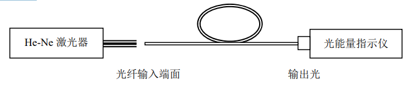
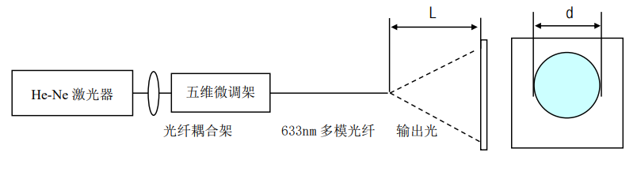
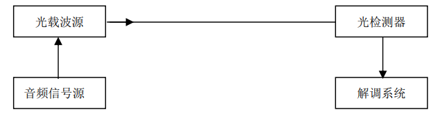

**stuID Name**

# 光纤信息及光通信系列实验

## 实验目的

1. 通过具体演示，使实验者对光纤光学有基本的认识，为以后的实验打下基础。
2. 学习光纤与光源耦合方法的原理；
3. 实验操作光纤与光源耦合。
4. 学习光纤数值孔径的含义及其测量方法；
5. 实验操作远场光斑法测量多模光纤的数值孔径。
6. 学习光纤传输损耗的含义、表示方法及测量方法；
7. 实验操作截断法测量光纤的传输损耗。
8. 使实验者建立通过内调制的方式上载信息到光载波的感性认识；了解模拟通信系统的基本组成和开路光通信的优越性；
9. 操作开路音频模拟信号传输实验。

## 实验原理
1. 光纤与光源耦合实验
   光纤与光源的耦合有直接耦合和经聚光器件耦合两种。聚光器件有传统的透镜和自聚焦透镜之分。自聚焦透镜的外形为“棒”形（圆柱体），所以也称之为自聚焦棒。实际上，它是折射率分布指数为 2（即抛物线型）的渐变型光纤棒的一小段。直接耦合是使光纤直接对准光源输出的光进行的“对接”耦合。这种方法的操作过程是：将用专用设备使切制好并经清洁处理的光纤端面靠近光源的发光面，并将其调整到最佳位置（光纤输出端的输出光强最大），然后固定其相对位置。这种方法简单，可靠，但必须有专用设备。 如果光源输出光束的横截面面积大于纤芯的横截面面积，将引起较大的耦合损耗。经聚光器件耦合是将光源发出的光通过聚光器件将其聚焦到光纤端面上，并调整到最佳位置（光纤输出端的输出光强最大）。这种耦合方法能提高耦合效率。耦合效率$η$的计算公式为$\eta=\frac{p_1}{p_2}\times 100\%$或$\eta=-10\lg\frac{p_1}{p_2}(dB)$
2. 多模光纤数值孔径（NA）测量实验
   1. 最大理论数值孔径 $NA_{max,t}=n_0\cdot \sin\theta_{max,i}=\sqrt{n_1^2-n_2^2}\approx n_1\sqrt{2\Delta}$ 
   式中$\theta_{max,i}$ 为光纤允许的最大入射角， $n_0$ 为周围介质的折射率，空气中为 1， $n_1$ 和 $n_2$ 分别为光纤纤芯中心和包层的折射率，$\Delta = \frac{n_1-n_2}{n_1}$ 为相对折射率差。最大理论数值孔径 $NA_{max,t}$由光纤的最大入射角的正弦值决定。 
   2. 远场强度有效数值孔径 $NA（NA_{eff}）$
      远场强度有效数值孔径是通过测量光纤远场强度分布确定的，它定义为光纤远场辐射图上光强下降到最大值的 5%处的半张角的正弦值。$CCITT$（国际电报电话咨询委员会）组织规定的数值孔径指的就是这种数值孔径 $NA$，推荐值为$（0.18—0.24）±0.02$。
   3. 光纤传输损耗性质及测量实验
      光波在光纤中传输，随着传输距离的增加，光波强度（或光功率）将逐渐减弱，这就是传输损耗。光纤的传输损耗与所传输的光波长$\lambda$ 相关，与传输距离 $L$ 成正比。
      通常，以传输损耗系数$\alpha(\lambda)$ 表示损耗的大小。光纤的损耗系数为光波在光纤中传输单位距离所引起的损耗，常以短光纤的输出光功率 $P_1$ 和长光纤的输出光功率 $P_2$ 之比的对数表示，即$\alpha(\lambda)=\frac{1}{L}10\lg\frac{P_1}{P_2}(dB/km)$
    4. 开路音频模拟信号传输实验
      光通信有无线光通信和有线光通信两类。有线光通信即光纤通信，而无线光通信则是开路光通信，以大气做信道的光通信。开路光通信无需线路，简单经济。在太空通信有着非常美好的前景。 通信的传输信号有数字信号和模拟信号两种，相应的系统为数字通信系统和模拟通信系统。模拟通信系统不需要复杂昂贵的编码系统，有独到之处。 调制是上载信息的手段，有内调制、外调制两种，内调制无需调制器，直接调制 $LD$的工作电流，简单方便、经济。 
## 实验装置和操作方法
1. 光纤与光源耦合实验
   1. 直接耦合
      1. 切制处理好光纤光学端面，然后按图 2 示意进行耦合操作。
      2. 计算耦合效率，对自己的工作进行评估。
   2. 透镜耦合
      
      1. 切制处理好光纤光学端面，然后按示意图 3 进行耦合操作；
      2. 计算耦合效率，对自己的工作进行评估；
      3. 比较、评估两种耦合方法的耦合效率。
2. 光纤数值孔径的测量
   1. 远场光强法
      远场光强法是 $CCITT$ 组织规定的 G.651 多模光纤的基准测试方法。该方法对测试光纤样品的处理有严格要求，并且需要很高的仪器设备：强度可调的非相干稳定光源；具有良好线性的光检测器等。
    2. 远场光斑法
      
      这种测试方法的原理本质上类似于远场光强法，只是结果的获取方法不同。虽然不是基准法，但简单易行，而且可采用相干光源。原理性实验多半采用这种方法。其测试原理如图 23.4 所示。测量时，在暗室中将光纤出射远场投射到白屏上（最好贴上坐标格纸，这样更方便），测量光斑直径（或数坐标格），通过式子$NA=k\cdot d$计算出数值孔径。式子中 $k$ 为一常数，可由已知数值孔径的光纤标定；$d$ 为光纤输出端光斑的直径。
3. 光纤传输损耗性质及测量实验
   在不改变输入条件下，分别测出长光纤的输出光功率和剪断后约为 2 米长的短光纤的输出光功率，按传输损耗系数$\alpha(\lambda)$ 的表示式计算出$\alpha(\lambda)$ 。这种方法测量精度最高，但它是一种“破坏性”的方法。
4. 开路音频模拟信号传输实验
   

## 实验数据

1. 光纤与光源耦合实验
   | $I/mA$ | $P/mW$   |
   | ------ | -------- |
   | $50$   | $17.32$  |
   | $40$   | $7.84$   |
   | $30$   | $0.1223$ |
   | $20$   | $0.019$  |
   | $10$   | $0.0072$ |
   | $0$    | $0.0022$ |
   经过光纤后$50mA$下功率$p = 3.8mW$,光纤耦合效率$\eta = \frac{3.8}{17.32} = 21.94\%$
2. 光纤数值孔径的测量
   | $d/cm$ | $L/cm$ | $sin\theta$ |
   | ------ | ------ | ----------- |
   | $0.4$  | $1.6$  | $0.124$     |
   | $1.0$  | $1.8$  | $0.2676$    |
   | $1.6$  | $2.1$  | $0.356$     |
   | $2.2$  | $2.3$  | $0.4315$    |
   | $2.8$  | $2.6$  | $0.4741$    |
   $NA = n\sin\theta$平均值$\overline{NA} = 0.3306$