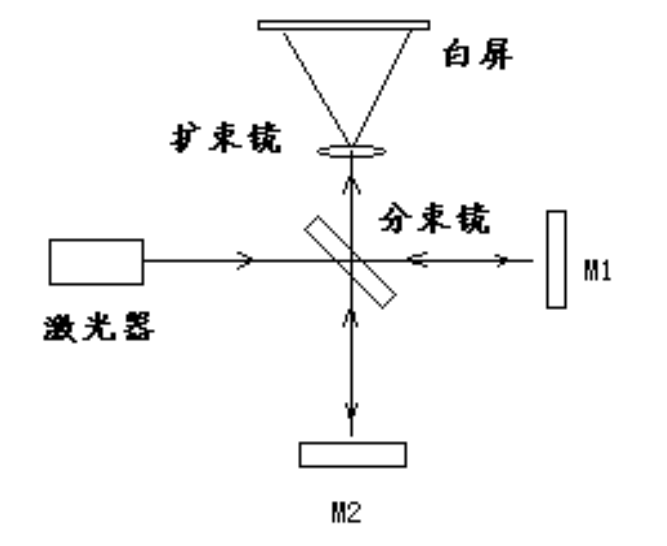
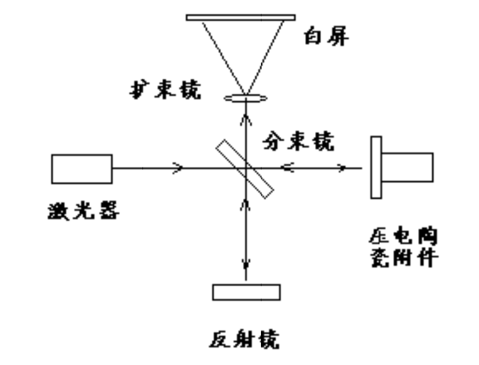
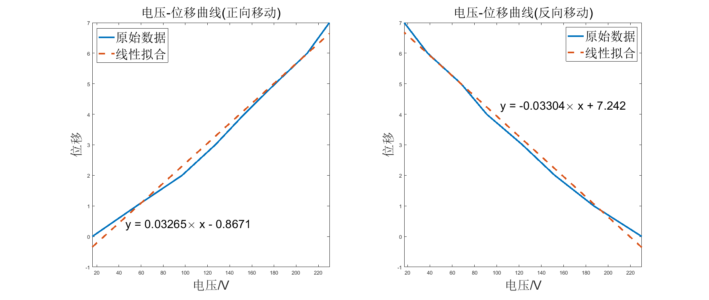

**stuID Name**

# 压电陶瓷特性测量实验
*指导老师：徐峰*
## 实验目的

1. 学习激光干涉测量微小位移量
2. 了解压电陶瓷特性

## 实验原理
1. 干涉测长原理
   测量位移是迈克尔逊干涉仪的典型应用，测量原理如下图所示：
   
   从激光器发出的一束相干光经分束镜一分为二，分为两束。一束透射光落在反射镜 $M_1$ 上，另一束反射光落在发射镜 $M_2$ 上，$M_1$、$M_2$ 分别将这两束光沿原路反射回来，在分束镜上重合后射入扩束镜，最后投影在白屏上。对光路进行调整，将在白屏上看到一系列的明暗相间的干涉条纹，这些干涉条纹会随着 $M_1$ 或 $M_2$ 的移动而移动，通过测出条纹的移动数就可计算出位移量，这就是激光测长的基本原理。
2. 压电陶瓷电致伸缩原理
   压电陶瓷的特点是在直流电场下对铁电陶瓷进行极化处理，使之具有压电效应。一般极化电场为$3～5kV/mm$，温度$100～150°C$，时间$5～20min$。这三者是影响极化效果的主要因素。压电陶瓷具有敏感的特性，可以将极其微弱的机械振动转换成电信号。

## 实验装置和操作方法
1. 压电陶瓷压电常数的测量及特性研究
   1. 搭建光路
      1. 将光学隔振平台放置在一个坚固平稳的桌面上，除四个隔振垫外，四周不要和任何物体接触。
      2. 按下图所示，在平台上搭建一套迈克尔逊干涉仪，其中的一个反射镜采用压电陶瓷附件。
      
      3. 将驱动电源分别与光探头，压电陶瓷附件和示波器相连。其中压电陶瓷附件接驱动电源插口，示波器CH1接驱动电压波形插口。光电探头接光探头插口，示波器CH2接光探头波形插口。
      4. 调整半导体激光器，观察激光束距平台的高度，使各点的高度尽量相等，光束尽量平行于平台表面。
      5. 调整光路中各光学元件，使两束反射光回到分束镜合并后，尽量重合，且不要回到激光器出光孔中（进入激光谐振腔的激光会使激光器工作不稳定）。
      6. 观察白屏上的干涉条纹，反复调整光学元件，尽量使干涉条纹变宽（两光束基本重合后，夹角越小，条纹越宽），最好能达到扩束光斑中有2-3条干涉条纹。
   2. 结果记录及数据处理
      1. 用笔在白屏上标记一个参考点，以作为记录干涉条纹移动数的基准。
      2. 将驱动电源面板上的波形开关打到左边直流“—”状态，打开驱动电源的电源开关（在后面板）。
      3. 慢慢旋转“电源电压”旋钮，观察白屏上条纹的变化，应可观察到条纹的移动，表头表示的驱动电压的大小的值也将变化。
      4. 将直流电压降到最低，平静一段时间，等干涉条纹稳定后，缓慢转动电压调节旋钮，观察条纹的移动。条纹每移动过参考点一条，就记录下相应的电压值；每移动一条干涉条纹，代表压电陶瓷长度变化了 $1/2$ 个波长，（即 $650/2nm=325nm$。）
      5. 到驱动电压开至最大后，再从高压反方向降压并记录相应的电压值和条纹移动之间的关系值。通过以上数据，画出电压-位移特性曲线。材料的压电常数就是材料单位长度在单位电压作用下的位移量，通过上述曲线，可求出平均压电常数。
2. 压电陶瓷振动特性的研究（激光干涉法）
   1. 搭建光路
      1. 取下白屏，换上光电探头，打开示波器。
   2. 结果记录及数据处理
      1. 将示波器置于双踪显示，CH1 触发状态，CH1 通道与驱动电压波形相连（此接口的信号已衰减约 10 倍）。
      2. 将驱动电源波形开关置于右侧“m”端，这时示波器 CH1 踪应可出现三角波形，调节驱动频率，使示波器屏上出现 1-2 个三角波。
      3. 将驱动幅度调到最大，“光放大”旋钮旋到最大，CH2 通道与光探头波形相连，这时 CH2 踪应有一系列类似正弦波的波形,此为干涉条纹扫过光电二极管探头的信号。
      4. 改变驱动频率和驱动幅度，观察 CH2 踪波形的变化情况，体会干涉条纹与压电陶瓷振动的关系，如频率、速度和振幅与波形的关系。
      5. 计算一个瞬时速度（压电陶瓷的振动速度，速度等于位移除以时间。CH2 通道对应信号相邻两个峰之间的时间周期可读，对应白屏上相邻两个条纹的间距（即位移）为$\frac{\lambda}{2}$
      6. 计算压电陶瓷震动的振幅（CH1通道一个三角波周期内对应CH2通道正弦信号的周期数量乘以$\frac{\lambda}{2}$为振幅的最大值）

## 实验数据
1. 压电陶瓷压电常数的测量及特性研究
      | $条纹移动条数（正向）/条$ | $电压/V$ | $条纹移动条数（反向）/条$ | $电压/V$ |
      | ------------------------- | -------- | ------------------------- | -------- |
      | $0$                       | $16$     | $0$                       | $230$    |
      | $1$                       | $56$     | $1$                       | $187$    |
      | $2$                       | $97$     | $2$                       | $152$    |
      | $3$                       | $127$    | $3$                       | $123$    |
      | $4$                       | $153$    | $4$                       | $91$     |
      | $5$                       | $181$    | $5$                       | $68$     |
      | $6$                       | $210$    | $6$                       | $38$     |
      | $7$                       | $230$    | $7$                       | $17$     |

      
      计算得到压电陶瓷的压电常数为：$0.0328\times\frac{\lambda}{2}=10.66nm/V$
2. 压电陶瓷振动特性的研究（激光干涉法）
   CH2对应两个峰之间的时间周期为$880\mu s$,瞬时速度$v = \frac{\lambda}{2 T} = 0.369\times 10^3m/s$
   CH1通道一个三角波周期内对应CH2通道正弦信号的周期数量为11，振幅最大值为：$11\times \frac{\lambda}{2} = 3.575\times 10^{-6}m$