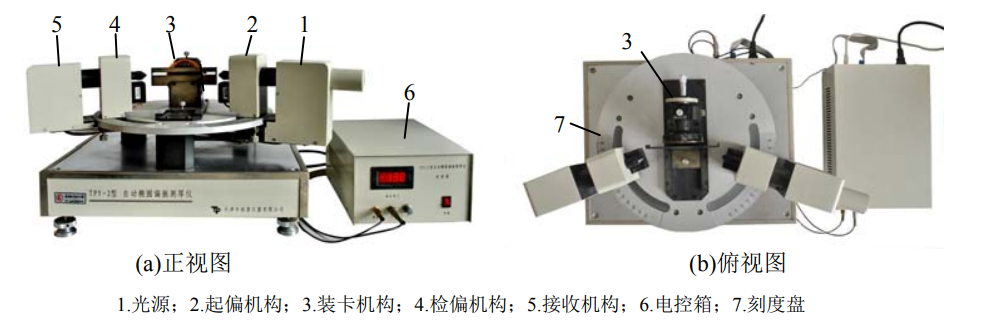

**stuID Name**

# 椭偏法测量薄膜厚度和折射率
*指导老师：吴平*
## 实验目的

1. 了解椭偏仪的构造和椭圆偏振法测定薄膜参数的基本原理。
2. 通过对薄膜样品厚度和折射率的测量，初步掌握椭圆偏振仪的使用和数据处理的方法。

## 实验原理

1. 线偏振光穿过$1/4$波片，由于双折射效应分成$o$光和$e$光，$o$光和$e$相位差为$\pi/2$，可合称为椭圆偏振光。
2. 椭圆偏振光入射到待测薄膜表面，经过薄膜反射出的反射光偏振态将发生改变。且总会存在一个起偏角使得反射光变成线偏振光。
3. 椭圆偏振光打在薄膜上发生薄膜干涉，根据折射定律和菲涅尔公式，可以算出反射光的相位差与薄膜折射率和厚度的关系，因此测出反射光的相位差，便可以计算出薄膜的折射率和厚度。但是反射光的相位并不能直接测量，只能通过测量椭偏参数$ψ$和$\Delta$来间接测量。
4. 为测量$ψ$，可以将$1/4$波片的快轴与$x$轴夹角调节为$45^o$，这样可以获得等幅椭圆偏振光，可以简化对$ψ$的计算。调节起偏器达到消光后，$\Delta$将只和起偏方向有关，测得起偏器旋转角度就可以计算得到$\Delta$。
5. 间接求得$ψ$和$\Delta$后便可根据其与薄膜折射率和厚度之间的关系计算折射率和厚度。

## 实验装置和操作方法
1. 实验装置
   试验系统由$TYP-1$型椭圆偏振测厚仪，计算机组成。待测样品为硅衬底上的二氧化硅膜.
   $TYP-1$型椭圆偏振测厚仪主要性能指标为:
   1. 测量范围:薄膜厚度$1nm-4000nm$,折射率$1.05-2.50$
   2. 偏振器方位角范围:$0^o-180^o$
   3. 偏振器步进角:$0.014^o$/步
   4. 测量膜厚和折射率重复性精度分别为$\pm0.5nm$和$\pm0.005$
   5. 入射角连续调节范围:$30^o-90^o$,精度$0.05^o$
   6. 入射光波长:$632.8nm$
   7. 光学中心高度:$80mm$
   8. 允许样品尺寸:$\Phi10-\Phi140mm$,厚度$\leq13mm$
   
2. 测量硅衬底上二氧化硅膜的折射率 $n_2$ 和厚度 $d$
   选择入射角 $70°$和 $65°$分别测量$（ψ，Δ）$，先测入射角$ 70°$还是 $65°$均可。其他测量设置为：扫描次数$ 3 $次，数据采集次数$ 20 $次，增益 $1$。操作方法如下：
   1. 开启主机电源（开关在主机背面），点亮氦氖激光器（预热 $30$ 分钟后再测量）。
   2. 电控箱与主机、计算机之间的各种数据线已连接，检查各连线是否连接完好。
   3. 装被测样品。（注意：旋紧吸盘拉杆时要视被测样品直径和质地而适当调节，切记不可用力过大，使样品损坏）。装被测样品时可将光阑移开一段距离，以方便样品的安装。样品安装完成后，将光阑机构置于被测样品表面附近处，以限制其它杂散光的进入。
   4. 选定入射角 $i$（如 $70°$）。旋转起偏和检偏机构悬臂，在刻度盘上使左右刻度对应同一角度 $i$。
   5. 对放置的样品作俯仰、左右和前后的三维调节，使经样品表面反射后的激光束刚好通过检偏器入光口。
   6. 逆时针轻旋电控箱电压旋钮至最小处（要求在关机时将电压旋到“0”，所以一般情况下旋钮已在最小位置处）。打开电控箱电源，顺时针旋转电控箱调节旋钮，将读数调到 $150V$ 左右（视仪器情况而定）即可。
   7. 按手册操作实验软件进行实验。
   
## 实验数据

|        | $\Psi$  | $\Delta$ | $n_2$      | $d$       |
| ------ | ------- | -------- | ---------- | --------- |
| $70^o$ | $50.55$ | $80.88$  | $1.4631$   | $113.12$  |
| $65^o$ | $51.76$ | $61.1$   | $1.7259$   | $92.87$   |
| 均值   |         |          | $1.595105$ | $102.995$ |