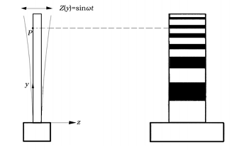
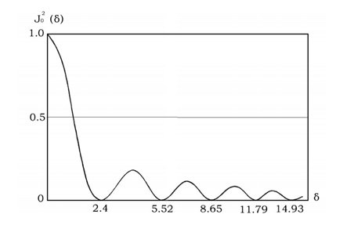
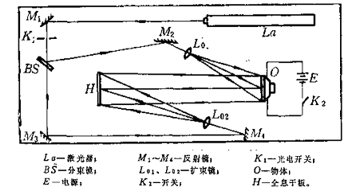

**stuID Name**

# 激光全息振动分析
*指导老师：yyy*
## 实验目的

1. 掌握用激光全息干涉计量技术测量物体振幅的原理
2. 学会用激光全息干涉法测平面物体的振幅

## 实验原理

先以一个简单的例子介绍正弦振动物体的时间平均全息图的基本特征。为此选择一个一端固定其余边自由的悬臂梁作为被测物体，该悬臂梁用沿垂直于它表面的 $z$ 方向传播的平面波照明，见图 21.1。该物体在其平衡位置附近作正弦振动，物体上每个点的振动位移为$z(x,y)=Z(x,y)\sin \omega t$

式中 $Z（x,y）$是在 $y$ 位置机械振动的振幅；$\omega$ 是振动的圆频率。设由静止在平衡位置上的悬臂梁散射到全息图上的光的复振幅为$U(x,y)=a(x,y)\exp [i\phi(x,y)]$

如果从点光源发出的光传播到静止物体上某点经过的距离为 $l_0$，则当物体振动时，光从该点返回全息图所通过的距离为$l_0-2Z(x,y)\sin \omega t$

相应的相位差为$\delta=\Delta \phi(x,y,t)=(2\pi/\lambda)2Z(x,y)\sin \omega t$

因此，在任意时刻全息图平面上的复振幅为$U_o(x,y,t)=a(x,y)\exp\{i[\phi(x,y)+(\frac{4\pi}{\lambda}Z(y)\sin \omega t)]\}$

将全息干版同时对$U(x, y,t)$和参考光曝光，曝光时间为一个振动周期$T$ ，就可记录时间平均全息图。当这张全息图经显影定影并用参考光照明再现时，再现光的复振幅与曝光时间间隔$T$ 内$U_o(x, y,t)$ 的时间平均成正比$\frac{1}{T}\int_0^Ta(x,y)\exp\{i[\phi(x,y)+(\frac{4\pi}{\lambda})Z(y)\sin \omega t]\}dt=U_o(x,y)\frac{1}{T}\int_0^T\exp[i(\frac{4\pi}{\lambda}Z(y)\sin \omega t)]dt$

其再现光强为$I=U^2(x,y)\{\frac{1}{T}\int_0^T\exp[i(\frac{4\pi}{\lambda}Z(y)\sin \omega t)]dt\}^2$

因$T\gg \frac{1}{\omega}$，故有：$\lim_{T\rightarrow \infin}\frac{1}{T}\int_0^T\exp[i(\frac{4\pi}{\lambda})Z(y)\sin \omega t]dt=J_0[(\frac{4\pi}{\lambda})Z(y)]$

代入式21.7，得：$I=a(x,y)^2J_0^2[(\frac{4\pi}{\lambda})Z(y)]$

式中的相位差$(\frac{4\pi}{\lambda})Z(y)$可记为$\delta$，这样式21.9变为：$I=a(x,y)^2J_0^2[\delta]$,表征了间间平均全息干涉图的基本特征，即再现的时间平均全息干涉图（虚像）被由零阶贝塞尔函数平方描述的条纹所调制。该函数曲线如图 21.2 所示。干涉图上的暗条纹的中心就在以物面上其振幅 $Z（y）$能使式（21.9）中的贝塞尔函数为零的各点处。因此，物体的振幅可根据振动体振幅引起的相位差应等于某级序暗条纹处贝塞尔函数为零的宗量值关系求出。

## 实验装置

$He-Ne$ 激光器,光学平台,光学组件，全息干版，冲印设备。

## 实验内容和操作方法

全息测振的方法分两大步：即记录实时全息图和时间平均全息图。记录实时全息图的目的是为了判断物体的振型。测量光路见图 21.3，具体测量方法如下。

1. 记录实时全息图并找出所要分析的振型
   1. 现按图排好光路。同一光路中的物光和参考光应等光程。参考光和物光的比例应在 3：1---10：1 左右。参考光和物光的夹角要合适（约 30°）。试件是一块金属板，表面用白漆涂白，竖直放置，其一边夹在虎钳上，其它边自由。采用声激振器（或压电晶片）对试件激振。用实时全息图拾振，判断振型。
   2. 关闭曝光定时器，在实时全息片夹上装上一块干版，药面对着物体。
   3. 开启曝光定时器，在物体静止状态下，使光路中的物光和参考光对干版曝光。
   4. 关闭曝光定时器，从实时全息片架上小心翼翼地取下曝好光的干版（与片架同时取下，不要触动和改变干版与底片架之间的相对位置），将其置于显影定影液中作显影定影处理，则处理好的干版就成为一张实时全息图。
   5. 开启曝光定时器，将处理好的还未干燥的实时全息图重新装到实时干版架的原来位置上，光路仍处于记录实时全息图的原来状态，即原来的物光还照在物体上，原来的参考光照仍在处理好的实时全息图上。这时通过干版可看到调制条纹（由冲洗时乳剂层厚度改变而引成）。
   6. 通过调节音频信号发生器的频率，改变声激振器的振动频率，通过实时全息图注意观察调制条纹的分布情况，当调到使调制条纹向金属平板的夹持部分平移并出现平行条纹时，这就调出了一弯振型。调节音频信号发生器输出信号的电压幅度，使平行条纹不致太密。 

2. 拍摄时间平均全息图
   1. 取下实时全息图，在声激振器不停振，并保持已调出的振型的条件下，关闭曝光定时器，在时间平均全息图片架上装上另一张干版。
   2. 开启曝光定时器，使光路 1 中的物光和参考光对干版曝光。
   3. 在干版架上取下曝好光的干版，将其作显影和定影处理，并加以晾干，则该干版就成为一张记录了平均全息图的干版。
   4. 将晾干了的干版重新夹到干版架上，用光路中的参考光照射，则干版可再现出时间平均干涉图。
   5. 作图像处理，测出试件上被测的条纹级数 $N$ 和查出对应的贝塞尔函数宗量。
## 实验数据
   实验观测到了清晰的环状全息图像
   $\lambda = 632.8nm$,由$z(x,y) = \frac{\delta\lambda}{4\pi}$可求得：
   1. 一级暗环$\delta = 2.4$：$z = 120.756nm$
   2. 二级暗环$\delta = 5.52$：$z = 277.969nm$