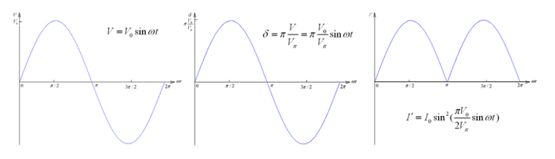
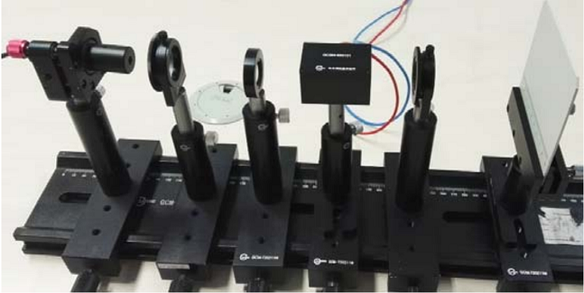
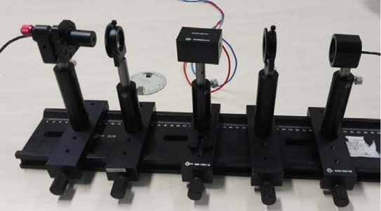
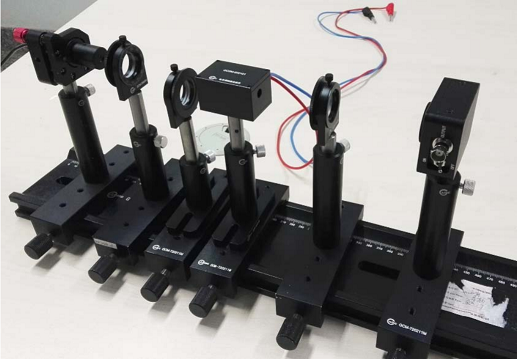
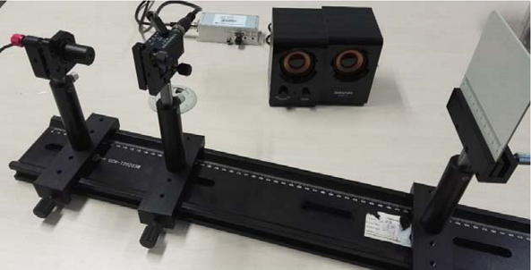
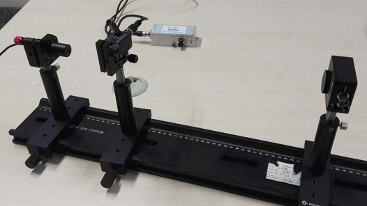
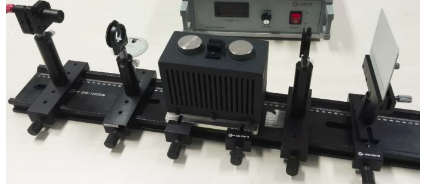
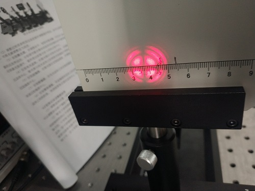
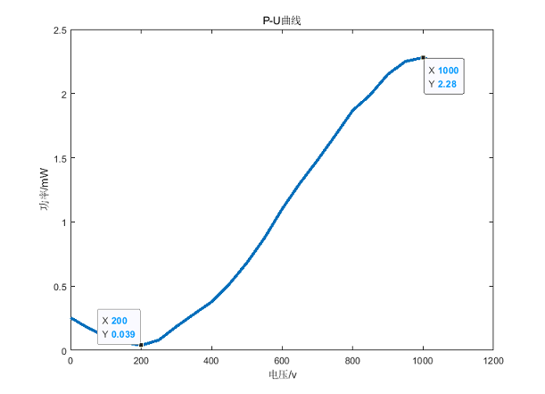
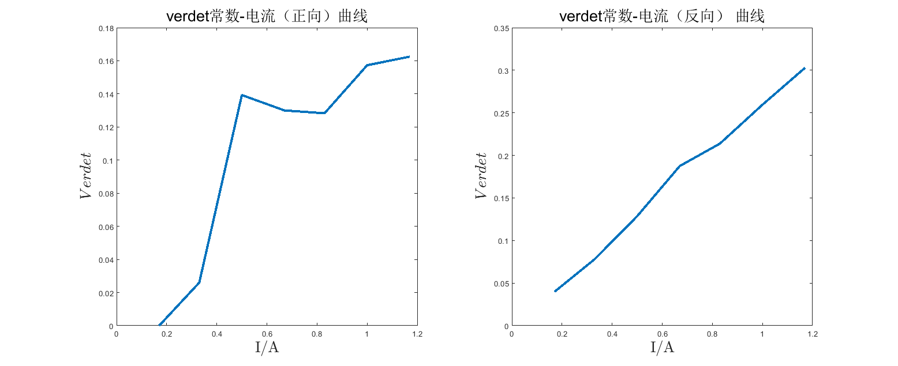

**081730109 朱文强**

# 电光、声光调制与磁致旋光实验
*指导老师：徐峰*
## 实验目的

1. 掌握晶体电光/声光调制的原理和实验方法。
2. 学会用简单的实验装置测量晶体半波电压、电光常数的实验方法。
3. 观察电光效应所引起的晶体光学特性的变化和会聚偏振光的干涉现象。

## 实验原理

1. 一次电光效应和晶体的折射率椭球
   由电场所引起的晶体折射率的变化，称为电光效应。
   光在各向异性晶体中传播时，因光的传播方向不同或者是电矢量的振动方向不同，光的折射率也不同。
   晶体的一次电光效应分为纵向电光效应和横向电光效应两种。纵向电光效应是加在晶体上的电场方向与光在晶体里传播的方向平行时产生的电光效应；横向电光效应是加在晶体上的电场方向与光在晶体里传播方向垂直时产生的电光效应。通常 $KD*P$(磷酸二氘钾)类型的晶体用它的纵向电光效应，$LiNbO_3$(铌酸锂)类型的晶体用它的横向电光效应。本实验研究铌酸锂晶体的一次电光效应，用铌酸锂晶体的横向调制装置测量铌酸锂晶体的半波电压及电光系数，并用两种方法改变调制器的工作点，观察相应的输出特性的变化。
2. 电光调制原理
   要用激光作为传递信息的工具，首先要解决如何将传输信号加到激光辐射上去的问题，我们把信息加载于激光辐射的过程称为激光调制，把完成这一过程的装置称为激光调制器。由已调制的激光辐射还原出所加载信息的过程则称为解调。因为激光实际上只起到了“携带”低频信号的作用，所以称为载波，而起控制作用的低频信号是我们所需要的，称为调制信号，被调制的载波称为已调波或调制光。按调制的性质而言，激光调制与无线电波调制相类似，可以采用连续的调幅、调频、调相以及脉冲调制等形式，但激光调制多采用强度调制。强度调制是根据光载波电场振幅的平方比例于调制信号，使输出的激光辐射的强度按照调制信号的规律变化。激光调制之所以常采用强度调制形式，主要是因为光接收器一般都是直接地响应其所接受的光强度变化的缘故。
   激光调制的方法很多，如机械调制、电光调制、声光调制、磁光调制和电源调制等。其中电光调制器开关速度快、结构简单。因此，在激光调制技术及混合型光学双稳器件等方面有广泛的应用。电光调制根据所施加的电场方向的不同，可分为纵向电光调制和横向电光调制。利用纵向电光效应的调制，叫做纵向电光调制，利用横向电光效应的调制，叫做横向电光调制。实验只做 $LiNbO_3$晶体的横向电光调制实验。
3. 铌酸锂晶体的会聚偏振光干涉
   汇聚偏振光干涉又叫锥光干涉，是一种汇聚偏振光的干涉，如图 5 所示，$P_1$ 和 $P_2$ 是正交的偏振片，$L_1$ 是透镜，用来产生会聚光；$N$ 是均匀厚度的晶体。对于本实验中的铌酸锂晶体，不加电压时为单轴晶体，光轴沿平行于激光束的方向，由于对晶体而言不是平行光的入射，不同倾角的光线将发生双折射（如图 6），而 $O$ 光和 $e$ 光的振动方向在不同的入射点也不同。离开晶体时，两条光线平行出射，它们沿$P_2$ 方向振动的分量将在无穷远处汇聚而发生干涉。其光程差$\delta$ 由晶体的厚度 $h$、$o$ 光和 $e$ 光的折射率之差以及入射的倾角$\theta$ 决定。不难想见，相同的光线将形成类似等倾干涉的同心圆环（如图 6）。$\theta$ 越大，$\theta$ 也越大，明暗相间的圆环间隔就越小。
   必须指出，汇聚偏振光干涉的明暗分布不仅与光程差有光，还与参与叠加的$o$ 光和 $e$ 光的振幅比有关。其中形成中央十字线的是来自沿$X$和$Y$ 平面进入晶体的光线，这些光线在进入晶体后或者有 $o$ 光，或者只有 $e$ 光，而且它们由晶体出射或都不能通过偏振片 $P_2$，形成了正交的黑色十字，而且黑十字的两侧也由内向外逐渐扩展。
4. 交变调制信号在特殊角度下的“倍频”现象
   如果电光调制电源在不输出直流电压的情况下单纯采用了一个正弦调制信号，即 $V = V_0\sin \omega t$ ，那么原来单轴晶体在电压作用下产生的感生轴如图 3 所示。
   如果此时起偏器 $P$ 沿 $x$ 方向透振，检偏器 $A$ 沿 $y$ 方向透振，电光调制晶体的感生主轴$\xi$，$\eta$ 方向和 $x$ 轴成 45°角，则输出光波的光强为：$I^{'}=I_0\sin^2(\frac{\delta}{2})=I_0\sin^2(\frac{\pi V_0}{2V_{\pi}}\sin \omega t)=a_0+a_2J_2(\frac{\pi V_0}{V_{\pi}})\cos(2\pi \omega t)- \cdot \cdot\cdot$
   式中 $a_0,a_2$ 为常数， $k$ $J$ 为$k$ 阶贝塞尔函数。上式表明输出的交变信号为二次频率信号，没有基频。这是系统零点的特征。
   调制电压、晶体的相位差、输出光强的关系如下图所示。
   
   在直流偏置 $V=0$，在交变调制信号不变（交变调制信号强度较小）的情况下，逐渐增加直流偏置信号，直到 $V=V_π$ 时，第二次获得“倍频”信号，那么可以根据这个方法测量电光晶体的半波电压。 
## 实验装置和操作方法
1. 观察晶体的会聚偏振光干涉图样
   1. 晶体的会聚偏振光干涉图样光路搭建
      1. 参考下图搭建晶体的会聚偏振光干涉图样光路。自左向右依次为激光器、起偏器、聚焦透镜（直径 $20mm$，$f30mm$）、电光晶体、检偏器和白屏。
      
      2. 调整过程需参照固定高度器件调整器件等高，如可以选择光阑作为参照，可将光阑调整适当高度。
      3. 安装激光器，并调整水平，借助可变光阑（开孔约 $2mm$），光阑在激光器的近处和远处，分别调节激光整体高低和夹持器的水平俯仰旋钮，反复 2 次即可将激光器调平，最终使出射激光束与导轨台面平行。
      4. 安装电光晶体，在激光器后安装电光晶体，并调整晶体高度使激光通过晶体中心，激光器与电光晶体之间预留安装偏振片和聚焦透镜的空间。
      5. 安装起偏器，在激光器后安装起偏器，并调整起偏器高低，使光束通过起偏器中心。
      6. 安装检偏器，在电光晶体之间安装检偏器，并调整检偏器高低，使光束通过检偏器中心。
      7. 安装聚焦透镜，在起偏器和晶体之间安装聚焦透镜，调整聚焦透镜与晶体之间的距离，使透镜聚焦点落在晶体中心，即可在白屏上看到透射的光斑。
   2. 结果记录及数据处理
      1. 调整晶体位置（晶体表面与）即可看到“十”字，如果图样有倾斜，可以调整前后两个偏振片偏振方向不是水平和竖直，适当调整可以修正。
      2. 锥光干涉的图样如图 9 所示，一个暗十字图形贯穿整个图样，四周为明暗相间的同心干涉圆环，十字形中心同时也是圆环的中心，它对应着晶体的光轴方向，十字形方向对应于两个偏振片的偏振轴方向。在观察过程中要反复微调晶体，使干涉图样中心与光点位置重合，同时尽可能使图样对称、完整，确保光束既与晶体光轴平行，又从晶体中心穿过的要求，再调节使干涉图样出现清晰的暗十字，且十字的一条线平行于 $x$ 轴。
      3. 晶体红黑高压头分别与电光高压电源后面板正负接口相连，如果此时调整“偏置高压”随着晶体两端电压变化可以看到黑十字发生变形，可以推断由单轴晶体变化为双轴晶体。
2. 极值法测量铌酸锂晶体的透过功率曲线(即 $P～U$ 曲线)，计算半波电压 $U_π$和电光系数 $γ_{22}$
   1. 极值法测量晶体半波电压光路搭建
      1. 参考下图搭建极值法测量半波电压光路。自左向右依次为激光器、起偏器、电光晶体、检偏器和功率计。
        
      2. 调整过程需参照固定高度器件调整器件等高，如可以选择光阑作为参照，可将光阑调整适当高度。
      3. 安装激光器，并调整水平，借助可变光阑（开孔约 $2mm$），光阑在激光器的近处和远处，分别调节激光整体高低和夹持器的水平俯仰旋钮，反复 2 次即可将激光器调平，最终使出射激光束与导轨台面平行。
      4. 安装电光晶体，在激光器后安装电光晶体，并调整晶体高度使激光通过晶体中心，激光器与电光晶体之间预留安装偏振片和聚焦透镜的空间。
      5. 安装起偏器，在激光器后安装起偏器，并调整起偏器高低，使光束通过起偏器中心。
      6. 安装检偏器，电光晶体后安装检偏器，并调整检偏器高低，是光束通过检偏器中心。
      7. 安装功率计，调整功率探头位置，使检偏器出射的光束落在功率计探头中心。
   2. 结果记录及数据处理
      1. 调整起偏器的偏振方向为水平或竖直，并与检偏器的偏振方向相互垂直，调试过程可以参考锥光干涉实验，最终在白屏上看到锥光“十”字，并旋转两个偏振片方向，保证“十”字不会倾斜，即偏振方向相互垂直。
      2. 晶体红黑高压头分别与电光高压电源后面板正负接口相连，调整“电光调制高压电源”偏置高压旋钮，读取“高压示数”和“功率计示数”。
      3. 随着直流电压从小到大逐渐改变（可间隔 $50V$），输出的光强将会出现极小值和极大值，相邻极小值和极大值对应的直流电压之差即是半波电压 $U_π$。
      4. 以 $P$ 为纵坐标，$U$ 为横坐标，画 $P～U$ 关系曲线，确定半波电压 $U_π$的数值。
      5. 根据公式$U_{\pi}=\frac{\lambda}{2n_0^3\gamma_{22}}(\frac{d}{l})$,计算电光系数 $\gamma_{22}$
   其中：晶体厚度 $d=5mm$，宽度 $w=5mm$，长度 $l=30 mm$，$n_0=2.29$，激光波长$λ=650nm$。
3. 光通信演示实验
   1. 搭建光通信演示实验
      1. 参考图 16 搭建光通信演示实验。自左向右依次为激光器、起偏器、电光晶体、$1/4$ 波片、检偏器和光电探测器。
         
      2. 调整过程需参照固定高度器件调整器件等高，如可以选择光阑作为参照，可将光阑调整适当高度。
      3. 安装激光器，并调整水平，借助可变光阑（开孔约 $2mm$），光阑在激光器的近处和远处，分别调节激光整体高低和夹持器的水平俯仰旋钮，反复 2 次即可将激光器调平，最终使出射激光束与导轨台面平行。
      4. 安装电光晶体，在激光器后安装电光晶体，并调整晶体高度使激光通过晶体中心，激光器与电光晶体之间预留安装偏振片和聚焦透镜的空间。
      5. 安装起偏器，在激光器后安装起偏器，并调整起偏器高低，使光束通过起偏器中心。
      6. 安装 $1/4$ 波片，在起偏器后安装 $1/4$ 波片，并调整波片高低，使光束通过波片中心。
      7. 安装检偏器，电光晶体后安装检偏器，并调整检偏器高低，是光束通过检偏器中心。
      8. 安装光电探测器，调整探测器位置，使检偏器出射的光束落在探测器中心，探测器并连接到音箱上。
   2. 结果记录及数据处理
      1. 晶体红黑高压头分别与电光高压电源后面板正负接口相连，“电光调制高压电源”的信号监测选择“外”，音频输出选择“外”，“正弦波/方波”均不在工作，将 MP3 音源链接到“音频输入”的 BNC 口，适当调整“幅度调节”，“偏置电压”可以适当调整。
      2. 调整音箱音量，同时旋转波片，也可以适当调整偏振片，最终可以听到 MP3 播放的声音。
4. 声光晶体衍射角测量
   1. 声光晶体衍射角测量光路搭建
      1. 参考下图搭建声光晶体衍射光路。自左向右依次为激光器（激光波长$650nm$）、声光晶体和白屏。
         
      2. 安装激光器，可以将白屏调整到合适高度，以白屏刻线作为参考高度，将白屏移到激光器近处和远处，分别调整激光器的高低和激光器夹持器的俯仰使激光均能打在刻线上，反复两次即可将激光调平。
      3. 安装白屏，将白屏移动到导轨右端，并将其固定在导轨上。
      4. 安装声光晶体（将声光晶体与驱动源相连，同时将 MP3 音源连接到驱动源 Vtone 上，MP3 可以不工作），适当旋转晶体角度，可以观察到透过晶体的光在布拉格衍射角下一级衍射最强。
   2. 数据记录与处理
      1. 使用白屏接收衍射光斑，读取 $0$ 级 $1$ 级衍射光斑的距离 $a$ 和测量晶体到白纸屏的距离 $b$ 计算衍射角$θ$，根据公式$d\sin \theta = K\lambda$其中$θ$为衍射角，$d$ 为光栅常数，$K=1$ 为级次，$λ$为波长 $650nm$，从而计算650nm 波长下形成的光栅常数。
5. 声光晶体通讯实验
   1. 声光晶体通信实验光路搭建
      1. 参考下图搭建声光晶体衍射光路。自左向右依次为激光器（激光波长$650nm$）、声光晶体和探测器。
         
      2. 安装激光器，可以将白屏调整到合适高度，以白屏刻线作为参考高度，将白屏移到激光器近处和远处，分别调整激光器的高低和激光器夹持器的俯仰使激光均能打在刻线上，反复两次即可将激光调平。
      3. 安装声光晶体，（将声光晶体与驱动源相连，同时将 MP3 音源连接到驱动源 Vtone 上，MP3 可以不工作），适当旋转晶体角度，可以观察到透过晶体的光在布拉格衍射角下一级衍射最强。
      4. 安装探测器，调整探测器高低及左右位置，使衍射 1 级光斑入射到接收口中，并将光电探测器接口与音箱相连。
   2. 结果处理
      1. 当衍射光斑的 1 级或-1 级入射探测器接收口，打开 MP3 音源，同时调整音箱的开关，一般可以听到播放的乐曲。调整 MP3 音源的音量，可以感受音箱播放的强弱变化。
      2. 如果以上调试没有问题，但仍然没有听到乐曲，可以适当调整探测器位置，一般激光较强时探测器会出现饱和，影响接收质量。
6. 磁致旋光实验
   1. 磁光效应光路搭建
      1. 搭建磁光效应光路。自左向右依次为激光器（激光波长 $650nm$）、起偏器、磁光晶体、检偏器和白屏。
         
      2. 安装激光器，可以将白屏调整到合适高度，以白屏刻线作为参考高度，将白屏移到激光器近处和远处，分别调整激光器的高低和激光器夹持器的俯仰使激光均能打在刻线上，反复两次即可将激光调平。
      3. 安装白屏，将白屏移动到导轨右端，并将其固定在导轨上。
      4. 安装磁光线圈和磁光晶体，磁光线圈直接固定在滑块上，并将磁光晶体安装在上面，调整激光器高度让激光通过晶体。
      5. 安装起偏器，在激光器后安装起偏器，并调整起偏器高低，使光束通过起偏器中心。
      6. 安装检偏器，磁光晶体后安装检偏器，并调整检偏器高低，使光束通过检偏器中心。
   2. 数据记录与处理
      1. 旋转起偏器使透过起偏器的激光最强。
      2. 旋转检偏器直至在白屏看到完全消光，此时记下检偏器偏振角度$θ_0$.
      3. 将磁光线圈与磁光电源正负极相连,调整电流并记录偏转的角度，线圈两端电压及电流如下表所示，并记录旋转角度，其中线圈电阻为 $150$ 欧姆，磁光玻璃棒（$TGG$）长度 $d=17.9mm$，直径 $5.5mm$。
## 实验数据
1. 晶体的会聚偏振光干涉图样

3. 极值法测量铌酸锂晶体的透过功率曲线

    | 电压/$V$ | 功率/$mW$ | 电压/$V$ | 功率/$mW$ |
    | -------- | --------- | -------- | --------- |
    | $0$      | $0.254$   | $600$    | $1.101$   |
    | $50$     | $0.174$   | $650$    | $1.3$     |
    | $100$    | $0.109$   | $700$    | $1.480$   |
    | $150$    | $0.064$   | $750$    | $1.671$   |
    | $200$    | $0.039$   | $800$    | $1.867$   |
    | $250$    | $0.080$   | $850$    | $1.99$    |
    | $300$    | $0.186$   | $900$    | $2.15$    |
    | $350$    | $0.283$   | $950$    | $2.25$    |
    | $400$    | $0.378$   | $1000$   | $2.28$    |
    | $450$    | $0.516$   | $1050$   | $2.23$    |
    | $500$    | $0.682$   | $1100$   | $2.16$    |
    | $550$    | $0.875$   |

    

    由图可知$U_{\pi} = 800V$,计算得$\gamma_{22} = 5.64\times 10^{-12}$
2. 声光晶体衍射角测量
   晶体位置：$249.9cm$,白屏位置：$750.4cm$,0级条纹坐标：$4.45cm$，一级条纹坐标：$3.75cm,5.25cm$
   光栅常数$d = \frac{K\lambda}{\sin \theta}$
   $\theta = \arctan(\frac{5.25-4.45}{750.4-249.9})$
   $d = 40.882\mu m$
4. 磁致旋光
   | 线圈电压($V$) | 磁场强度($mT$) | 线圈电流($A$) | 正向旋转角度($^o$) | $Verdet$常数 | 反向旋转角度($^o$) | $Verdet$常数 | 计算平均值 |
   | ------------- | -------------- | ------------- | ------------------ | ------------ | ------------------ | ------------ | ---------- |
   | $0$           | $0$            | $0$           | $0$                |              | $0$                |
   | $25$          | $49$           | $0.17$        | $0$                | $0$          | $2$                | $0.0398$     |
   | $50$          | $75$           | $0.33$        | $2$                | $0.026$      | $6$                | $0.078$      |
   | $75$          | $91$           | $0.5$         | $13$               | $0.1393$     | $12$               | $0.1286$     |
   | $100$         | $105$          | $0.67$        | $14$               | $0.13$       | $20$               | $0.1875$     |
   | $125$         | $114$          | $0.83$        | $15$               | $0.1283$     | $25$               | $0.2138$     |
   | $150$         | $124$          | $1.0$         | $20$               | $0.1573$     | $33$               | $0.2595$     |
   | $175$         | $132$          | $1.17$        | $22$               | $0.1625$     | $41$               | $0.3029$     |
   