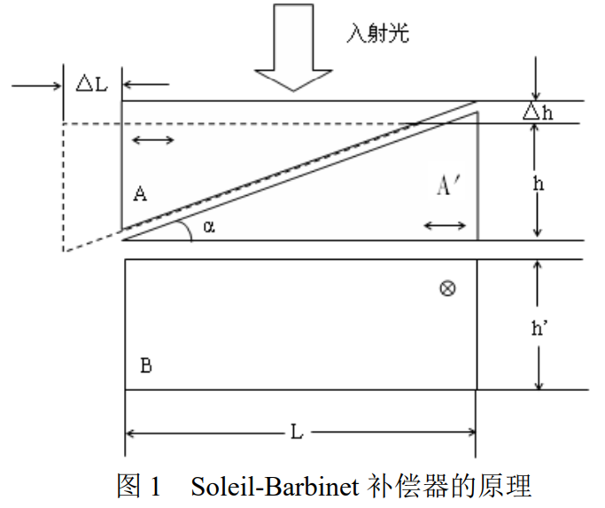
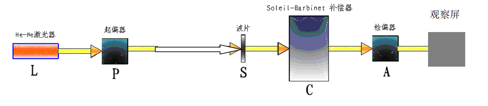
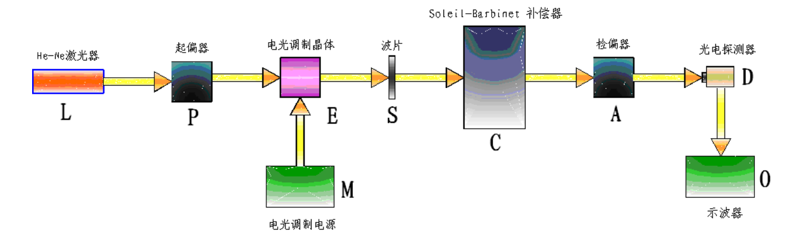

**stuID Name**

# 调制偏振光相位延迟精密测量实验
*指导老师：杨雁南*
## 实验目的

1. 了解偏振光学理论
2. 了解电光晶体的线性电光效应及调制理论
3. 掌握 $Soleil-Barbinet$ 相位补偿器的应用
4. 掌握相位延迟测量方法
5. 调试实验测量系统，并采用两种方法测量某种待测波片的相位延迟

## 实验原理

1. 偏振光学理论
一般情况下，普通光源或激光器输出的光不具有特定的偏振态，要想使这种光成为线偏振光，需要在光路中放入偏振器件（称为起偏器，是由双折射材料制成的偏振器，或由二向色性材料制成的偏振片）。而检验一束光是否为线偏振光，则只需在光路中再放入另一偏振器件（称为检偏器），转动检偏器（或起偏器），如果通过检偏器后的光强有强弱变化，且最小光强为零，则说明透过起偏器的光为线偏振光。
相位延迟片则是由双折射材料制成的另外一种光学器件，它可以将线偏振光分解成两个振动方向相互垂直的线偏振光，一个叫 $o$ 光，一个叫 $e$ 光，当晶体的光轴与入射面垂直时，$o$、$e$ 光的传播方向相同，但由于两束光在晶体中具有不同的折射率和传播速度，当它们从晶体中透射出来时，便具有了一定的相位差，因此该晶体被称为“相位延迟”。 透过相位延迟片的 $o$、$e$ 光合成为椭圆偏振光，该椭圆偏振光的形状与 $o$、$e$ 光的相位差有关。特殊情况下，若 $o$、$e$ 光的相位差（延迟）为$\pi /2$，则合成光为正椭圆线偏振光，若 $o$、$e$ 光的相位差（延迟）为$\pi$，则合成光仍为线偏振光，但振动方向转过一角度。对于给定的相位延迟片，$o$、$e$ 光的相位差与晶体片的厚度有关，对于给定厚度，其相位差固定。在椭圆偏振光后的光路中再放入检偏器，转动检偏器，其后的光强不变。

2. 补偿原理
$Soleil-Barbinet$ 补偿器是一个 $o$、$e$ 光相位延迟量可调的“相位延迟片”。由成对的晶体楔 $A$ 和 $A^{'}$和一块平行晶片 B 组成。A 和 A两光轴都与入射光垂直，且平行于折射棱边，它们可以彼此相对移动，形成一个厚度可变的晶片；晶片 $B$ 的光轴与晶体楔 $A$ 垂直，如图 1 所示。

3. 调制原理 
   
由电场所引起的晶体折射率的变化，称为电光效应。通过晶体的透射光是一对振动方向相互垂直的线偏振光，通过调节外加电场大小，可对偏振光的振幅或相位进行调制。

## 实验装置 

1. 只采用 $Soleil-Barbinet$ 补偿器的实验装置

$L$ 是光源，$P$ 为起偏器，$S$ 为待测波片，$C$ 为 $Soleil-Barbinet$ 补偿器，$A$ 为检偏器，出射光强在观察屏上观察。系统的坐标方向规定为：光束传播方向为 $z$ 轴，起偏器的透振方向沿 $x$ 轴、检偏器的透振方向沿 $y$轴，当 $S$、$C$ 未加入时，观察屏上光强为零。当加入待测波片 $S$ 或 $Soleil-Barbinet$ 补偿器 $C$ 时，调节它们的快慢轴方位，都会发现大多数情况下观察屏上光强随其快慢轴方位发生变化，此时起偏器 $P$ 产生的线偏振光经过 $S$ 或 $C$，变成椭圆偏振光，该椭圆偏振光在检偏器 $A$ 的偏振化方向上有分量。但当 $S$ 或 $C$ 的快慢轴平行起偏器 $P$ 或检篇器 $A$ 的偏振化方向时，观察屏上光强为零。本实验中将将待测波片 $S$ 和补偿器 $C$ 的快慢轴方位均调至与 $x$ 轴和 $y$ 轴的夹角为 $45^0$，通过补偿器 $C$ 的光学相位补偿测量待测波片 $S$ 的相位延迟。

2. 采用 $Soleil-Barbinet$ 补偿器与电光调制结合的实验装置

$L$ 是光源，$P$ 为起偏器，$E$ 为电光调制晶体，通过调制信号源 $M$ 加上调制信号。$S$ 为待测波片，$C$ 为 $SoleilBarbinet$ 补偿器，$A$ 为检偏器，出射光由光探测器 $D$ 接收，并经过滤波放大等处理后，最终结果显示在示波器$O$ 上。系统的坐标方向规定为：光束传播方向为 $z$ 轴，起偏器的透振方向沿 $x$ 轴、检偏器的透振方向沿 $y$ 轴，电光调制器加电压后的感生轴$\xi$,$\eta$方向和待测波片及补偿器的快慢轴方向一致，和 $x$ 轴成 $45°$角.

## 实验内容及步骤

1. 只采用 $Soleil-Barbinet$ 补偿器测量的实验内容与步骤
    1. 参见图 5，在光学防震平台上仔细调试，使各部件等高共轴。
    2. 调整激光器 $L$ 方向，使出射光平行于台面。后续放入的探测器和各种光学元件其表面均应和光线传
播方向垂直。
    3. 放入偏振棱镜 $P$、检偏棱镜 $A$，通过观察图 5 中“观察屏”上的光强“最小”，表示两者严格正交
（由于偏振棱镜的消光比不理想，观察屏上仍有微弱光强）。
    4. 放入补偿器 $C$，调节其上的螺旋测微器，亦即改变式（3）中的$\Delta L$，使 $C$ 处于零延迟位置以外的其他
任何位置。
    5. 绕轴旋转补偿器 $C$ 使出射光最小，此时补偿器快慢轴沿 $x$、$y$ 轴，记下此时补偿器的旋转方位角。
    6. 将补偿器 $C$ 相对上述位置旋转 45 度，锁紧旋转螺丝。
    7. 补偿器定标。由于 $Soleil-Barbinet$ 补偿器通过厚度调节能够提供 $0－2\pi$ 范围内任意的相位延迟量，调节补偿器 $C$ 的平移旋钮，观察输出光强的变化，定出光强相继两次变为最小（对应的相位延迟量为 $0$ 和$2\pi$）时补偿器平移位置的 $x_1$，$x_2$，两最小值之间的平移距离 $\pi L=x_2 –x_1$ 作为仪器常数，对补偿器在 $0－2\pi$ 之间的相位延迟进行线性定标。即$\delta_c=\frac{2\pi}{\lambda}(n_e-n_o)\tan \alpha\cdot \Delta L=C\cdot \Delta L$
    可得补偿器的定标系数为：$C=\frac{2\pi}{\lambda}(n_e-n_o)\tan \alpha=\frac{2\pi}{\Delta L}$
    该系数与光源波长、补偿器楔角值以及材料的折射率差有关。每次测量前应先对补偿器定标。
    8. 调节补偿器 $C$ 的平移旋钮，使补偿器 $C$ 恢复到零延迟位置 $x_1$。至此，系统调试完毕，进入测量状态。
    9. 放入待测波片元件 $S$，旋转 $S$，找到光强为零的位置（此时快慢轴平行起偏器 $P$ 或检偏器 $A$ 的偏振化方向），记下此时 $S$ 的旋转方位角。然后将 $S$ 准确旋转45度，此时待测元件 $S$ 的快慢轴方向、补偿器 $C$的快慢轴方向方向重合，即它们与 $x$、$y$ 轴的夹角均为 45 度。“观察屏”上的光强不为零。
    10. 调节补偿器 $C$ 的平移旋钮，找到使光强为零的平移位置 $x^{'}$，此时补偿器 $C$ 的平移量为 $\Delta L^{'}=x^{'}-x_1$。根据定标系数，可得到补偿器 $C$ 的相位延迟$C\delta_C^{'}$，待测元件 $S$ 的相位延迟即为$\delta_S=2\pi-\delta_C^{'}$。
    11. 对待测元件 $S$ 光强为零的位置（即其快慢轴平行起偏器 $P$ 或检篇器 $A$ 的偏振化方向）分别顺时针、逆时针各旋转 45 度，并让激光照射 $S$ 的不同位置多次测量求平均值。
2. 采用 $Soleil-Barbinet$ 补偿器与电光调制结合时的实验内容与步骤
   1. 在上述测量内容完成后，先将补偿器 $C$、待测元件 $S$ 移出光路，再将电光晶体 $KD*P$ 调制器 $E$ 放入 $P$与 $A$ 中间的光路中并加上调制电压，将光电探测器 $D$ 置于 $A$ 后面的光路中替代观察屏，并将 $D$ 的输出信号接入示波器 $O$，参见图 6。
   2. 调整 $KD*P$ 晶体的角度，当其感生主轴方向与 $x$ 轴或 $y$ 轴的夹角为 45 度（沿$\xi$,$\eta$方向）时，示波器上的信号出现频率加倍现象，如图 4(c)。
   3. 放入补偿器 C，使 C 处于零延迟位置以外的其他任何位置。
   4. 绕轴旋转补偿器 $C$，当示波器上信号出现频率加倍现象时，说明补偿器快慢轴沿 $x$、$y$ 轴。记下此时补偿器旋转的位置。
   5. 补偿器 $C$ 相对上述位置旋转 45 度。此时补偿器快慢轴和入射正交调制偏振光的偏振方向重合（沿$\xi$、$\eta$方向）。锁进旋转螺丝。
   6. 补偿器定标。调节补偿器 $C$ 的平移旋钮，观察输出信号的变化，由二次谐波出现的位置，可定出 0 和$2\pi$ 相位延迟量对应补偿器的平移位置 $x_1$，$x_2$，两个最小值之间的平移距离 $\Delta L=x_2 –x_1$作为仪器常数，随光源波长的不同而不同。可在 $0－2\pi$ 之间对补偿器线性定标。根据$\delta_C=\frac{2\pi}{\lambda}(n_e-n_o)\tan \alpha\cdot \Delta L=C\cdot\Delta L$可得补偿器的定标系数为：$C=\frac{2\pi}{\lambda}(n_e-n_o)\tan \alpha=\frac{2\pi}{\Delta L}$
   该系数和光源波长、补偿器楔角值及材料的折射率差有关。每次测量前应先对补偿器定标。
   7. 调节补偿器 $C$ 的平移旋钮，使补偿器 $C$ 恢复到零延迟位置 $x_1$。至此，系统调试完毕，进入测量状态。
   8. 放入待测元件 $S$。旋转 $S$，找到零点位置（即信号倍频位置）。然后将 $S$ 准确旋转 45 度。此时待测元件 $S$ 的快慢轴方向、补偿器 $C$ 的快慢轴方向、$KD*P$ 晶体的感生主轴方向重合。
   9. 调节补偿器 $C$ 的平移旋钮，找到零点位置（即信号倍频位置）$x^{'}$，此时补偿器 $C$ 的平移量为 $\Delta L=x^{'}-x_1$。根据定标系数，可得到补偿器$C$ 的相位延迟$\delta C$，待测元件 $S$ 的相位延迟即为$\delta_S=2\pi-\delta_C$。
   10. 对待测元件 $S$ 不同方向，不同位置多次测量求平均值。

## 实验数据

定标：测得出射光强第一次为零位置为：$x_1=15.405mm$,第二次为零位置为：$x_2=1.510mm$

| $x^{'}/mm$ | $\Delta L^{'}/mm$ | $\delta c^{'}$ | $\delta s$ |
| ---------- | ----------------- | -------------- | ---------- |
| $5.03$     | $3.52$            | $0.506\pi$     | $1.494\pi$ |
| $11.85$    | $10.34$           | $1.488\pi$     | $0.512\pi$ |
实验表明待测波片的相位延迟约为$\frac{1}{2}\pi$