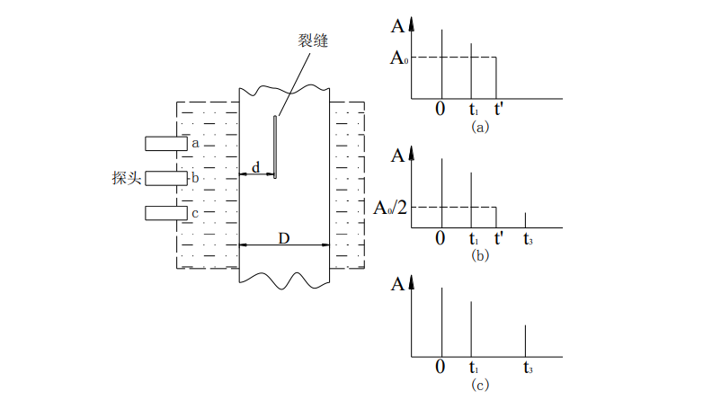

*朱文强 081730109*

# A类超声探伤
## 实验目的
* 了解超声波产生和发射的机理
* 测量水中声速或测量水层厚度
* 测量固体中的声速
* 测试超声实验仪器对于铝合金材料的分辨力
* 利用脉冲反射法进行超声无损探伤实验

## 实验原理
> 超声波是指频率高于 20KHz 的声波，与电磁波不同，它是弹性机械波，不论材料的导电性、导磁性、导热性、导光性如何，只要是弹性材料，它都可以传播进去，并且它的传播与材料的弹性有关，如果弹性材料发生变化，超声波的传播就会受到扰，根据这个扰动，就可了解材料的弹性或弹性变化的特征，这样超声就可以很好地检测到材料特别是材料内部的信息，对某些其它辐射能量不能穿透的材料，超声更显示出了这方面的实用性。与 X 射线、γ射线相比，超声的穿透本领并不优越，但由于它对人体的伤害较小，使得它的应用仍然很广泛。

### 超声脉冲反射法探伤
- 对于有一定厚度的工件来说，若其中存在缺陷，则该缺陷处会反射一与工件底部声程不同的回波，一般称之为缺陷回波。如图为一存在裂缝缺陷的工件

    

上图中，(a),(b),(c)分别反映了同一超声探头在a,b,c三个不同位置时的反射情况。在位置a时，超声信号被缺陷完全反射，此时缺陷回波的高度为 A0；在位置 c 时，该
处不存在缺陷，回波完全由工件底面反射；而在位置 b 时，由于超声信号一半由缺陷反射，一半由工件底面反射，缺陷回波的高度降为 A0/2，此处即为缺陷的边界——这种确定缺陷边界的方法称为半高波法。测量出工件的厚度 D，分别记录工件表面、底面及缺陷处回波信号的时间 t1、t2、t’，再利用半高波法，就可得到工件中缺陷的深度 d 及其位置。超声探头本身的频率特征及脉冲信号源的性质等条件决定了超声波探伤具有时间上的分辨率，该分辨率反映在介质中即为区分距离不同的相邻两缺陷的能力，称为分辨力。能区分的两缺陷的距离愈小，分辨力就愈高。

## 实验装置
该实验主要由 FD-UDE-B 型 A 类超声诊断与超声特性综合实验仪主机、数字示波器（选配）、有机玻璃水箱、配件箱（样品架两个，横向导轨一个，横向滑块一个，铝合金、冕玻璃、有机玻璃样品按高度不同各两个，分辨力测试样块一个，探伤实验用工件样块一个等）组成。

## 实验数据记录

* 测量水中声速

    |      $X / cm$      | $10$  |  $12$  | $14$  | $16$  | $18$  | $20$  |
    | :----------------: | :---: | :----: | :---: | :---: | :---: | :---: |
    |      *t / us*      | $118$ | $145$  | $172$ | $202$ | $226$ | $254$ |
    | $\frac{t}{2} / us$ | $59$  | $72.5$ | $86$  | $101$ | $113$ | $127$ |

    

    **水中声速测量结果为：$v=1468m/s$**

* 利用脉冲反射法进行超声无损探伤实验

    | 实验测量 |  裂缝一  | $t_1 / us$ | $t_1' / us$ | $t_3 / us$ |          $d_1 / mm$          | $x_1$ |
    | :------: | :------: | :--------: | :---------: | :--------: | :--------------------------: | :---: |
    |          |          |   $101$    |  $107.16$   |   $122$    |           $19.067$           | $97$  |
    |          |  裂缝二  | $t_1 / us$ | $t_1' / us$ | $t_3 / us$ |          $d_2 / mm$          | $x_2$ |
    |          |          |   $101$    |   $113.8$   |   $122$    |           $26.15$            | $70$  |
    | 直接测量 | $D / mm$ | $d_1 / mm$ | $d_2 / us$  | $\Delta X$ | $\Delta X$ 与实验值误差 $=4$ |
    |          |   $65$   |    $20$    |    $25$     |    $23$    |

## 思考题

- 在实验过程中如何区分波源、样品反射峰和杂峰的位置？判断的依据是什么？ 

    1. 波源信号是强度最大的信号。同时，无论怎样移动试样，波源信号的波形和相位不会改变。
    2. 样品反射波信号是强度稍次的信号。移动试样时，反射波信号与波源信号之间的相位差改变。
    3. 杂波强度较小，且相位分布不均匀。
  