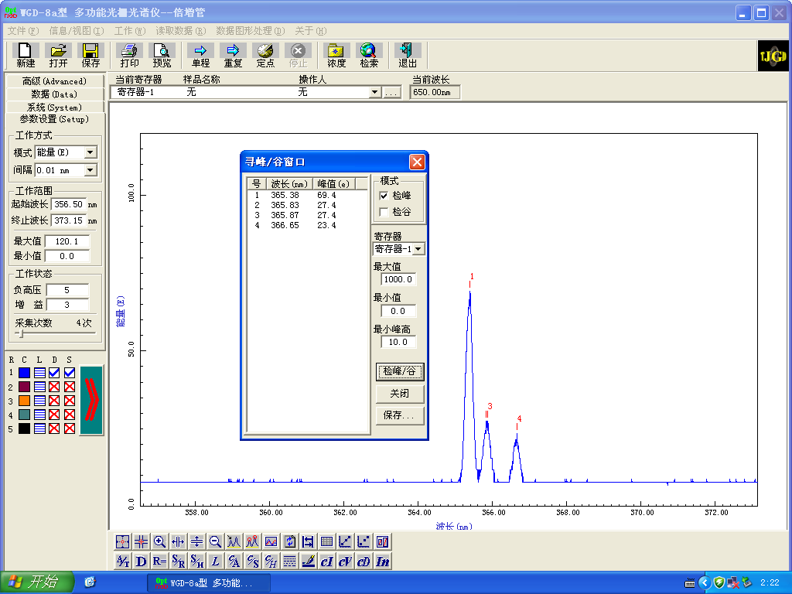
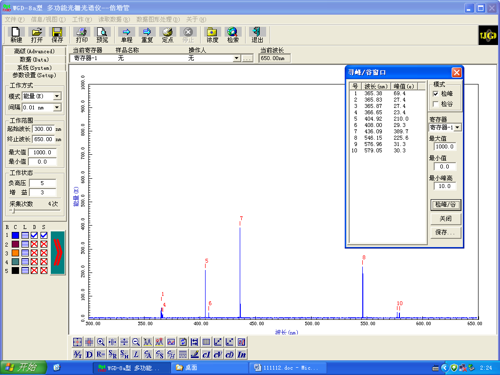
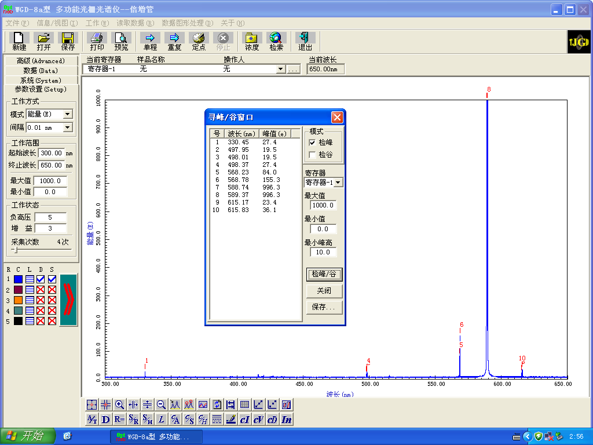
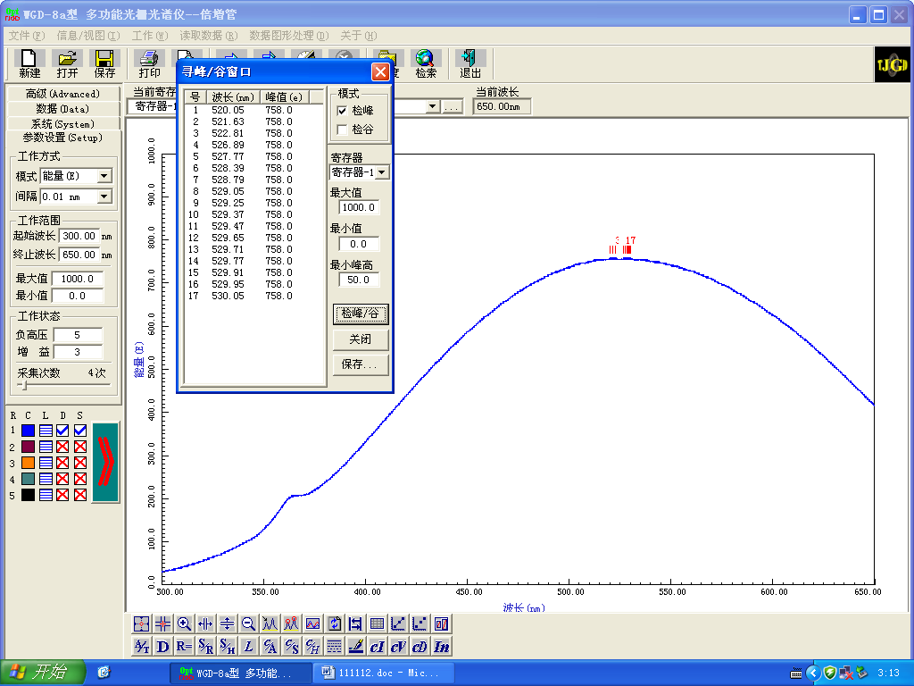

**stuID Name**

*同实验者：yyy yyy zzz*

# 光栅光谱

## 一 实验目的

1. 了解光栅光谱仪的结构和工作原理；
2. 学习光栅光谱仪的使用方法，了解光谱仪的应用；
3. 学会识别纳原子光谱等。

## 二 光栅光谱仪的结构和基本原理

$WGD-8A$型组合式多功能光栅光谱仪，由光栅单色仪，接收单元，扫描系统，电子放大器，$A/D$采集单元，计算机等部件组成。

<image src = "1.png">

光学系统采用的是切尔尼-特纳装置$(C-T)$型，如图 1 所示。准直和成象透镜的焦距是$500nm$，相对孔径$1/7$，光栅条数分别为 $2400l/mm$和$1200l/mm$，闪耀波长为$250nm$。闪耀光栅的原理如图 2 所示。图中的$n$为光栅表面的法线，$n'$为刻痕工作表面的法线；$\beta$和$\beta'$是相对于刻痕工作表面法线$n'$的入射角和反射角；$\phi$和$\theta$是相对于光栅表面法线$n$的入射角和反射角；$d$为光栅常数；$\alpha$为刻痕工作表面与光栅表面的夹角，称为闪耀角，是表征闪耀光栅的一个重要参数；$a$为刻痕工作表面的宽度。

对于普通平面光栅，因为单缝衍射的中央极大位置与零级谱重合，所以零级谱占据了多数能量。由光栅方程$d(\sin\phi\pm\sin\theta)=k\lambda$可知，零级光谱出现在$\theta = \phi$的位置上。对于透射光栅，单缝衍射中央极大的位置与入射光的透射方向相同，而对于反射光栅，单缝衍射中央极大的位置与反射光的方向相同。闪耀光栅入射角和衍射角的定义是指光线与光栅表面法线的夹角，因此，零级谱仍然出现在与光栅平面法线夹角为$\phi$的位置上，零级光谱的位置没有变化。但刻痕的工作面与光栅平面的夹角为$\alpha$，造成单缝衍射中央极大的位置与光栅平面法线的夹角变为$\phi-2\alpha$，这就导致单缝衍射中央极大的位置与零级光谱不再重合。角度$\phi-2\alpha$称为闪耀方向。一般情况下，采用闪耀波长来表述闪耀光栅的性质。闪耀波长$\lambda_B$是当$\phi = \theta = \alpha$时（即平行光垂直入射闪耀光栅平面），由光栅方程所确定的一级光谱的波长为$\lambda_B = 2d\sin\alpha$。现在分光仪器中使用的几乎都是反射式的闪耀光栅，其优点就是能将单缝中央极强的方向从没有色散的零级转移到其他有色散的光谱级上，从而把光能集中在该级谱线上。

狭缝是光谱仪器中的一个精密部件。光谱仪器的准直系统一般是由入射狭缝和准直物镜组成。光谱仪器所获得的不同波长的谱线是入射狭缝经过整个光学系统后形成的象。狭缝的好坏决定了光谱仪器的工作质量，除此以外，狭缝还起到控制进入光谱仪器光强的作用。在单色仪中，出射狭缝同样可以控制出射的单色光的强度。狭缝的几何形状是根据入射狭缝-谱线的物象共轭关系所确定的，一般有四边形（直缝）和弧形（弯缝）两种。狭缝又有缝宽不可变的固定狭缝和缝宽可以调节的可变狭缝两种。狭缝是由两个在同一平面上，并严格平行的刃面形成的，刃面的刀刃尖锐，不能有缺口、划痕和沾污。可变狭缝可以根据需要改变狭缝的宽度。本仪器中入射狭缝和出射狭缝均为直狭缝，宽度范围在$0-2mm$内可调，顺时针旋转，宽度加大，反之减小。

为了能方便地进行光谱数据的判读，通常要求在进行波长（波数）扫描时，从仪器的出射狭缝出射的光束波长（波数）值与色散元件的转角之间成线性关系。但是，由于衍射光栅的转角与波长（波数）并不成线性关系，因此在光谱仪器中必须采用适当的波长（波数）扫描机构才能实现波长（波数）的线性扫描。波长扫描机构是采用图 3 所示的正弦机构，光栅转台与长度为 $l$的正弦杆$P$固定连接、并可以一起绕轴$O$转动，正弦杆的另一端靠弹簧与螺母$N$保持接触，并可以左右自由滑动。当精密丝杠$B$转动时，推动螺母平移，最终推动正弦杆带着光栅绕$O$轴转动。螺母上下移动时$\phi$角随之改变。在图中$\sin\phi=x/l$由于正弦杆的长度$l$是固定的，$x$随螺母的上下移动而变化，这样转角的正弦值随之变化，所以这种扫描机构被称为正弦机构，特定条件下保证波长$\lambda$与$x$值成线性关系。

<image src = 2.png>

光谱的扫描过程、信号处理和光谱显示都是由计算机进行控制的，其工作原理如图 4所示。

光谱仪的探测器为光电倍增管或 $CCD$，用光电倍增管时，出射光通过狭缝 $S2$到达光电倍增管。用$CCD$做探测器时，转动小平面反射镜$M1$，使出射光通过狭缝$S3$到达$CCD$，$CCD$可以同时探测某一个光谱范围内的光谱信号。

光电倍增管是在光电管的基础上，在光阴极和阳极之间加入二次电子发射极。它的工作原理及剖面结构如图 5 所示，$K$为光阴极，$D_1,D_2...$为二次发射极，又称倍增极或打拿极，$A$为阳极。当光照射光阴极时，每一个光电子，在极间电场的作用下被加速，打到第一个倍增级$D_1$上，$D_1$发射出 $\sigma_1$个二次电子；这些二次电子再次在极间电场的作用下，打到第二个倍增极$D_2$上，产生$\sigma_2$个二次电子。如此继续下去，阳极将收集到$\sigma_n$个电子。这里，$n$为倍增级的数目，$\sigma$为二次电子发射系数。一般$\sigma = 3-5$，若$n=10$，光电倍增管的放大系数为$105-108$。极间电压一般为$100V$左右。由于光电倍增管有极高的积分灵敏度，当入射光能量过大时，轻者导致性能变坏，降低使用寿命，重者将造成电极烧毁。因此，必须严格控制入射光通量，加工作电压后不允许有强光照射。本仪器使用九级倍增管。

<image src = "3.png">
<image src = "4.png">

电荷耦合器件($CCD$)是一种新型光电转换器件，它能存储由光产生的信号电荷。当对它施加特定时序的脉冲时，其存储的信号电荷便可在$CCD$内作定向传输而实现自扫描，主要由光敏单元、输入结构和输出结构等组成。

光信号经过倍增管(或 $CCD$）变为电信号后，首先经过前置放大器放大，再经过$A/D$变换（模拟量转变成数字量），最终由计算机处理显示。前置放大器的增益、光电倍增管的负高压和$CCD$的积分时间可以由控制软件根据需要设置。前置放大器的增益现为七个档次，数越大放大器的增益越高。光电倍增管的负高压也分为七个档次，数越大所加的负高压越高，每档之间负高压相差约$200V$。$CCD$的积分时间可以在 $10ms-40s$之间任意改变。

扫描控制是利用步进电机控制正弦机构中丝杠的转动，进而实现光栅转动的。步进电机在输入一组电脉冲后，就可以转动一个角度，相应地丝杠上螺母就移动一个固定的距离。每输入一组脉冲，光栅的转动便使出射狭缝出射的光波长改变$0.1nm$。

## 三 实验仪器

$WGD-8A$多功能光栅光谱仪，计算机，低压汞灯，钨灯，氘灯等。

## 四 实验内容

1. 实验前，认真检查光栅光谱仪的各个部分（单色仪主机、电控箱、接受单元、计算机）连线是否正确，保证准确无误。入射狭缝、出射狭缝调节到合适的宽度。若接收单元采用光电倍增管时，注意负高压旋钮的调节。
2. 打开光谱仪电源以及计算机。启动$“WGD-8A CCD系统”$软件程序，熟悉软件界面的功能。
3. 采用标准光谱灯对光谱仪进行波长校准。利用低压汞灯的绿线波长$(546.1nm)$定标光谱仪扫描的光谱中该线位置。
4. 测量低压汞灯的各谱线的波长及能量值。观测汞光谱中 $365.0nm$的 3 线结构，测量它的 3 线波长并由此粗略计算此光谱仪的分辨本领。
5. 分别测定不同物质光源的谱线能量，由钠原子光谱确定各光谱项值$(T_{3p},T_{4p},T_{5p},T_{6p},T_{7p}...)$及能级值，画出能级图。
6. 观测钨灯以及氘灯的发射光谱，描叙它们的光谱线特征及区别。

# 汞灯分辨率

# 低压汞灯

# 钠灯

# 钨灯

   

