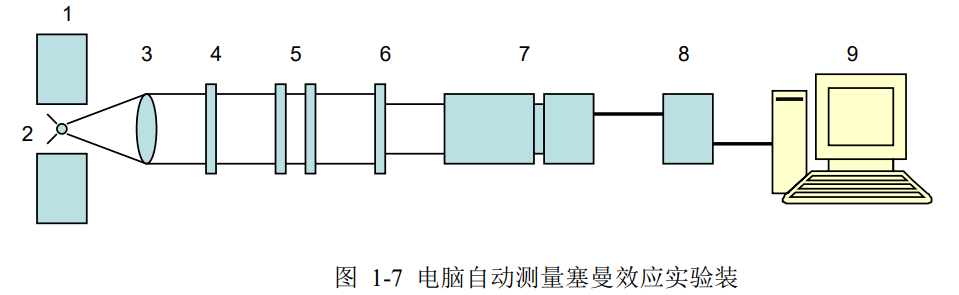
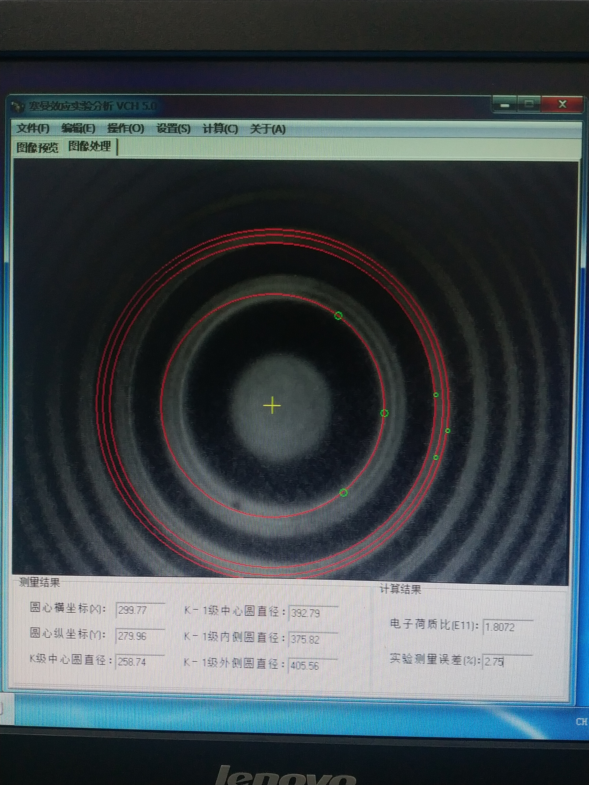

**081730109 朱文强**

# 塞曼效应

## 一 实验目的

1. 了解原子在磁场中能级的分裂和测量电子荷质比$e/m$的原理；
2. 学习光路调节和标准具，高斯计的使用方法。

## 二，实验原理

1. 原子的总磁矩与总角动量的关系

严格来说，原子的总磁矩由电子磁矩和核磁矩两部分组成，但由于后者比前者小三个数量级以上，所以暂时只考虑电子的磁矩这一部分。原子中的电子由于作轨道运动产生轨道磁矩，电子还具有自旋运动产生自旋磁矩。根据量子力学的结果，电子的轨道角动量$\overrightarrow{P_L}$和轨道磁矩$\overrightarrow{\mu_L}$以及自旋角动量$\overrightarrow{P_S}$和自旋磁矩$\overrightarrow{\mu_S}$在数值上有下列关系：$\mu_L = \frac{e}{2m}P_L$,$P_L = \sqrt{L(L+1)}\frac{h}{2\pi}$,$\mu_s = \frac{e}{m}P_S$,$P_S = \sqrt{S(S+1)}\frac{h}{2\pi}$式中$e,m$分别表示电子电荷和电子电量；$L,S$分别表示轨道量子数和自旋量子数；$h$为普朗克常数。轨道角动量和自旋角动量合成原子的总角动量$\overrightarrow{P_J}$,$J$为总角动量量子数；轨道磁矩和自旋磁矩合成原子的总磁矩$\overrightarrow{\mu}$,如图 1-1 所示。

<image src = "1.png">

由于$\mu_s$和$P_S$的比值是$\mu_L$和$P_L$比值的两倍，因此合成的原子总磁矩$\overrightarrow{\mu}$不在总角动量$\overrightarrow{P_J}$方向上。但由于$\overrightarrow{P_L}$和$\overrightarrow{P_S}$是绕$\overrightarrow{P_J}$旋进的，因此$\overrightarrow{\mu_L},\overrightarrow{\mu_S}$和$\overrightarrow{\mu}$都绕$\overrightarrow{P_J}$的延线旋进。把$\overrightarrow{\mu}$分解成量个分量：一个沿$\overrightarrow{P_J}$的延线，称为$\overrightarrow{\mu_J}$，这是有确定方向的恒量；另一个是垂直于$\overrightarrow{P_J}$的，它绕着$\overrightarrow{P_J}$转动，对外平均效果为零。因此，对外发生效果的是$\overrightarrow{\mu_J}$。

按照图 1-1 进行矢量运算，可以得到$\overrightarrow{\mu_J}$和$\overrightarrow{P_J}$数值上的关系：$\mu_J = g\frac{e}{2m}P_J$,式中：$g = 1+\frac{J(J+1)-L(L+1)+S(S+1)}{2J(J+1)}$叫做朗德$(lande)g$因数，它表征单电子的总磁矩与总角动量的关系，而且决定了能级在磁场中分裂的大小。具有两个或两个以上电子的原子，可以证明磁矩与原子的总角动量的表达式仍与式(1-1)相同，但$g$因数随着耦合类型的不同有两种计算方法。对于$LS$耦合，与单电子的$g$因数有相同的形式，只是$L,S和J$是各电子耦合后的数值。若是$JJ$耦合，$g$因数的表达式为：$g = g_i\frac{J(J+1)+j_i(j_i+1)-J_P(J_P+1)}{2J(J+1)}+g_P\frac{J(J+1)-j_i(j_i+1)+J_P(J_P+1)}{2J(J+1)}$

如果原子有$n$个电子，$j_i,g_i$分别表示一个电子的$J$值和$g$因数。

2. 外磁场对原子能级的影响

原子的总磁矩在外磁场中受到力矩$\overrightarrow{L}$的作用$\overrightarrow{L} = \overrightarrow{\mu_J}\times\overrightarrow{B}$式中$\overrightarrow{B}$表示磁感应强度。力矩$\overrightarrow{L}$使角动量发生旋进，见图 1-2，可以证明，旋进引起附加的能量为$\Delta E = -\mu_JB\cos\alpha$

<image src = "2.png">

把式(1-1)代入上式并注意到$\alpha,\beta$互为补角，得
$\Delta E = g\frac{e}{2m}P_JB\cos\beta$

由于$\overrightarrow{\mu_J}$和$\overrightarrow{P_J}$在磁场中取向是量子化的，也就是$\beta$角不是任意的。$\overrightarrow{P_J}$的分量只能是$\hbar$的整数倍，即：
$P_J\cos\beta = M\frac{h}{2\pi},M = J,(J-1),...-J$
共有$(2J+1)$个$M$值，把式(1-3)代入式(1-2)得$\Delta E = Mg\frac{eh}{4\pi m}B$

这样，无外磁场时的一个能级，在外磁场的作用下分裂成$(2J+1)$个子能级，分裂的能级是等间隔的，每个能级附加的能量由(1-4)决定，它正比于外磁场B和朗德g因数。

## 三 实验装置

本实验装置如图 1-7 所示

## 四 实验内容

通过实验观察 $Hg(546.1nm)$绿线在外磁场中的分裂情况，并测量$e/m$值。

1. 按照图 1-7 所示,依次放置各光学元件（偏振片可以先不放置），并调节光路上各光学元件等高共轴，点燃汞灯，使光束通过每个光学元件的中心。
2. 本实验使用塞曼效应实验软件进行数据分析。如图 1-8 所示，可以在前面直读测量的基础上，将读数望远镜和成像透镜去掉，装上$CCD$摄像器件，并连接$USB$外置图像采集卡，安装驱动程序以及塞曼效应实验分析$VCH4.0$软件，进行自动测量。注意这时偏振片上应该加装小孔光阑。具体软件的操作见软件的“使用说明“。

