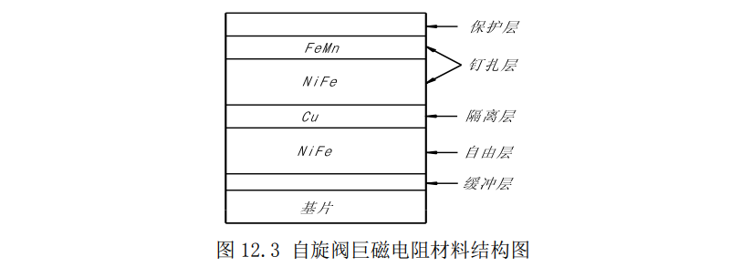

*stuID Name*

# 磁电阻效应实验

## 实验目的

- 了解不同磁电阻效应原理，测量不同磁场下三种材料磁电阻阻值$R_B$，作$\frac    {R_B}{R_0-B}$关系图，求:电阻相对变化率$\frac{R_B-R_0}{R_0}$的最大值；
 
- 学习磁电阻传感器定标方法，计算三种磁电阻传感器灵敏度；
- 测量三种磁电阻传感器输出电压$V_{输出}$与通电导线电流$I$的关系；
- 作自旋阀巨磁电阻传感器磁滞回线。

## 实验原理
- **自旋阀巨磁电阻效应**
  
    自旋阀巨磁电阻材料主要由钉扎层（一般由$FeMn$层和$NiFe$层构成）、自由层（$NiFe$层）和隔离层（$Cu$构成，为了防止氧化，一般再镀一层保护层。

    

    在钉扎层中，$FeMn$和$NiFe$之间存在交换耦合作用，这导致$NiFe$层中出现单向各向异性。因此，钉扎层的磁滞回线将以一非零场$H_B$为中心，（$H_B$为偏磁场）。自由层通过隔离层与钉扎层中的$NiFe$层存在很弱的耦合，所以自由层的磁滞回线基本上是以零场为中心的。因此，类似于多层膜中 GMR 的起因，在这样的结构中也存在较大的磁致电阻。在偏置场的作用下，钉扎层的磁矩方向在外场小于$H_B$时不发生改变，而自由层磁矩的方向则随外场方向变化而改变。当自由层磁矩与钉扎层磁矩平行时，体系处于低电阻状态，当两者反平行时，体系处于高电阻状态。由于体系的电阻随自由层磁矩方向的变化而改变，所以形象的称这种结构为自旋阀。

    本仪器所用自旋阀巨磁电阻传感器采用惠斯登电桥结构，惠斯登电桥由四只相同的巨磁电阻组成，其中$R_1$和$R_3$受外磁场作用时电阻增大，而$R_2$和$R_4$电阻减小。

    

## 实验数据 
* **实验一 计算不同磁场下的磁电阻阻值$R_B$，作$R_B / (R_0 - B)$关系图，求$(R_B-R_0)/R_0$最大值**

    ${\large B_0=\frac{8}{5^{\frac{3}{2}}} \cdot \frac{\mu_0NI}{R}}$

| 线圈电流$I/A$ | 磁场$B/mT$ | 电压表输出$V/V$ | $R_B/K$  | $R_B/R_0$ | 线圈电流$I/A$ | 磁场$B/mT$ | 电压表输出$V/V$ | $R_B/K$  | $R_B/R_0$ |
| :-----------: | :--------: | :-------------: | :------: | :-------: | :-----------: | :--------: | :-------------: | :------: | :-------: |
|      $0$      |    $0$     |    $1.7523$     | $1.3344$ |    $1$    |    $0.65$     |  $1.1689$  |    $1.7709$     | $1.3129$ | $0.9838$  |
|    $0.05$     |  $0.0899$  |    $1.7534$     | $1.3332$ | $0.9990$  |    $0.70$     |  $1.2588$  |    $1.7721$     | $1.3115$ | $0.9828$  |
|    $0.10$     |  $0.1798$  |    $1.7544$     | $1.3320$ | $0.9982$  |    $0.75$     |  $1.3488$  |    $1.7729$     | $1.3106$ | $0.9821$  |
|    $0.15$     |  $0.2698$  |    $1.7555$     | $1.3307$ | $0.9972$  |    $0.80$     |  $1.4387$  |    $1.7735$     | $1.3099$ | $0.9816$  |
|    $0.20$     |  $0.3597$  |    $1.7570$     | $1.3289$ | $0.9959$  |    $0.85$     |  $1.5286$  |    $1.7740$     | $1.3093$ | $0.9812$  |
|    $0.25$     |  $0.4496$  |    $1.7584$     | $1.3273$ | $0.9947$  |    $0.90$     |  $1.6185$  |    $1.7744$     | $1.3089$ | $0.9808$  |
|    $0.30$     |  $0.5395$  |    $1.7600$     | $1.3255$ | $0.9933$  |    $0.95$     |  $1.7084$  |    $1.7748$     | $1.3084$ | $0.9805$  |
|    $0.35$     |  $0.6294$  |    $1.7617$     | $1.3235$ | $0.9918$  |    $1.00$     |  $1.7984$  |    $1.7752$     | $1.3079$ | $0.9801$  |
|    $0.40$     |  $0.7193$  |    $1.7634$     | $1.3215$ | $0.9903$  |    $1.05$     |  $1.8883$  |    $1.7753$     | $1.3078$ | $0.9801$  |
|    $0.45$     |  $0.8093$  |    $1.7650$     | $1.3197$ | $0.9889$  |    $1.10$     |  $1.9782$  |    $1.7754$     | $1.3077$ | $0.9800$  |
|    $0.50$     |  $0.8992$  |    $1.7667$     | $1.3177$ | $0.9875$  |    $1.15$     |  $2.0681$  |    $1.7756$     | $1.3075$ | $0.9798$  |
|    $0.55$     |  $0.9891$  |    $1.7683$     | $1.3159$ | $0.9861$  |    $1.20$     |  $2.1580$  |    $1.7758$     | $1.3073$ | $0.9796$  |
|    $0.60$     |  $1.0790$  |    $1.7697$     | $1.3142$ | $0.9849$  |    $1.25$     |  $2.2479$  |    $1.7759$     | $1.3071$ | $0.9795$  |
 

$(R_B-R_0)/R_0$最大值为 0；

----

* **实验二 记录实验数据，以传感器输出电压$V_{输出}$为$Y$轴，磁场$B$为$X$轴作图，得到
    多层膜巨磁电阻传感器的灵敏度$K$。**

    | 线圈电流$I/A$ | 磁场$B/mT$ | 传感器输出$V_{输出}/V$ | 线圈电流$I/A$ | 磁场$B/mT$ | 传感器输出$V_{输出}/V$ |
    | :-----------: | :--------: | :--------------------: | :-----------: | :--------: | :--------------------: |
    |      $0$      |    $0$     |          $0$           |    $0.65$     |  $1.1689$  |        $0.0648$        |
    |    $0.05$     |  $0.0899$  |        $0.0041$        |    $0.70$     |  $1.2588$  |        $0.0680$        |
    |    $0.10$     |  $0.1798$  |        $0.0084$        |    $0.75$     |  $1.3488$  |        $0.0703$        |
    |    $0.15$     |  $0.2698$  |        $0.0131$        |    $0.80$     |  $1.4387$  |        $0.0720$        |
    |    $0.20$     |  $0.3597$  |        $0.0183$        |    $0.85$     |  $1.5286$  |        $0.0733$        |
    |    $0.25$     |  $0.4496$  |        $0.0238$        |    $0.90$     |  $1.6185$  |        $0.0745$        |
    |    $0.30$     |  $0.5395$  |        $0.0291$        |    $0.95$     |  $1.7084$  |        $0.0754$        |
    |    $0.35$     |  $0.6294$  |        $0.0346$        |    $1.00$     |  $1.7984$  |        $0.0763$        |
    |    $0.40$     |  $0.7193$  |        $0.0403$        |    $1.05$     |  $1.8883$  |        $0.0770$        |
    |    $0.45$     |  $0.8093$  |        $0.0458$        |    $1.10$     |  $1.9782$  |        $0.0776$        |
    |    $0.50$     |  $0.8992$  |        $0.0512$        |    $1.15$     |  $2.0681$  |        $0.0782$        |
    |    $0.55$     |  $0.9891$  |        $0.0563$        |    $1.20$     |  $2.1580$  |        $0.0787$        |
    |    $0.60$     |  $1.0790$  |        $0.0607$        |    $1.25$     |  $2.2479$  |        $0.0792$        |

    

    灵敏度$K$的值为 $11.25 mV/V/mT$：

    ---

* **实验三 记录实验数据，以传感器输出电压$V_{输出}$为${Y}$轴，被测电流值$I$为$X$轴作图。**
    
    | 被测电流$I/A$ | 传感器输出电压$V_{输出}/V$ | 被测电流$I/A$ | 传感器输出电压$V_{输出}/V$ |
    | :-----------: | :------------------------: | :-----------: | :------------------------: |
    |      $0$      |            $0$             |     $3.0$     |          $0.0045$          |
    |     $0.5$     |          $0.0006$          |     $3.5$     |          $0.0052$          |
    |     $1.0$     |          $0.0014$          |     $4.0$     |          $0.0060$          |
    |     $1.5$     |          $0.0022$          |     $4.5$     |          $0.0068$          |
    |     $2.0$     |          $0.0029$          |     $5.0$     |          $0.0075$          |
    |     $2.5$     |          $0.0037$          |     $5.5$     |          $0.0083$          |

    

    ---

* **实验四 记录实验数据，以传感器输出电压$V_{输出}$为$Y$轴，磁场$B$为$X$轴作图，作出自旋阀巨磁电阻传感器磁滞回线，计算自旋阀巨磁电阻传感器的灵敏度$K$，并与技术指标相比较。**

| 被测电流$I/A$ | 磁场$B/mT$ | 传感器输出$V_{输出}/V$ | 被测电流$I/A$ | 磁场$B/mT$ | 传感器输出$V_{输出}/V$ | 被测电流$I/A$ | 磁场$B/mT$ | 传感器输出$V_{输出}/V$ |
| :-----------: | :--------: | :--------------------: | :-----------: | :--------: | :--------------------: | :-----------: | :--------: | :--------------------: |
|      $0$      |    $0$     |          $0$           |      $0$      |    $0$     |        $0.0006$        |      $0$      |    $0$     |       $-0.0084$        |
|     $0.1$     |  $0.1798$  |        $0.0083$        |    $-0.1$     | $-0.1798$  |       $-0.0090$        |     $0.1$     |  $0.1798$  |        $0.0026$        |
|     $0.2$     |  $0.3597$  |        $0.0179$        |    $-0.2$     | $-0.3597$  |       $-0.0239$        |     $0.2$     |  $0.3597$  |        $0.0140$        |
|     $0.3$     |  $0.5395$  |        $0.0287$        |    $-0.3$     | $-0.5395$  |       $-0.0403$        |     $0.3$     |  $0.5395$  |        $0.0267$        |
|     $0.4$     |  $0.7193$  |        $0.0398$        |    $-0.4$     | $-0.7193$  |       $-0.0535$        |     $0.4$     |  $0.7193$  |        $0.0391$        |
|     $0.5$     |  $0.8992$  |        $0.0508$        |    $-0.5$     | $-0.8992$  |       $-0.0657$        |     $0.5$     |  $0.8992$  |        $0.0511$        |
|     $0.6$     |  $1.0790$  |        $0.0604$        |    $-0.6$     | $-1.0790$  |       $-0.0769$        |     $0.6$     |  $1.0790$  |        $0.0613$        |
|     $0.7$     |  $1.2588$  |        $0.0678$        |    $-0.7$     | $-1.2588$  |       $-0.0875$        |     $0.7$     |  $1.2588$  |        $0.0684$        |
|     $0.8$     |  $1.4387$  |        $0.0719$        |    $-0.8$     | $-1.4387$  |       $-0.0922$        |     $0.8$     |  $1.4387$  |        $0.0723$        |
|     $0.9$     |  $1.6185$  |        $0.0744$        |    $-0.9$     | $-1.6185$  |       $-0.0964$        |     $0.9$     |  $1.6185$  |        $0.0748$        |
|     $1.0$     |  $1.7984$  |        $0.0762$        |    $-1.0$     | $-1.7984$  |       $-0.0995$        |     $1.0$     |  $1.7984$  |        $0.0765$        |
|     $1.1$     |  $1.9782$  |        $0.0776$        |    $-1.1$     | $-1.9782$  |       $-0.1018$        |     $1.1$     |  $1.9782$  |        $0.0777$        |
|     $1.2$     |  $2.1580$  |        $0.0787$        |    $-1.2$     | $-2.1580$  |       $-0.1036$        |     $1.2$     |  $2.1580$  |        $0.0789$        |
|     $1.1$     |  $1.9782$  |        $0.0776$        |    $-1.1$     | $-1.9782$  |       $-0.1018$        |
|     $1.0$     |  $1.7984$  |        $0.0764$        |    $-1.0$     | $-1.7984$  |       $-0.0995$        |
|     $0.9$     |  $1.6185$  |        $0.0746$        |    $-0.9$     | $-1.6185$  |       $-0.0966$        |
|     $0.8$     |  $1.4387$  |        $0.0721$        |    $-0.8$     | $-1.4387$  |       $-0.0923$        |
|     $0.7$     |  $1.2588$  |        $0.0785$        |    $-0.7$     | $-1.2588$  |       $-0.0863$        |
|     $0.6$     |  $1.0790$  |        $0.0621$        |    $-0.6$     | $-1.0790$  |       $-0.0775$        |
|     $0.5$     |  $0.8992$  |        $0.0536$        |    $-0.5$     | $-0.8992$  |       $-0.0669$        |
|     $0.4$     |  $0.7193$  |        $0.0437$        |    $-0.4$     | $-0.7193$  |       $-0.0550$        |
|     $0.3$     |  $0.5395$  |        $0.0327$        |    $-0.3$     | $-0.5395$  |       $-0.0428$        |
|     $0.2$     |  $0.3597$  |        $0.0202$        |    $-0.2$     | $-0.3597$  |       $-0.0306$        |
|     $0.1$     |  $0.1798$  |        $0.0102$        |    $-0.1$     | $-0.1798$  |       $-0.0185$        |
  

---

## 思考题
- **请根据不同磁电阻原理推测你所测的磁滞回线与其他磁电阻的磁滞回线的区别，并作相应的解释。**

    由于自旋阀巨磁电阻材料具有低饱和场的特点，它的剩余磁化强度更弱，因此磁滞回线更为细长。