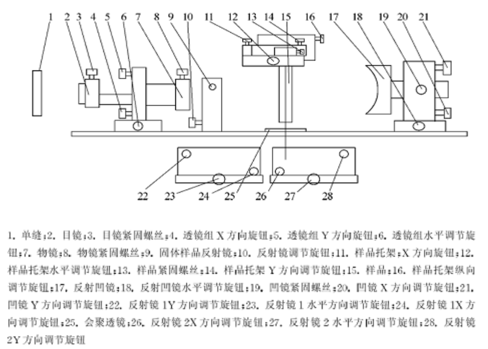

**stuID Name**

*同实验者：081730101 洪涵真，081730125 刘鹏凯*

# 拉曼散射

## 实验目的

1. 掌握拉曼散射的基本原理，初步学会根据拉曼散射光谱来确定分子结构及其简正振动类型。
2. 掌握拉曼散射光谱的实验技术。

## 实验原理

1. 当受光照射时，介质对光除反射、吸收和透射之外，总有一部分向四周散射。相对于入射光的频率或波数改变可分为三类散射。第一类是散射光的频率与入射光的基本相同，频率变化小于 $3×105Hz$，相应的波数变化小于 $10^{-5}cm^{-1}，通常称它为瑞利（$Rayleigh$)散射；第二类是频率变化约为 $3×109Hz$，波数变化约为 $0．1cm^{-1}，称为布里渊（$Brilouin$）散射，第三类的频率或波数变化比较大，频率变化大于 $3×10^{10}Hz$，波数变化大于 $1cm^{-1}，这就是拉曼（$Raman$）散射。拉曼散射对应于分子的转动、振动能级之间的跃迁范围，它是由印度科学家拉曼（$C.V.Raman$）于 1928年发现的。

从散射光的强度来看，瑞利散射最强，是入射光的 $10^{－3}$ 左右，拉曼散射最弱，通常小于入射光的 $10^{－6}$，因此当强度、单色性和方向性极好的激光的诞生，以及高质量、低杂散光的单色仪和高灵敏度的微弱信号检测系统出现以后，拉曼散射光谱技术才得以迅速发展。除了传统的线性拉曼光谱技术外，还发展了许多新的线性和非线性激光拉曼光谱技术，目前它已成为科研和应用技术强有力的工具，被广泛地应用于物质鉴定、分子结构等物理、化学、地学、生命科学以及环境科学等领域。

实验得到的拉曼散射光谱图，在外观上有三个明显的特征：第一，拉曼散射谱线的波数$\tilde{v}$随入射光的波数$\tilde{v_0}$而变化，但对同一样品，同一拉曼线的波数差$\Delta \tilde{v} = \tilde{v}-\tilde{v_0}$则保持不变。第二，在以波数为单位的拉曼光谱图上，以入射光波数为中心点，两侧对称分列着拉曼谱线，$\Delta \tilde{v}<0$的称斯托克斯（$stokes$）线，$\Delta \tilde{v}>0$的称反期托克斯($anti-stokes$)线。第三，一般情况下斯托克斯线的强度都大于反斯托克斯线。

## 实验仪器

## 实验内容

1. 将四氯化碳倒入液体池内，调整好外光路，注意将杂散光的成像对准单色仪的入射狭缝上，并将狭缝开至 $0.1mm$ 左右；
2. 启动 $LRS-II/III$ 应用软件；
3. 输入激光的波长；
4. 扫描数据；
5. 采集信息；
6. 测量数据；
7. 读取数据；记录$CCl_4$分子的振动拉曼光谱和偏振光谱，分析和辨认各谱线所对应的简正振动类型和对称性质。
8. 寻峰；
9. 修正波长
10. 计算拉曼频移。

