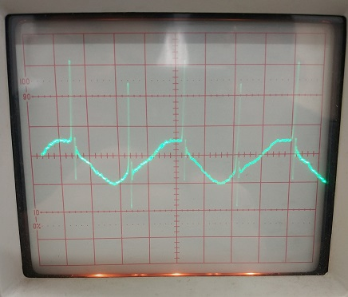
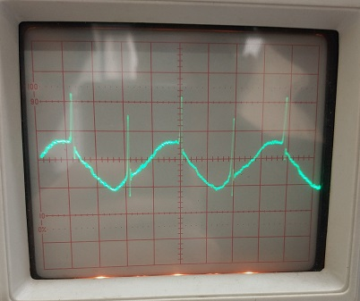
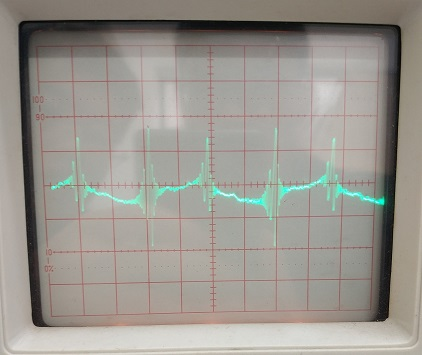
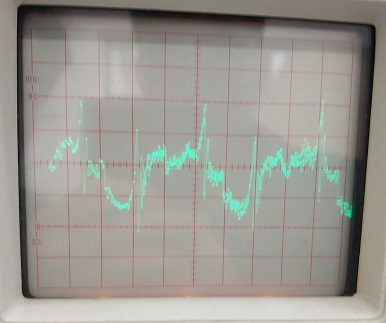
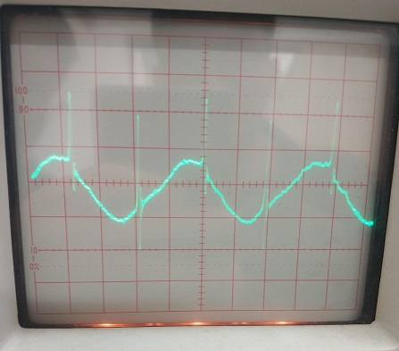
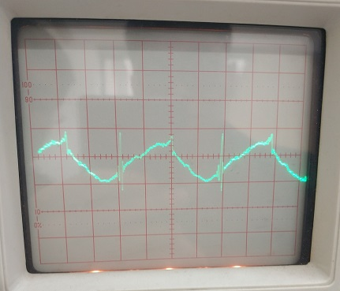

**stuID Name**

# 核磁共振

## 一、实验原理

设磁性核的核磁矩为$\overrightarrow{\mu}$,本征角动量为$\overrightarrow{P}$，则有$\overrightarrow{\mu}=\frac{q}{2m_N}\overrightarrow{P}$

其中 $q$ 为原子核电荷，$m_N$为原子核的质量。但是实验测量表明，上式与实验值不符，必须引进一个无量纲因子 $g$，写成$\overrightarrow{\mu}=g\frac{q}{2m_N}\overrightarrow{P}$

实验测出质子的 $g=5.585691$，中子的 $g=-3.8262$。可见，中子虽然是电中性的，但它也有
自旋磁矩，其磁矩相对于角动量是负值，它的磁矩类型与一个旋转的负电荷相似，$g$ 称为朗德因子，不同的核有不同的朗德因子，它无法通过理论计算得到，只能由实验测定。为方便起见，我们定义$\mu_N$作为原子核磁矩的单位，称为核磁子。

$\mu_N=\frac{q\hbar}{2m_N}=5.050824\times10^{-27}J/T$

式中$\hbar=h/2\pi$ ，$h$ 为普朗克常数。原子核磁矩可写成$\overrightarrow{\mu}=\frac{1}{\hbar}g\mu_N\overrightarrow{P}$

### 1.磁共振的产生和观察方法

(1) 核自旋能级在外磁场中的塞曼分裂

<image src = "1.png">

对于自旋为 $I$ 的核，处于$(2I+1)$度能级简并态，如果把它放入磁场强度为$\overrightarrow{B}$的外磁场中，角动量$\overrightarrow{P}$和磁矩$\overrightarrow{\mu}$将以圆频率将以圆频率$\omega_0$绕$\overrightarrow{B}$方向进动，如图 1。设$\overrightarrow{B}$方向与 z 坐标重合，则$\overrightarrow{P}$在 z 方向的投影$m_I\hbar$产生(2I+1)个分立值，mI 称为磁量子数，核能级产生相应的塞曼分裂，形成$(2I+1)$个磁能级，各能级的能量可以用$E=-g\mu_Nm_IB$表达，相邻能级间的能量差$\Delta E=g\mu_NB$引进符号$\gamma$，写成$\Delta E = \gamma\hbar B$，显然$\gamma=\frac{g\mu_N}{\hbar}$，$\gamma$称为旋磁比，显然其值只能由实验测定。

## 二、实验装置

<image src = "2.png">

实验装置由永磁铁、边限振荡器，电源，频率计、示波器等组成，如图 3-5。为了测定磁场，还配备了数字式特斯拉计。永磁铁中央部分为约 $500mT$ 的均匀磁场，磁极上绕有扫描线圈，通 $50Hz$ 的正弦交流电。为保证中央部分磁场均匀，永磁铁磁极面积较大，两极的平行度应调节得很好。边限振荡器是处于振荡与不振荡之间的仪器，其振荡线圈装在仪器背面伸出的样品管前端，它既作发射线圈，又作接收线圈，频率可以粗调、细调，射频信号的强度也可以调节，发射的射频磁场与外磁场相垂直。共振发生在$ω=γB，B=B_0+B’$，对接收信号放大与检波的电路也在边限振荡器中，由输出端输出至示波器的 $Y$ 轴。电源对边限振荡器及音频扫描线圈供电，扫描磁场的振幅可以调节，另外还有专门的接线柱把音频信号输到示波器的 $X$ 轴，以便观察碟形信号，这一路输出信号的幅度和位相均可以调节。数字式特斯拉计的探头是一个霍尔元件，利用它放入磁场产生的霍尔电压直接变换成毫特斯拉用数字显示出来，测量前需要先调零，测量时霍尔元件的宽面必须与磁场方面垂直，否则读出的是磁场的一个分量，使用完毕应该保护好探头。

## 三、实验内容

1. 将电源的扫描调节旋钮逆时针调到最小，打开电源，示波器和频率计，予热二十分钟，将 1 号样品轻轻装入样品管端，调节前后、左右、高低位置，使样品处于磁场中央。
2. 将扫描调节顺时针调到最大附近，粗调边限振荡器频率，注视示波器信号，在共振频率附近有较强的共振吸收信号闪现，将粗调调到共振频率附近。调频率细调旋钮、信号强度旋钮、示波器扫描微调旋钮及核磁共振仪的扫描调节旋钮等，使吸收信号清晰、稳定、且有清晰的尾波，尾波的节数较多。当吸收信号间的间距相等时，射频信号的频率即为共振频率，符合 $2πυ=γB_0$ 的条件，记下共振频率，按示波器上的格数画出吸收信号的图形。
3. 调节射频频率，根据吸收信号一分为二又合二而一的现象，测定扫描磁场的振幅 $B_m$.。
4. 利用碟形信号测定共振频率，记录碟形图形（按示波器格数）分析内扫法和相移法测共振频率的优缺点
5. 观察样品在磁场的不同位置时的信号强弱、尾波形状，信号宽度的变化，并进行分析讨论。
6. 更换样品，测各样品的共振频率，观察吸收信号变化，并进行分析讨论。
7. 数字式特斯拉计测出样品所在处的磁感应强度，计算氢核的旋磁比，并与标准值
$\gamma_H=2.6752\times10^{8}/T\cdot s$ 比较，算出氢核的 $g$ 因子。

1. $CuSO_4$：

    

2. $FeCl_3$：

    

3. $HF(H)$：

    
4. $HF(F)$：

    

5. $丙三醇$

    

6. $纯水$：

    

|      样品       | $CuSO_4$  | $FeCl_3$  |  $HF(H)$  |  $HF(F)$  |  丙三醇   |   纯水    |
| :-------------: | :-------: | :-------: | :-------: | :-------: | :-------: | :-------: |
| 共振频率$f/MHz$ | 22.192275 | 22.193038 | 22.193591 | 20.876060 | 22.189677 | 22.189734 |

由$HF$样品中$H$的共振频率$f=22.193591MHz$得到当前样品位置处磁场强度$B_0=2\pi f/\gamma_H=0.521T$

由$B_0$和$F$的共振频率$f=20.876060MHz$：$\gamma_F=2\pi f_F/B_0=251.76MHz/T$

