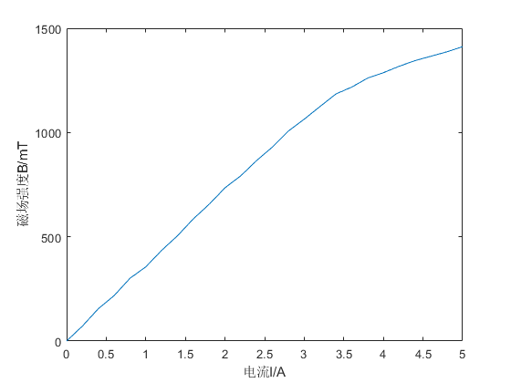

**stuID Name**

# 法拉第效应

## 一 实验目的

1. 用毫特斯拉计测量电磁铁磁头中心的磁感应强度，分析线性范围。
2. 消光法测量样品的费尔德常数。

## 二 实验原理

实验表明，在磁场不是非常强时，如图 1 所示，偏振面旋转的角度$\theta$与光波在介质中走过的路程$d$及介质中的磁感应强度在光的传播方向上的分量$B$成正比，即：$\theta = VBd$。比例系数$V$由物质和工作波长决定，表征着物质的磁光特性，这个系数称为费尔德常数。 费尔德常数与磁光材料的性质有关，对于顺磁、弱磁和抗磁性材料（如重火石玻璃等），$V$为常数，即$\theta$与磁场强度$B$有线性关系；而对铁磁性或亚铁磁性材料（如$YIG$等立方晶体材料），$\theta$与$B$不是简单的线性关系。

<image src = "1.png">

表 1 为几种物质的费尔德常数。几乎所有物质（包括气体、液体、固体）都存在法拉第效应，不过一般都不显著。

|    物质    | $\lambda(nm)$ |                  $V$                  |
| :--------: | :-----------: | :-----------------------------------: |
|     水     |    $589.3$    |          $1.31\times 10^{2}$          |
|  二硫化碳  |    $589.3$    |          $4.17\times 10^{2}$          |
| 轻火石玻璃 |    $589.3$    |          $3.17\times$ 10^{2}          |
| 重火石玻璃 |    $830.0$    |  $8\times 10^{2} - 10\times 10^{2}$   |
|   冕玻璃   |    $632.8$    | $1.36\times 10^{2}-7.27\times 10^{2}$ |
|    石英    |    $632.8$    |          $4.83\times 10^{2}$          |
|    磷素    |    $589.3$    |          $12.3\times 10^{2}$          |

不同的物质，偏振面旋转的方向也可能不同。习惯上规定，以顺着磁场观察偏振面旋转绕向与磁场方向满足右手螺旋关系的称为“右旋”介质，其费尔德常数$V>0$;反向旋转的称为“左旋”介质，费尔德常数$V<0$

对于每一种给定的物质，法拉第旋转方向仅由磁场方向决定，而与光的传播方向无关（不管传播方向与磁场同向或者反向），这是法拉第磁光效应与某些物质的固有旋光效应的重要区别。固有旋光效应的旋光方向与光的传播方向有关，即随着顺光线和逆光线的方向观察，线偏振光的偏振面的旋转方向是相反的，因此当光线往返两次穿过固有旋光物质时，线偏振光的偏振面没有旋转。而法拉第效应则不然，在磁场方向不变的情况下，光线往返穿过磁致旋光物质时，法拉第旋转角将加倍。利用这一特性，可以使光线在介质中往返数次，从而使旋转角度加大。这一性质使得磁光晶体在激光技术、光纤通信技术中获得重要应用。

与固有旋光效应类似，法拉第效应也有旋光色散，即费尔德常数随波长而变，一束白色的线偏振光穿过磁致旋光介质，则紫光的偏振面要比红光的偏振面转过的角度大，这就是旋光色散。实验表明，磁致旋光物质的费尔德常数$V$随波长$\lambda$的增加而减小。

## 三 实验仪器

该实验主要由法拉第效应塞曼效应综合实验仪控制主机、励磁电源、电磁铁、转台、激光器、起偏器、检偏器、探测器、薄透镜、干涉滤色片、$F-P$标准具、厚透镜以及测微目镜组成实验装置如图所示。

## 四 实验过程

1. 仪器连接：

    1. 实验桌上依次放置$50cm$导轨（上面放置四个滑块以及合适的光学元件）、电磁铁（放于转台上）、$65cm$导轨（上面放置五个滑块以及合适的光学元件）、控制主机以及励磁电源，将样品架固定在磁铁中心，并转动样品架前端的旋钮使法拉第效应实验样品能够正好处于磁铁中心。
    2. 接通励磁电源以及控制主机的电源，检查控制主机上的$LED$表和励磁电源的$LCD$表是否正常显示，如果表头不亮，检查仪器电源线插座的保险丝是否正常工作。
    3. 将激光器与控制主机上的“激光器”电源用连接线相连，检查激光器是否正常工作，调节激光器前端的调焦镜头使出射光线在$1m$左右处光斑直径最小。将毫特斯拉计探头与控制主机上的探头“输入”端相连，将探头放置于无干扰磁场处，调节“调零”电位器使表头显示“$000mT$”,然后将探头通过固定螺母固定在样品架后板上的下端孔处，拉动样品架，探头可以处于磁头间隙中心。
    4. 将笔形汞灯固定在臂形支架上，另一端与主机“汞灯电源“相连。打开主机“电源－$LAMP$”开关，检查笔形汞灯是否正常工作。调节主机“激光功率计”中的“调零”电位器，使表头显示为零（底下换挡开关置于任意一档都可以），用连接线将探测器与主机上激光功率计的“输入”端相连。
    5. 将电磁铁两个线圈并联后与励磁电源相连，并用毫特斯拉计探头检查两个线圈通电方向，要求两个线圈产生磁场方向一致，判断方法是将励磁电源电流调节至最大（$5A$左右），此时磁铁中心产生磁感应强度至少$1.2T$,如果数值较小，说明两线圈产生磁场方向相反。

<image src = "2.png">

2. 励磁电流与电磁铁产生的磁场关系测量

    1. 将毫特斯拉计探头移至磁头中心，打开励磁电源。
    2. 调节励磁电流，从$0$至$5.0A$，每增加 $0.2A$，记录相应的磁感应强度数值填入表一，做励磁电流 $I$与磁感应强度$B$的关系图，分析其线性范围。

3. 法拉第效应实验

    1. 如图 3 所示，电磁铁纵向放置，一边滑块上依次固定“激光器”－“起偏器”，另一边滑块上依次固定“检偏器”－“探测器”。
    2. 调节激光器固定架上的两维调节旋钮，使激光斑完全通过电磁铁的中心孔（注意，这一步要求仔细调节，之前需要调节激光器前端的调焦镜头使激光斑在一定范围内发散角比较小），调节探测器前端的光阑，使通过电磁铁的激光能够完全被探测器接收。
    3. 拿掉检偏器，旋转起偏器使探测器输出数值最大，这是因为半导体激光器输出光为部分偏振光，调节起偏器使其透光轴方向与部分偏振光较大电矢量方向一致，这样光强输出较大，可以提高后面法拉第效应实验的效果。（可以在法拉第效应实验之前，测量激光器的偏振度）
    4. 放入检偏器，并调节样品架前端的旋钮，升起实验样品，并移动样品架，使直径较小的旋光玻璃样品处于磁场中间，并且激光完全通过样品，调节检偏器的中心转盘，使得探测器输出最小，即正交消光（因为其它因素影响，探测器输出数值不会为零，找到最小值即可）。
    5. 打开励磁电源，逐渐增加励磁电流,$0-2.4A$,每次增加$0.4A$，分别测量对应的磁致旋光角度，记下消光位置$x$，则前后两次的消光偏转的角度为$\Delta \theta = 190\Delta x$（单位：$min$）。数据填入表二,因为旋光玻璃样品实验现象非常明显，所以磁场不需要加到最大
    6. 根据公式$\Delta \theta = V\Delta Bd$，其中，样品厚度$d$为$5.02mm$，计算样品的费尔德常数$V$
    7. 同样过程，测量另外一种样品的费尔德常数，因为该样品费尔德常数相对较小，所以应该加较大的磁场测量。

表一 励磁电流与磁头中心磁感应强度关系数据记录

| $I(A)$ | $B(mT)$ | $I(A)$ | $B(mT)$ | $I(A)$ | $B(mT)$ |
| :----: | :-----: | :----: | :-----: | :----: | :-----: |
| $0.00$ |   $0$   | $1.80$ |  $656$  | $3.60$ | $1218$  |
| $0.20$ |  $72$   | $2.00$ |  $735$  | $3.80$ | $1261$  |
| $0.40$ |  $155$  | $2.20$ |  $793$  | $4.00$ | $1287$  |
| $0.60$ |  $218$  | $2.40$ |  $866$  | $4.20$ | $1318$  |
| $0.80$ |  $301$  | $2.60$ |  $931$  | $4.40$ | $1345$  |
| $1.00$ |  $356$  | $2.80$ | $1007$  | $4.60$ | $1366$  |
| $1.20$ |  $435$  | $3.00$ | $1064$  | $4.80$ | $1387$  |
| $1.40$ |  $505$  | $3.20$ | $1125$  | $5.00$ | $1412$  |
| $1.60$ |  $586$  | $3.40$ | $1185$  |

---

表二 旋光玻璃样品法拉第效应测试数据

| $I(A)$ | $B(mT)$ | $转动角度\Delta \theta$ | $菲尔德常数V$ |
| :----: | :-----: | :---------------------: | :-----------: |
|  $0$   |   $0$   |          $--$           |     $--$      |
| $0.4$  |  $155$  |          $390$          |  $0.501221$   |
| $0.8$  |  $301$  |          $690$          |  $0.456645$   |
| $1.2$  |  $435$  |          $750$          |  $0.343454$   |
| $1.6$  |  $586$  |         $1140$          |  $0.387528$   |
| $2.0$  |  $735$  |         $1500$          |  $0.406537$   |
| $2.4$  |  $866$  |         $1740$          |  $0.400247$   |