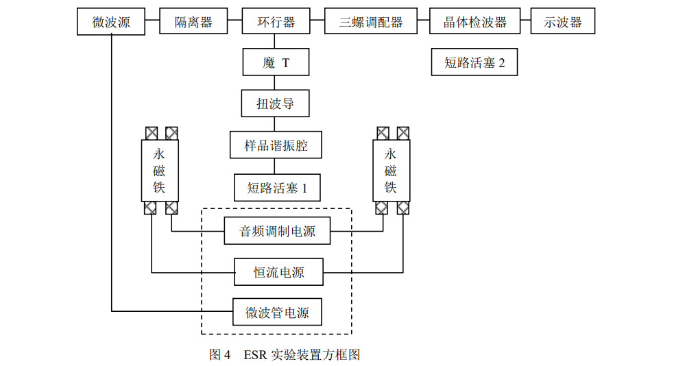
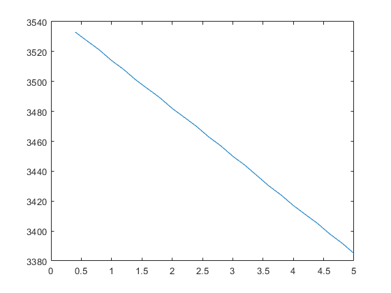

**stuID Name**

# 电子自旋

## 一，原理

原子的总磁矩包括电子磁矩和核磁矩，而电子磁矩又由电子轨道磁矩和电子自旋磁矩两部分组成（参阅实验一原理 1，2，3）。理论和实验证明，对于固相物质和液相物质，电子的轨道角动量要被邻近的原子或离子所产生的电场完全淬灭。所以对固相和液相物质来说，电子磁矩来源于电子的自旋磁矩。

根据泡利不相容原理，分子中一个轨道只能容纳两个自旋方向相反的电子。如果分子中所有轨道都已被填满，它们的自旋磁矩就完全被抵消，分子呈现抗磁性。
通常大多数化合物都是抗磁性的。仅当分子中一个或数个轨道只有一个电子时，自旋磁矩没有抵消，分子呈现顺磁性，所以$ESR$ 也称为顺磁共振，只有顺磁物质才可
以观测其 $ESR$ 信号。本实验所使用的样品为 $DPPH （Di-Phenyyl-Pieryl-Hydrazyl）$，叫作二苯基-苦基-肼基，是一个稳定的自由基，分子式为$（C_6H_5）_2N-NC_6H_2（NO_2）_3$，分子结构如图 1 所示。从图中可以看出，第二个氮原子少了一个共价键，有一个未偶电子。

<image src = "1.png">

因为电子的自旋量子数为$\pm\frac{1}{2}$，正如实验 1 原理所述，自旋电子将产生塞曼效应，分裂为两个能级，如图 2。图中

$E_1=-\frac{1}{2}g\mu_BB$

$E_2=\frac{1}{2}g\mu_BB$

式中 $g$ 为朗德因子，标准值 $g=2.0037(2)$，$μB$为电子自旋磁矩的玻尔磁子，

<image src = "2.png">

$\mu_B=\frac{e\hbar}{2m_e}=9.274078\times10^{-24}J/T$

$m_e,e$分别为电子的质量和电量，$\hbar=h/2\pi$

## 二，实验内容

实验装置包括永磁铁，ESR 仪，微波系统，示波器和数字式特斯拉计。方框图如图 4

1. ESR仪

    内部装有微波发射管的电源，音频调制电源和恒流源，分别使微波发射管、音频扫描磁场和直流可调励磁线圈工作。线圈产生的直流磁场 0—10mT 范围内连续可调，扫描磁场的幅度也可调节。

2. 微波系统

    （1）微波传播的路径

    微波源是半导体微波发射管，产生 $9.37GHz$ 微波，传向隔离器，隔离器是单向传播的微波元件，微波只能向前传播，不允许前面的微波反过来影响发射管。环行器规定了微波从隔离器出来只能向扭波导方向传播，通过样品腔至短路活塞，在活塞处反射。如果活塞的位置恰当，在矩形波导内将形成驻波。如果驻波的波峰（电场和横向磁场最强处）就在样品位置，共振吸收最强，示波器上出现最强的吸收信号。微波波导中的驻波场分布见实验 2 中的图 2-13。由于驻波的周期性，活塞位置移动$λ_g/2$，仍可获得最佳信号。$λ_g$为微波在波导中的波长。

    由三个匹配螺钉和检波器构成的波导称为检测臂。三个匹配螺钉厂方已调好，不要对它们调节，最后装一个检波二极管。检测臂端头调节螺丝为活塞 2。由扭波导向后传的微波，通过环行器，只能向检测臂传播，二极管对微波进行检波，产生的直流信号直接反映了微波的强弱，调节活塞 2，改变检测臂内电磁场分布，使检测到的信号最强。从检测臂出来的微波经环行器到隔离器，被隔离器吸收。

    （2）扭波导的作用

    由实验 2 的图 2-13 可见，当微波系统调节好后，微波波导内形成驻波且其波峰在样品管处。波峰是指波导管内电场和横向磁场最强处。所谓横向磁场，是指磁场方向平行于波导矩形截面的宽边。根据电子自旋共振的条件，要求微波的磁场方向与外磁场垂直，扭波导的作用就是将波导管转 $90^0$，使波导的宽边处于竖直位置，以满足共振条件。

    （3）微波系统的调整

    将示波器的输入信号置于 $DC$ 档，$V/div$ 放在 $0.1～0.5$ 档，调检测臂的端头活塞 2，使示波器上的水平线处于最高位置，此时检测臂达到了最佳状态。

    接着调样品谐振腔端头的短路活塞 1，使示波器上的水平线降到最低位置，此时样品谐振腔中形成了驻波。波导管内所储存的微波能量最大，回输到检测器的能量就相应地降低了，整个微波系统达到了最佳工作状态。

    测量时必须用 $AC$ 档，$V/div$ 放到灵敏度最高档（顺时针旋到底）$10mV/div$。

3. 永磁铁

    永磁铁提供 320mT 左右的固定磁场，为了使中央磁场均匀，磁铁面积很大，要求两磁极的平行度非常好，磁极面要保持清洁。

## 三、实验内容

1. 将电子自旋共振仪的直流磁场及扫描磁场旋钮逆时针调到最小，开启 ESR 仪和示波器预热十分钟。

2. 仔细调节样品位置，使它处在磁场的正中央。
3. 按实验装置 2（3）节的步骤，将微波系统调至最佳状态。
4. 将扫描磁场调节旋钮顺时针调到较大的位置，再调直流磁场调节旋钮，示波器上出现吸收信号。观察信号形状随直流磁场增加的变化情况，直到吸收信号之间的距离相等为止，在实验报告中进行描述。
5. 细调样品塞端头的活塞 1，检测臂端头的活塞 2，扫描磁场及直流磁场使信号形状最好，幅度最大，间距相等，记下活塞 1 千分尺的刻度值 A1，画出吸收信号波形图。
6. 继续调活塞 2，观察信号变化情况，并在实验报告中进行说明，信号消失后继续调节，会第二次出现吸收信号，达到最佳状态时记下活塞位置 $A_2$，则波导波长$λ_g$为

    

    $\lambda_g=2|A_2-A_1|$

    $\frac{1}{\lambda_g^2}=\frac{1}{\lambda_0^2}-\frac{(m/a)^2+(n/b)^2}{4}$

    

    式中$λ_0$为微波在真空中的波长，$m$ 和 $n$ 分别为驻波在宽边和窄边方向的节点数，其中 $m=1，n=0，a=2.29cm$ 为波导的宽边长度，$b=1.02cm$ 为窄边长度，并分析一下测量值与理论值的差别。

7. 测量扫描磁场的振幅 $B_m$。利用一个信号分裂成两个信号最后变成等距信号的现象，可
以测出 $B_m$。
8. 测量共振时的磁感应强度，并分别给出永磁铁及直流线圈各自的磁感应强度值，计算$DPPH$ 的朗德因子 $g$，与标准值进行比较。
9. 将样品放在磁场的不同位置，调节 $Bm$ 使其有不同大小，观察信号形状的变化，并作出解释。
10. 将直流调节旋钮和扫描调节旋钮逆时针调到最小后关机。

- 磁场强度随电压变化数据

    

    | $V/V$ | $B/Gs$ | $V/V$ | $B/Gs$ | $V/V$ | $B/Gs$ | $V/V$ | $B/Gs$ |
    | :---: | :----: | :---: | :----: | :---: | :----: | :---: | :----: |
    |  0.4  |  3533  |  1.6  |  3495  |  2.8  |  3457  |  4.0  |  3417  |
    |  0.6  |  3527  |  1.8  |  3489  |  3.0  |  3450  |  4.2  |  3411  |
    |  0.8  |  3521  |  2.0  |  3482  |  3.2  |  3444  |  4.4  |  3405  |
    |  1.0  |  3514  |  2.2  |  3476  |  3.4  |  3437  |  4.6  |  3398  |
    |  1.2  |  3508  |  2.4  |  3470  |  3.6  |  3430  |  4.8  |  3392  |
    |  1.4  |  3501  |  2.6  |  3463  |  3.8  |  3424  |  5.0  |  3385  |

    

    

    出现吸收信号时：磁场强度$B=3381Gs$，微波频率$f=9.465GHz$

    朗德因子$g=\frac{fh}{\mu_BB}=2.00016$

    三次出现吸收信号时千分尺读数分别为：$L_1=6.455mm,L_2=28.735mm,L_3=51.065mm$

    半波长$\frac{\lambda_g}{2}=\frac{1}{2}[(L_3-L_2)+\frac{1}{2}(L_3-L_1)]=35.08375mm$