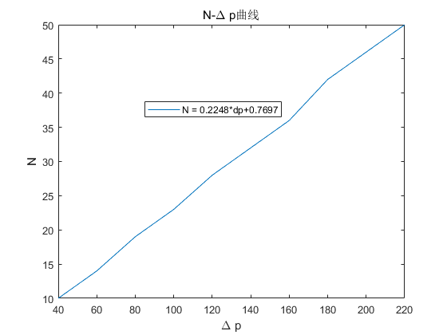

**stuID Name**

# 空气折射率测量

## 一、实验目的

1. 学习利用分离光学元件组装迈克尔逊干涉仪；
2. 掌握用迈克尔逊干涉仪测气体折射率的原理和方法。

## 二、实验原理

<image src = "1.png">

如图 10.1，由 $He-Ne$ 激光器发出的光束经分束镜 $BS$ 分成两束，各经平面镜 $M_1、M_2$
反射后又经 $BS$ 重新会合于毛玻璃屏 $H$。在激光器前置小孔光阑 $R$ 和扩束镜 $BE$，则在 $P$处可见到非定域干涉圆环条纹，在一个光臂中插入一长度为 l 的气室，重新调出非定域干涉圆环条纹。

在测定空气折射率实验中，设气室内空气柱长度为$l$, 气室内空气压力改变了$\Delta p$, 折射率随之改变了$\Delta n$. 就会导致光经过气室的光程变化$\delta = 2l\Delta n$。 引起干涉圆环“陷入”或“冒出”N 条。则：

$\delta = 2\Delta nl = N\lambda$

$\Delta n = N\lambda/2l$

若将气室抽真空（室内压强近似于零，折射率$n = 1$），再向室内缓慢充气，同时计数干涉环变化数 $N$可计算出不同压强下折射率的改变值$\Delta n$，则相应压强下空气折射率$n = 1 + \Delta n$

若采取打气的方法增加气室内的粒子（分子和原子）数量，根据气体折射率的改变量与单位体积内粒子数改变量成正比的规律，可求出相当于标准状态下的空气折射率$n_0$。对有确定成分的干燥空气来说，单位体积内的粒子数与密度$\rho$成正比，于是有:
$\frac{n-1}{n_0-1} = \frac{\rho}{\rho_0}$

式中$\rho_0$是空气在热力学标准状态下$(T_0 = 273K,p_0 = 101325Pa)$下的密度，
$n_0n_0$是相应状态下的折射率；n和$\rho$是相对于任意温度 $T$ 和压强 $p$ 下的折射率和密度。联系理想气体的状态方程，有:$\frac{\rho}{\rho_0} = \frac{pT_0}{p_0T} = \frac{n-1}{n_0-1}$

实验中若$T$不变，对上式求 $p$ 的变化所引起的 $n$ 的变化，则有:$\Delta n = \frac{n_0-1}{p_0}\cdot\frac{T_0}{T}\Delta p$

因$T = T_0(1+\alpha t)$（其中$\alpha$ 是相对压力系数，等于${1/273.15 = 3.661\times10^{-3}}^{\circ}C^{-1}$ (t是摄氏温度，即室温）。代入上式，有：$\Delta n = \frac{n_0-1}{p_0}\cdot\frac{\Delta p}{1+\alpha t}$，于是：$n_0 = 1+p_0(1+\alpha t)\frac{\Delta n}{\Delta p}$，所以：

$n_0 = 1+p_0(1+\alpha t)\frac{\lambda}{2l}\cdot\frac{N}{\Delta p}$

测出若干不同的$\Delta p$所对应的干涉环变化数 $N$，$N-\Delta p$关系曲线的斜率即为$N/\Delta p$。$p_0$和$\alpha$为已知t见温度计显示，$\lambda$和$l$为已知，一并代入上式，即可求得相当于热力学标准状态下的空气折射率。

根据式（10-3）求得 $p_0$代入式（10-4），经整理，并联系式（10-1），即可得

$n = 1+\frac{N\lambda}{2l}\cdot\frac{p}{\Delta p}$

其中的环境气压 $p$ 从实验室的气压计读出，根据上式，通过实验即可测得实验环境下的空气折射率。

## 三、实验装置

<image src = "2.png">
<image src = "3.png">

## 四、实验内容

1. 将各器件夹好，靠拢，调等高。
2. 调激光光束平行于台面，按图 10.2 所示，组成迈克尔逊干涉光路（暂不用扩束器）。
3. 调节反射镜 M1和 M2 的倾角，直到屏上两组最强的光点重合。
4. 加入扩束器，经过微调，使屏上出现一系列干涉圆环。
5. 紧握橡胶球反复向气室充气，至血压表满量程$（40kPa）$为止，记为$△p$。
6. 缓慢松开气阀放气，同时数出干涉圆环变化数 $N$（可估计出一位小数），至表针回零。
7. 计算实验环境的空气折射率$n = 1.0000+\frac{N\lambda}{2l}\times\frac{p_{amb}}{\Delta p}$。其中激光波长$\lambda$和气室长度 l 为已知，环境气压$p_{amb}$从实验室的气压计读出。
8. 重复步骤 5、6、7，测量 10 组数据取平均，求出空气的折射率。

    1. 实验数据
    
    

    |  $p$  | $\Delta p$ |  $N$  |  $p$  | $\Delta p$ |  $N$  |
    | :---: | :--------: | :---: | :---: | :--------: | :---: |
    | $110$ |    $40$    | $10$  | $210$ |   $140$    | $32$  |
    | $130$ |    $60$    | $14$  | $230$ |   $160$    | $36$  |
    | $150$ |    $80$    | $19$  | $250$ |   $180$    | $42$  |
    | $170$ |   $100$    | $23$  | $270$ |   $200$    | $46$  |
    | $190$ |   $120$    | $28$  | $290$ |   $220$    | $50$  |

    

    2. $N-\Delta p$曲线
   
    

    

    曲线斜率$N/\Delta p = 0.2248$，$l = 20cm$，$\lambda = 632.8nm$，空气折射率为$n = 1+0.2248\times \frac{\lambda p_{amb}}{2l} = 1.000248$