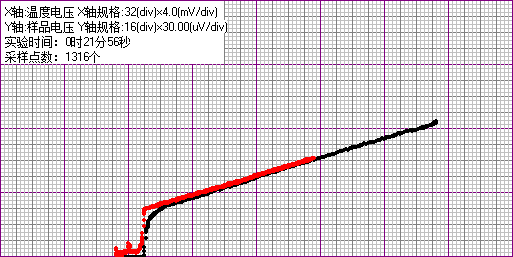

**stuID Name**
*同实验者：081730107 张骋宇*

# 高温超导

## 实验目的

1. 学习液氮低温技术
2. 测量氧化物超导体 $YBaCuO$ 的临界温度，掌握用测量超导体电阻—温度关系测定转变温度的方法。
3. 了解超导体的最基本特性以及判定超导态的基本方法。

## 实验原理

1. 简介

    超导电性发现于 1911 年，荷兰科学家翁纳斯（$K.Onnes$）在实现了氦气液化之后不久，利用液氦所能达到的极低温条件，指导其学生($GillesHolst$)进行金属在低温下电阻率的研究，发现在温度稍低于 4.2K 时水银的电阻率突然下降到一个很小值。后来有人估计，电阻率的下限为 $3.6×10-23Ω/cm$，而迄今正常金属的最低电阻率大约为 $10-13Ω/cm$。与此相比，可以认为汞进入了电阻完全消失的新状态—超导态。我们定义超导体开始失去电阻时的温度为超导转变温度或超导临界温度，通常用 $T_C$表示。

    超导现象发现以后，实验和理论研究以及应用都有很大发展，但是临界温度的提高一直很缓慢。1986 年以前，经过 75 年的努力，临界温度只达到 23.2K，这一记录保持了差不多 12 年。此外，在 1986 年以前，超导现象的研究和应用主要依赖于液氦作为致冷剂。由于氦气昂贵、液化氦的设备复杂，条件苛刻，加上 4.2K 的液氦温度是接近于绝对零度的极低温区等因素都大大限制了超导的应用。为此，探索高临界温度超导材料成为人们多年来梦寐以求的目标。

    1987 年初液氮温区超导体的发现震动了整个世界，人们称之为 20 世纪最重大的科学技术突破之一，它预示着一场新的技术革命，同时也为凝聚态物理学提出了新的课题。

2. 超导特性

    超导体有许多特性，其中最主要的电磁性质是：

    1. 零电阻现象：当把金属或合金冷却到某一确定温度 $T_C$ 以下，其直流电阻突然降到零，把这种在低温下发生的零电阻现象称为物质的超导电性，具有超导电性的材料称为超导体。电阻突然消失的某一确定温度 $T_C$叫做超导体的临界温度。在 $T_C$以上，超导体和正常金属都具有有限的电阻值，这种超导体处于正常态。由正常态向超导态的过渡是在一个有限的温度间隔里完成的，即有一个转变宽度$ΔT_C$，它取决于材料的纯度和晶格的完整性。理想样品的$ΔT≤10^{-3}K$。基于这种电阻变化，可以通过电测量来确定 $T_C$，通常是把样品的电阻降到转变前正常态电阻值一半时的温度定义为超导体的临界温度 $T_C$。
    2. 完全抗磁性：当把超导体置于外加磁场时，磁通不能穿透超导体，而使体内的磁感应强度始终保持为零（$Ｂ≡０$），超导体的这个特性又称为迈斯纳（RＭeissner$）效应。
    3. 超导体的这两个特性既相互独立又有紧密的联系，完全抗磁性不能由零电阻特性派生出来，但是零电阻特性却是迈斯纳效应的必要条件。

## 实验仪器

如下图所示，将高温超导探测器与仪器主机相连。

<image src = '1.png'>

## 实验过程

本实验的目的测量超导材料的转变温度，也就是在常气压环境下超导体从非超导态变为超导态时的温度。由于超导材料在超导状态时电阻为零，因此我们可用检测其电阻随温度变化的方法来判定其转变温度。实验中要测电阻及温度二个量。样品的电阻用四引线法测量，通以恒定电流，测量二端的电压信号，由于电流恒定，电压信号的变化即是电阻的变化。

温度用铂电阻温度计测量，它的电阻会随温度变化而变化，比较稳定，线性也较好，实验时通以恒定的 $1.00mA$，测量温度计两端电压随温度变化情况，从表中可查到其对应的温度。

温度的变化是利用液氮杜瓦瓶空间的温度梯度来获得。样品及温度计的电压信号，可从数字显示表中读得，也可用 x－y 记录仪记录

1. 样品、探棒与测量仪器用连接线连接起来。
2. 样品连线连接好以后，开启电源，小心地把探测头浸入杜瓦瓶内，待样品温度达到液氮温度后（一般等待 10—15 分钟），观察此时样品出现信号是否处于零附近（因此时温度最低，电阻应为 0，但因放大器噪声也被放大，会存在本底信号）注意此时不能再改变放大倍数，放大倍数档位置应与高温时一致。如果此时电压信号仍很大，与高温时一样，则属不正常，需检查原因。如电阻信号小，与高温时的电阻信号相差大，则可进行数据测量了。
3. 样品温度达到稳定到液氮温度时，记下此时的样品电压及温度电压值，然后把探测头小心地从液氮瓶内提拉到液面上方，温度会慢慢升高，在这变化过程中，温度计的电压信号及样品的电阻信号会同时变化，同时记录这二值，记下 50—60 个数据。作图即可求得转变温度。在过程中要耐心观察，特别在转变温度附近，最好多测些数据。
4. 如时间允许可从高温到低温再测量一次，观察二条曲线是否重合，解析原因。
5. 将本仪器与计算机连接，使用本机提供的专用软件可实时记录样品的超导转变曲线。计算机的连接和所用软件的使用说明详见附录。
6. 实验结束工作：1）实验结束后关掉仪器电流，用热吹风把探测头吹干。2）旋开探测头的外罩，把样品吹干，使其表面干燥无水气。3）用烙铁把样品与样品架连接的四个焊点焊开，取出样品，用滤纸包好，放回干燥箱内，以备下组实验者使用。

    ---

    

