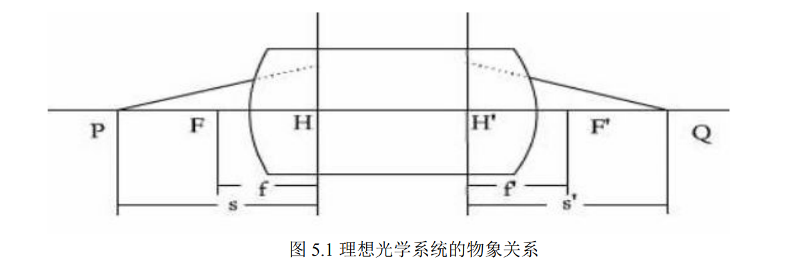
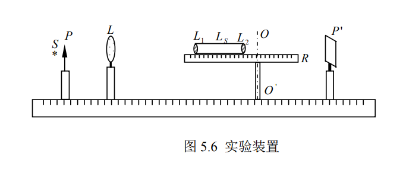
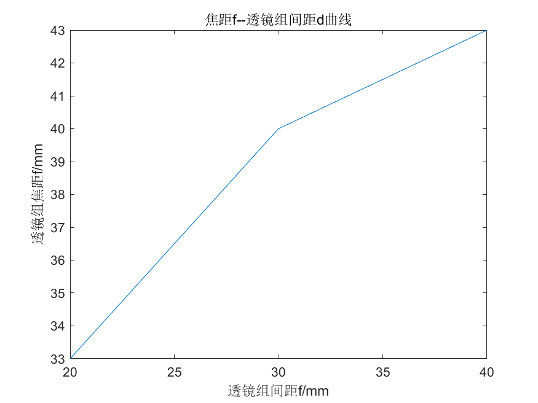

*stuID Name*

# 光具组基点测定
## 一 实验目的

- 了解测节器的构造及工作原理。
- 加深对光具组基点的理解和认识。
- 学会利用测节器及平行光测定光具组的基点及焦距。

## 二 实验原理

光学仪器中常用的光学系统,一般都是由单透镜或胶合透镜等球面系统共轴构成的.对于由薄透镜组合成的共轴球面系统 ,其物和像的位置可由高斯公式：

$\Large\frac{1}{f'}=\frac{1}{s'}-\frac{1}{s}$ 确定.

如图 5.1 所示，

式中 f’为系统的像方焦距,s’为像距,s 为物距.物距是从第一主面到物的距离,像距是从第二主面到像的距离,系统的像方焦距是从第二主面到像方焦点的距离.各量的符号从各相应主面,沿光线进行方向测量为正,反向为负.共轴球面系统的物和像的位置,还可由牛顿公式表示：

$\Large xx'=ff'(f=-f')$

即式中 $x$ 为从物方焦点量起的物方焦点到物的距离,$x’$为从像方焦点量起的像方焦点到像的距离.物方焦距 $f$ 和像方焦距 $f’$分别是从第一、第二主面量到物方焦点和像方焦点的距离.符号规定同上.

## 三 实验仪器

光具座，光源，测节器，薄透镜（若干），物屏(毫米尺)，白屏，准直透镜，平面反射镜

## 四 实验内容

1. 用自准成像法调光。借助平面镜调整毫米尺（物屏）与准直物镜的距离，使出射光束为平行光。

2. 调整测节器及光路。把两个凸透镜装在测节器上的小透镜夹内。调整测节器的高度，使平行光束正好穿过二透镜中心。

3. 移动白屏，找到毫米尺清晰像。绕转轴摆动测节器，看到屏上的像也随着摆动。再改变测节器与转轴的相对位置（注意：光具组与屏的距离不能变，即沿节点架导轨前后移动透镜组，同时相应地前后移动白屏），同时摆动测节器并仔细观察像的位置如何变化。最后总能找到一点，当测节器绕这点摆动时像的位置固定不动。这时转轴在测节器上的位置就是后节点的位置，亦即后主点的位置。在测节器上量出转轴到屏的距离，即光具组的后焦距。分别记下屏和节点架在米尺导轨上的位置 $a$ 和 $b$，并从节点架导轨上记下透镜组中间位置（有标线）到节点架转轴中心的偏移量 $L$。

4. 将测节器转动 $180$ 度，重复步骤 3，测得另一组数据 $a’$，$b’$，$L’$。

6. 改变二透镜的距离，使$（a）d=0$,$(b) f_1’<d< f_2’$,$(c) f_2’<d< f_1’+ f_2’$,$(d)d > f_1’+f_2’$。依据以上方法分别测定所列各种情况下的焦距，各测一次。记录焦点虚实与焦距的正负.

7. 当在 $L_2$ 的后面得不到实焦点时，可再利用一凸透镜，使光具组的虚焦点在该凸透镜的后面成实像，再用牛顿公式或高斯公式确定虚焦点的位置，并利用测节的方法测出节点的位置（即转动尺杆，观察虚焦点不动），从而确定其焦距。

## 五 数据处理

1. 记录各种情况下的数据于表中：
   
    像方节点偏离透镜组中心的距离为 $L$
    透镜组的像方焦距 $f’=a-b$
    物方节点偏离透镜中心的距离为 $L’$
    透镜组的物方焦距 $f=a’-b’$。
    比较各种情况下的实验测量数据和理论计算数据。
    试用作图法大致确定透镜组基点位置。
   
    **透镜 1 焦距 $f_1' =    70    cm$**

    **透镜 2 焦距 $f_2' =   50     cm$**

    **透镜间距$d =        2       cm$**

    |            像屏位置$a$             | $3.3$ |            像屏位置 $a’$            | $3.3$ |
    | :--------------------------------: | :---: | :---------------------------------: | :---: |
    |           节点架位置 $b$           |  $0$  |           节点架位置$b’$            |  $0$  |
    | 像方节点偏离透镜组中心的距离为 $L$ | $0.2$ | 物方节点偏离透镜组中心的距离为 $L’$ | $0.2$ |
    |      透镜组的像方焦距$f’=a-b$      | $3.3$ |      透镜组的像方焦距$f=a’-b’$      | $3.3$ |

    **用合适的比例画出被测透镜组及其各种基点的相对位置**

    

    ---

    **透镜间距$d =        3       cm$**

    |            像屏位置$a$             |  $4$  |            像屏位置 $a’$            |  $4$  |
    | :--------------------------------: | :---: | :---------------------------------: | :---: |
    |           节点架位置 $b$           |  $0$  |           节点架位置$b’$            |  $0$  |
    | 像方节点偏离透镜组中心的距离为 $L$ | $0.1$ | 物方节点偏离透镜组中心的距离为 $L’$ | $0.8$ |
    |      透镜组的像方焦距$f’=a-b$      |  $4$  |      透镜组的像方焦距$f=a’-b’$      |  $4$  |

    **用合适的比例画出被测透镜组及其各种基点的相对位置**

    

    ---

    **透镜间距$d =       4        cm$**

    |            像屏位置$a$             | $4.3$ |            像屏位置 $a’$            | $4.5$ |
    | :--------------------------------: | :---: | :---------------------------------: | :---: |
    |            节点架位置 b            |  $0$  |           节点架位置$b’$            |  $0$  |
    | 像方节点偏离透镜组中心的距离为 $L$ | $0.3$ | 物方节点偏离透镜组中心的距离为 $L’$ | $1.4$ |
    |      透镜组的像方焦距$f’=a-b$      | $4.3$ |      透镜组的像方焦距$f=a’-b’$      | $4.3$ |

    **用合适的比例画出被测透镜组及其各种基点的相对位置**

    

    ---

   **画出透镜组的焦距随透镜间距的变化曲线**

   | 透镜组间距$d/mm$ | 焦距$f/mm$ |
   | :--------------: | :--------: |
   |        20        |     33     |
   |        30        |     40     |
   |        40        |     43     |

    

