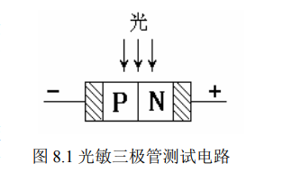
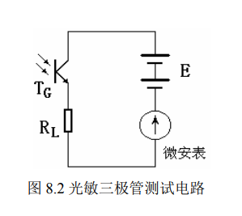
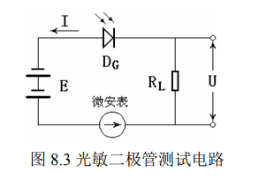
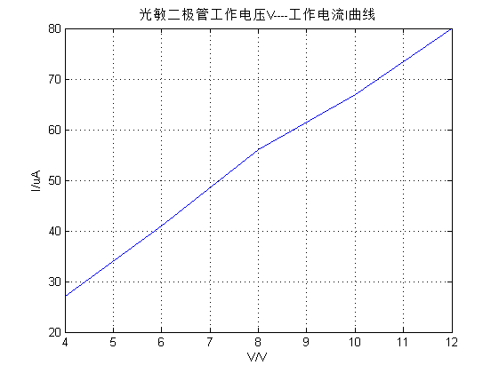
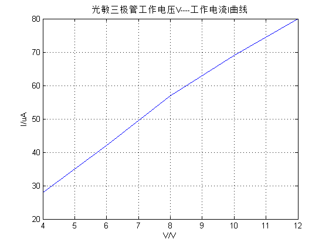

*stuID Name*

# 光敏二极管、光敏三极管特性测量

## 实验目的

- 了解光敏二极管、光敏三极管的工作原理特性
- 了解光敏二极管、光敏三极管的测试电路
- 学习光敏二极管、光敏三极管的特性测试方法
- 学习光敏二极管、光敏三极管的极性识别方法

## 实验原理
1. 光敏二极管

    >光敏二极管与半导体二极管在结构上是类似的，其管芯是一个具有光敏特征的 PN 结，具有单向导电性，因此工作时需加上反向电压。无光照时，有很小的饱和反向漏电流，即暗电流，此时光敏二极管截止。当受到光照时，饱和反向漏电流大大增加，形成光电流，它随入射光强度的变化而变化。是光敏二极管结构示意图，当 PN 结处于反向偏置时，在无光照时具有高阻特性，反向暗电流很小；当光照时，结区产生电子-空穴对，在结电场作用下，电子向 N 区运动，空穴向 P 区运动形成光电流 ，方向与反向电流一致，光的照度愈大，光电流愈大。由于无光照时的反向暗电流很小，因此光照时的反向电流基本上与光强成正比。

    

2. 光敏三极管

    > 光敏三极管是具有 $NPN$ 或 $PNP$ 结构的半导体管，结构与普通三极管类似，但它的引出电极通常只有两个。光敏三极管的结构与工作电路如图所示，集电极接正电压，发射极接负电压，它可以看成是一个 $bc$ 结为光敏二极管的三极管，不同之处是光敏三极管必须有一个对光敏感的 $PN$ 结作为感光面，一般用集电极作为感光面，入射光主要被面积做得较大的基区所吸收。当人射光子在基区及集电区被吸收而产生电子-空穴对时，便形成光生电压，由此产生的光生电流由基极进入发射极，从而在集电极回路中得到一个放大了的信号电流。它比光敏二极管具有更高的灵敏度。光敏二级管和光敏三极管均用硅或锗制成，由于硅器件暗电流小、温度系数小，又便于用平面工艺大量生产，尺寸易于精确控制，因此硅光敏器件比锗光敏器件更为普通。

    

## 实验仪器

> CSY10G 型光电传感器系统实验仪，我们仅选择如下部件：光敏二极管、光敏三极管、直流稳压电源、负载电阻、光源（高亮度卤钨灯、激光器和各种发光二极管）、遮光罩、试件插座、电路面板、连接导线、电吹风、秒表和万用表等。本实验使用的 CSY10G 型光电传感器系统实验仪，其特点是将各种光电传感器、被测体、信号源、仪表显示、信号采集、处理电路及实验所需的温度、位移、光源、旋转装置集中于一体，可以方便地对多种光电传感器进行光谱特性、光电特性以及温度特性等的测试。并可根据实验原理自主开发出更多的实验内容。实验仪主要由实验工作台、信号控制及仪表显示、图象和数据采集、光电转换/处理电路组成。

## 实验内容

**实验电路**

   

1. **光敏二极管光电流测试，取走遮光罩，读出微安表上的电流值，或是用万用表 $200mV$档测得 $R_L$上的电压降 $V$ 光，光电流 $I_光=V_光/R_L$。**

    80$uA$

2. **伏安特性测试，光敏二极管在给定的光照强度与工作电压下，记录下所测得的工作电压$V_{ce}$ 与工作电流（仅对一个光敏二极管研究即可，列表格记录实验数据），工作电压可从$±4V~±12V$ 变换，并作出一组 $V/I$ 曲线。**

    | 工作电压$V_{ce}$ | $4V$  | $6V$  | $8V$  | $10V$ | $12V$ |
    | :--------------: | :---: | :---: | :---: | :---: | :---: |
    |     工作电流     | $27$  | $41$  | $56$  | $67$  | $80$  |

   

3. **光敏二极管光谱特性测试，不同材料制成的光敏二极管对不同波长的入射光反应灵敏度是不同的。用备用的各色发光二极管、卤钨灯、激光照射光敏二极管（至少选择五种光源），分别测得光电流并加以比较（列表格记录实验数据）。同时，要尽量保证在相同的条件下（比如光源到光敏二极管有相同的距离，相同的光照强度等）进行实验。**

   |    发光二极管种类    | 红光  | 黄光  | 蓝光  | 绿光  | 白光  |
   | :------------------: | :---: | :---: | :---: | :---: | :---: |
   | 二极管光电流$I_2/mA$ | $18$  |  $2$  |  $9$  | $24$  | $28$  |

4. **光敏三极管光电流测试，取走遮光罩，即可测得光电流 $I_光$。通过实验比较可以看出，光
敏三极管与光敏二极管相比能把光电流放大更大的倍数，具有更高的灵敏度（列表格进行比较）。**

   | 发光二极管种类 | 红光  | 黄光  | 蓝光  | 绿光  | 白光  |
   | :------------: | :---: | :---: | :---: | :---: | :---: |
   |  光电流$I/mA$  | $18$  |  $2$  |  $9$  | $24$  | $28$  |

5. **光敏三极管伏安特性测试，光敏三极管在给定的光照强度与工作电压下，将所测得的工
作电压 $V_{ce}$ 与工作电流记录下来（列表格记录实验数据），工作电压可从$±4V~±12V$变换，并作出一组 $V/I$ 曲线。**

    |   工作电压$V_{ce}$   | $4V$  | $6V$  | $8V$  | $10V$ | $12V$ |
    | :------------------: | :---: | :---: | :---: | :---: | :---: |
    |  三极管光电流$I/mA$  | $28$  | $42$  | $57$  | $69$  | $80$  |
    | 二极管光电流$I_2/mA$ | $18$  |  $2$  |  $9$  | $24$  | $28$  |
    

6. **光敏三极管光谱特性测试，对于一定材料和工艺制成的光敏管，必须对一定波长的入射图 8.3 光敏二极管测试电路光才有响应。按图 8.2 接好光敏三极管测试电路，参照光敏二极管的光谱特性测试方法，分别用各种光源照射光敏三极管（至少选择五种光源），测得光电流（列表格记录实验数据），并做出定性的结论。**

    |   发光二极管种类   | 红光  | 黄光  | 蓝光  | 绿光  | 白光  |
    | :----------------: | :---: | :---: | :---: | :---: | :---: |
    | 三极管光电流$I/mA$ | $40$  |  $2$  | $15$  | $55$  | $45$  |

- **结论：**

    该三极管对绿光，红光波段的光信号最为敏感，对黄光波段的光信号极不敏感。
