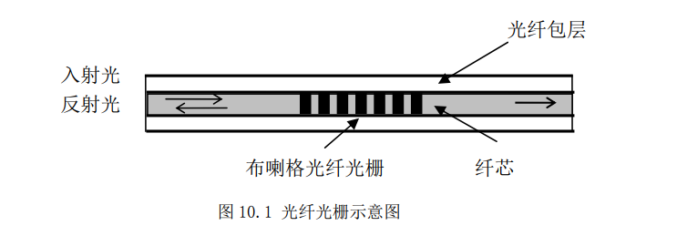
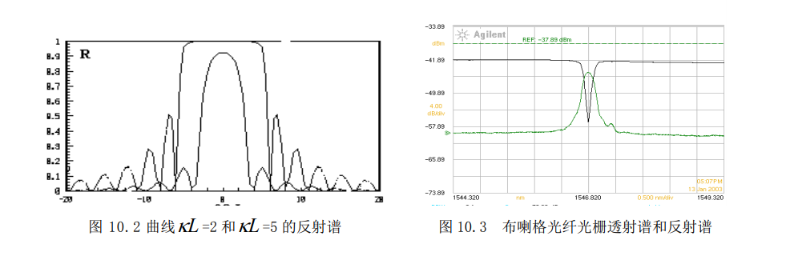
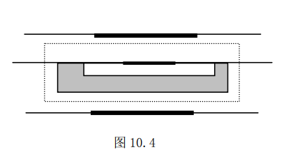
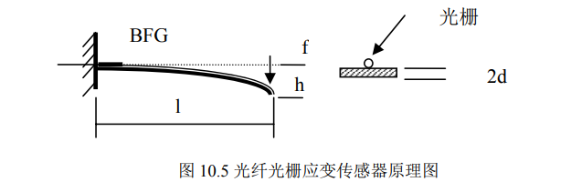
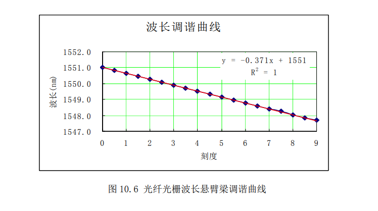
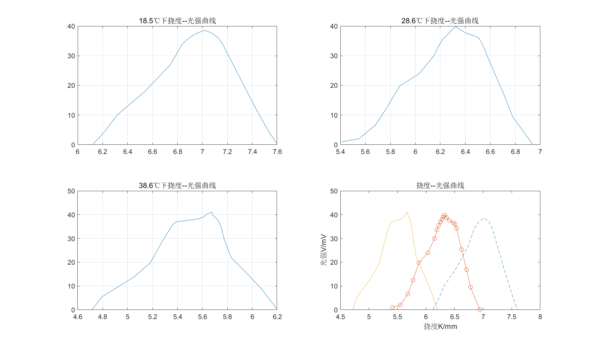
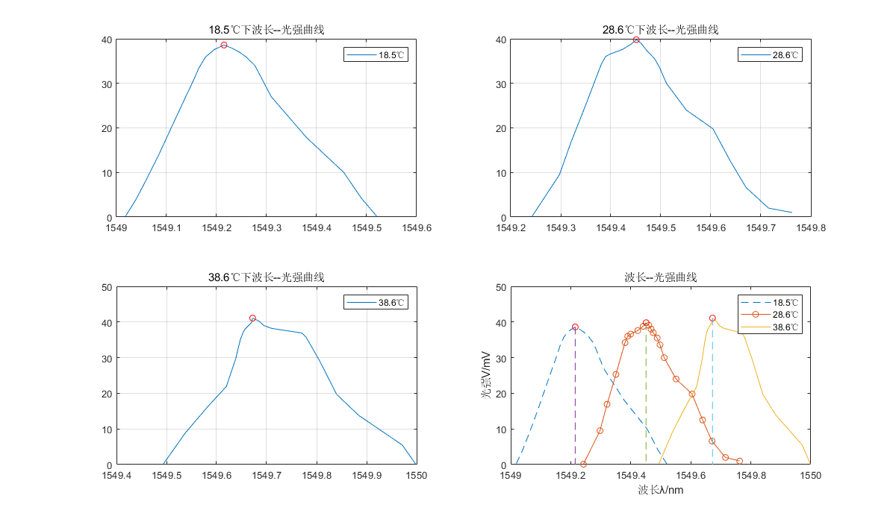
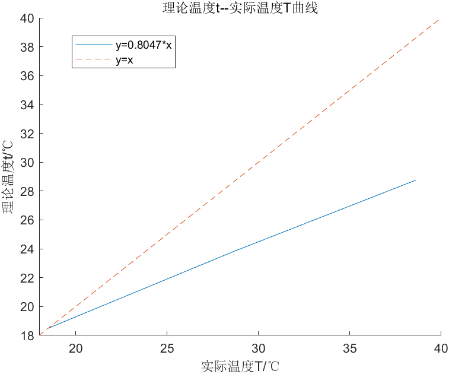

*朱文强 081730109*

# **光纤传感器**

## **实验目的**

通过实验使学生了解和掌握光纤光栅的基本特性、光纤光栅传感器的基本结构、光纤光栅传感的基本原理、光纤光栅传感测量的基本方法和原理，同时使学生了解光纤光栅和光纤传感的局限性。

## **实验原理**

1. **光纤光栅及其基本特性**
   
   光纤光栅的基本结构如图 10.1 所示。它是利用光纤材料的光折变效应，用紫外激光向光纤纤芯内由侧面写入，形成折射率周期变化的光栅结构，这种光栅称之为布喇格（Bragg）光纤光栅。

   

    这种折射率周期变化的$Bragg$光纤光栅满足下面相位匹配条件时，入射光将被反射：
    
    ${\Large \lambda_B=2\cdot n_{eff}Λ}$

    式中$λ_B$为 $Bragg$ 波长（即光栅的反射波长）， $Λ$为光栅周期，$n_{eff}$为光纤材料的有效折射率。如果光纤光栅的长度为 $L$，由耦合模方程可以计算出反射率 $R$ 为：

    ${\huge R={|\frac{A_r(0)}{A_i(0)}|}^2=\frac{\bar{k}k\sinh^2sL}{s^2\cosh^2sL+(\Delta \beta/2)^2\sinh^2sL}}$

    图 10.2 显示了两条不同反射率的布喇格光纤光栅反射谱，图 10.3 为实际的一个布喇格光纤光栅反射谱和透射谱。

    

    其峰值反射率 $Rm$ 为：

    ${\huge R_m=\tanh^2[\frac{\pi\Delta nL}{2n_{eff}Λ}]}$

    反射的半值全宽度（FWHM），即反射谱的线宽值为：

    ${\Large \Delta \lambda_B=\lambda_B\sqrt{(\frac{Λ}{L})^2+(\frac{\Delta n}{n_{eff}})^2}}$

    式中，$n_{eff}$ ,$Λ$ 是温度 $T$ 和轴向应变 $\epsilon$ 的函数，因此布喇格波长的相对变化量可以写成：

    ${\Large \Delta \lambda/\lambda_B=(a+\xi)\Delta T+(1-Pe)\epsilon}$

    其中 $α$、$ξ$ 分别是光纤的热膨胀系数和热光系数，其值$α＝0.55×10－6$,$ξ＝8.3×10－6$，即温度灵敏度大约是 $0.0136 nm /℃$，（$λ$为 $1550nm$）；$Pe$ 是有效光弹系数，大约为 $0.22$，即应变灵敏度为 $0.001209 nm /με$。应变 $ε$ 可以是很多物理量（如，压力、形变、位移、电流、电压、振动、速度、加速度、流量等等）的函数，应用光纤光栅可以制造出不同用途的传感图 10.2 曲线 $κL =2$ 和 $κL =5$ 的反射谱 图 10.3 布喇格光纤光栅透射谱和反射谱头，测量光栅波长的变化就可以计算出待测物理量的变化，所以（10.5）式是光栅传感的基本方程。

---

2. **光纤光栅传感和传感测量的基本原理**
   
   1. **光纤光栅温度传感器**
      为了提高光纤光栅温度灵敏度，在光纤光栅温度传感器中，是将光纤光栅封装在温度增敏材料基座上，外部有不锈钢管保护，外面有加热装置，如图10.4。波长变化量及温度灵敏度分别为：

      $Δλ/ΔT =[(α+ξ) +(1－P)(α_j－α)]λ$

      $Δλ/ΔT =α_t$

      $α_t$ 定义为该温度传感器的温度灵敏度，可由实验获得，大约是$α_t＝0.035nm/℃$。由测量到的波长的变化量可计算出温度的变化$t-t_0$：

      ${\large t=t_0+\frac{\Delta \lambda_t}{\alpha_T}}$ 

      

      在上面的公式中，

      $α$：石英材料（光纤光栅）光纤热膨胀系数 $0.5×10－6/℃$

      $ξ$：石英材料（光纤光栅）光纤热光系数 $8.3×10－6/℃$

      $Pe$：石英材料（光纤光栅）光纤有效光弹系数，为 $0.22$，$η＝1－Pe$

      $αj$：基座热膨胀系数

    2. **光纤光栅应变传感器**
   
       本实验仪的光纤光栅应变传感器是一种悬臂梁应变调谐机构。应用材料力学原理可以严格计算出光纤光栅的应变，用于模拟环境物理量使光纤光栅产生的应变。由光纤光栅的应变又可计算出传感光栅的波长变化。光纤光栅应变传感器原理图如图 10.5。

       

       光纤光栅粘接在悬臂梁距固定端根部 $x$ 位置，螺旋测微器调节挠度 ，由材料力学可知，光纤光栅的应变为：

       ${\Large\epsilon = \frac{3(l-x)dh}{l^3}}$

       其中 $l$、$h$ 、$d$ 分别表示梁的长度、挠度和中性面至表面的距离，$η＝1－Pe$，$Pe$ 是光纤有效光弹系数。挠度变化$Δh$ 时，应变的变化量$Δε$及峰值波长的变化量为：

       ${\Large \Delta \epsilon = \frac{3(l-x)d}{l^3}\Delta h}$

       ${\Large \Delta \lambda =(1-Pe)\lambda_\epsilon\Delta \epsilon}$

       ${\huge \frac{\Delta \lambda}{\Delta h}=\beta_\epsilon=\frac{(1-Pe)\Delta \epsilon \lambda_\epsilon}{\Delta h}}$

       $βε$ 为光纤光栅悬臂梁波长调谐灵敏度（单位是 $nm/mm$），可理论计算，但主要是通过实验获得。作为光纤光栅应变传感器使用时，应变调谐灵敏度为：

       ${\huge \frac{\Delta \epsilon}{\Delta h}=\frac{\beta_\epsilon}{(1-Pe)\lambda_\epsilon}}$

       

       光纤光栅波长悬臂梁调谐器中悬臂梁是 $79×5×1.4mm$ 钢 带 ，螺旋测微器最大行程为 $8mm$，光纤光栅粘接在根部的 $5mm$ 处， 光纤光栅波长调谐灵敏度为 $0.38nm/mm$（实际测量为 $0.3875$，对应的应变调谐灵敏度为 $320με/mm$），最大调谐量 $3.8nm$；图 10.6是光纤光栅波长悬臂梁调谐曲线。

   

## **实验内容**

  **原始数据**

  | 温度/$℃$ | $K/mm$  | $V/mV$ | 温度/$℃$ | $K/mm$  | $V/mV$ | 温度/$℃$ | $K/mm$  | $V/mV$ |
  | :------: | :-----: | :----: | :------: | :-----: | :----: | :------: | :-----: | :----: |
  |  $18.5$  | $6.121$ | $0.1$  |  $28.6$  | $5.409$ | $0.1$  |  $38.6$  | $4.715$ | $0.1$  |
  |          | $6.212$ | $4.2$  |          | $5.548$ | $2.0$  |          | $5.675$ | $41.1$ |
  |          | $6.316$ |  $10$  |          | $5.680$ | $6.6$  |          | $5.636$ | $40.2$ |
  |          | $6.537$ | $17.9$ |          | $5.772$ | $12.5$ |          | $5.609$ |  $39$  |
  |          | $6.743$ | $27.0$ |          | $5.875$ | $19.8$ |          | $5.562$ | $38.2$ |
  |          | $6.839$ | $34.0$ |          | $6.032$ |  $24$  |          | $5.385$ | $36.9$ |
  |          | $6.890$ | $35.9$ |          | $6.149$ |  $30$  |          | $5.361$ | $35.8$ |
  |          | $6.930$ | $37.0$ |          | $6.190$ | $33.6$ |          | $5.280$ |  $29$  |
  |          | $6.980$ | $38.0$ |          | $6.218$ | $35.5$ |          | $5.181$ | $19.7$ |
  |          | $7.021$ | $38.6$ |          | $6.256$ |  $37$  |          | $5.051$ | $13.8$ |
  |          | $7.077$ | $37.6$ |          | $6.278$ |  $38$  |          | $4.795$ | $5.5$  |
  |          | $7.130$ | $35.9$ |          | $6.300$ | $39.1$ |          | $5.682$ | $39.8$ |
  |          | $7.169$ | $33.4$ |          | $6.326$ | $39.8$ |          | $5.720$ |  $38$  |
  |          | $7.201$ | $30.6$ |          | $6.356$ | $38.8$ |          | $5.732$ |  $37$  |
  |          | $7.240$ | $27.5$ |          | $6.408$ | $37.6$ |          | $5.740$ |  $36$  |
  |          | $7.323$ | $20.7$ |          | $6.478$ | $36.6$ |          | $5.749$ | $34.8$ |
  |          | $7.402$ | $14.2$ |          | $6.507$ |  $36$  |          | $5.775$ | $29.6$ |
  |          | $7.468$ | $9.1$  |          | $6.533$ | $34.2$ |          | $5.830$ | $21.9$ |
  |          | $7.538$ | $4.0$  |          | $6.622$ | $25.3$ |          | $5.940$ | $16.2$ |
  |          | $7.600$ | $0.2$  |          | $6.709$ | $16.9$ |          | $6.071$ | $8.9$  |
  |          |         |        |          | $6.778$ | $9.5$  |          | $6.200$ | $0.2$  |
  |          |         |        |          | $6.940$ | $0.1$  |          |         |        |
    

   

- **扰度--光强曲线**

  

- **波长--光强曲线**
  
  

  **光强极大值对应的波长：**

    |      温度      |  $18.5℃$   |  $28.6℃$   |  $38.6℃$   |
    | :------------: | :--------: | :--------: | :--------: |
    |      波长      | $1549.2nm$ | $1549.5nm$ | $1549.7nm$ |
    | 与室温波长之差 |   $0nm$    |  $0.3nm$   |  $0.5nm$   |
    | 温度理论值    |  $18.5℃$  |  $23.794℃$  |   $28.752℃$|
  
- **实际温度--理论温度曲线**
  
  

  测得实验数据曲线斜率约为$0.8047$，误差为$0.1953* (T-T_0)℃$