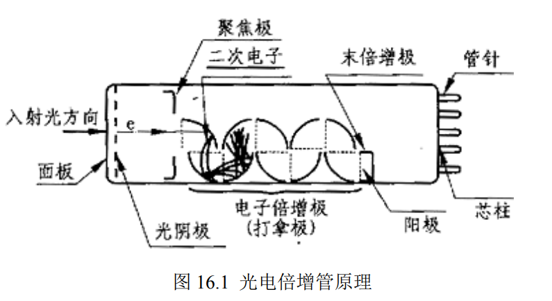

**stuID Name**

# 单光子计数

## 一，实验目的

1. 学习光电倍增管的工作原理，熟悉弱光照射下光电倍增管输出电流信号自然离散化的特征。
2. 了解光子计数方法的基本原理，掌握单光子计数采用的脉冲高度甄别技术和数字计数技术。
3. 通过对生物超微弱光子辐射的测量掌握弱光检测技术。

## 二，实验原理

1. 光电倍增管

    光电倍增管是把微弱的光输入转换成光电子，并使光电子获得倍增的电真空器件，光电倍增管性能的好坏直接决定了单光子探测器性能的好坏。光电倍增管的工作原理如图 16.1所示。光电倍增管由光电发射阴极（光阴极）和聚焦电极、电子倍增极及电子收集极（阳极）等组成， 工作时这些电极的电位从阴极到阳极逐渐升高。当弱光信号照射到光电倍增管光阴极上时，每个入射的光子以一定的概率（即量子效率）使光阴极向真空中激发出光电子。这个光电子经聚焦极电场进入倍增系统，并通过进一步的二次发射得到的倍增放大。然后把放大后的电子用阳极收集作为信号输出。因为采用了二次发射倍增系统，所以光电倍增管在探测紫外、可见和近红外区的辐射能量的光电探测器中，具有极高的灵敏度和极低的噪声。另外，光电倍增管还具有响应快速、成本低、阴极面积大等优点。

    

2. 单光子计数器原理

    单光子计数主要采用的是一种逐个记录单光电子产生的脉冲数目的探测技术。光电倍增管是整个系统的基础，单光子信号经过光电倍增管，把光子信号转换为电信号。当入射光的辐射光功率低于 $1.0\times10^{-12}-1.0\times10^{-14}$时，光电倍增管的光电阴极上产生的光电流不再是连续的，这样，在光电倍增管的输出端就有离散的数字脉冲信号输出。当有一个光子信号打到光电阴极上，就会产生一定数量的光电子。入射的光子信号打到光电倍增器件上产生光电子，然后经过倍增系统倍增产生电脉冲信号，称为“单光子脉冲”。

    

    光电倍增管中除出现单光子脉冲外，探测器的噪声也会出现脉冲（主要是热噪声），其中脉冲幅度较小的是探测器噪声脉冲，脉冲幅度较大的是单光电子脉冲。单光子计数技术主要是利用弱光下光电倍增管输出电流信号自然离散的特征，采用脉冲高度甄别和数字计数技术将淹没在背景噪声中的弱光信号提取出来。通过设置一定的鉴别电平$V_h$,用它来把高于$V_h$的脉冲鉴别输出，从而实现单光子计数。如图 16.2 所示，当输入脉冲高度低于$V_h$时，甄别器无输出。当输入脉冲高度高于$V_h$的脉冲，甄别器输出一个标准脉冲。如果把甄别器电平选在图 16.2 中的谷点对应的脉冲高度上，就能弃除了大量的噪声脉冲。因对光电子脉冲影响较小，从而可以大大提高信噪比。

## 三，实验装置和实验方法

$GSZF-2B$型或$WSZ-5A$型单光子计数器，半导体制冷系统，计算机（已安装单光子计数实验系统电脑控制软件）。

1. 单光子计数系统的基本结构

    单光子计数系统由样品室、单光子计数器，半导体制冷系统，计算机采集、控制系统等部分组成。系统的基本结构如图 16.3 所示。

    
<image src = '6.png'>

    

2. 单光子计数器

    单光子计数器由光电倍增管、制冷系统、宽带放大器、甄别器、计数器组成。单光子计数器的组成如图 16.4 所示。

    
<image src = '7.png'>

    

    1. 制冷系统。采用制冷技术降低光电倍增管工作温度, 去除热噪声，提供稳定性。
    2. 放大器。放大器的功能是把光电子脉冲和噪声脉冲线性放大，经放大后的脉冲信号送至脉冲幅度甄别器。
    3. 甄别器。甄别器即脉冲甄别器，其功能是鉴别输出光电子脉冲，弃除光电倍增管的热发射噪声脉冲，如图 16.2 所示
    4. 计数器。计数器的作用是在规定的测量时间间隔内将甄别器的输出脉冲累加计数，并送入计算机进行处理。

3. 单光子计数系统的操作方法

    1. 接通水源。制冷器采用自来水冷却。
    2. 打开电源。通水 $2min$ 后，接通制冷器的电源开关和单光子计数系统的电源开关。
    3. 设定控温仪表温度.控温仪表为智能化仪表，$PV$ 显示测量温度，$SV$ 显示设定温度，参考设定温度值为$-20^oC$。设定温度的具体操作是：按“SET”键一次，$SV$单元的数值出现闪动，其中最后一位为修改位，使用“▽”或“△”键将显示数值设定为所需数值后，再按“<”键一次，亮位向左移一位，用上述方法修改此位数值，以此类推，将 SV 单元数值设定为所需温度值后，再按“SET”键一次，闪动现象消失，温度设定完成，控温开始。
    4. 启动测量软件。等待数分钟，待 PV 显示值与 SV 显示值相符后，可以启动软件测量。
    5. 测量无样本时的阈值电压。在单光子计数系统工作平台参数设置栏内，设置模式为阈值方式。关闭灯光，保持黑暗环境，并在样品室上遮盖黑布，测量没有样本时的阈值电压，并记录。
    6. 放置样品。植物叶子样本分为不经光刺激和经光刺激两种。光刺激可用光源（40W 白炽灯）近距离照射植物叶子样本的表面，记录照射时间。然后将测量样品放入样品室，并正对光电管入光口，盖严盖子，在样品室上遮盖黑布。
    7. 设定数值范围和采样参数。将单光子计数系统设置为时间模式，并适当地设定数值范围和采样参数。所设定的参数应保证曲线完整，并尽可能在屏幕上显示较大且清晰，以便进一步分析。记录下设定的参数。参考参数如下：

       > 数值范围    起始点 0，终止点 500，最大值 50，最小值 0；
        采样参数 时间单位毫秒（ms），采样间隔 1000，积分间隔 1000，高压 8，域值40，冷却温度－20℃。

    8. 开始计数。点击单光子计数系统工作平台上的“开始”，系统自动进入计数状态。计数结束后，将计数结果保存至指定位置，以备分析讨论。
    9. 测量不同照射时间的样品。重新设置后，重复步骤 6、7、8 中其他过程。其中植物样本的被照时间应不同。
    10. 关机。仪器使用完毕后，依次关闭单光子计数系统电源及制冷器电源，2 分钟后，再切断水源。

## 四，实验内容

1. 研究在弱光测量时杂散光对测量结果的影响
2. 测量植物叶片样品的超微弱光子辐射
3. 用 Origin 软件对数据进行分析讨论。

---

1. **光电倍增管的量子效率**

    

    平均光子数$R_P = 1561$

    方程：$P_0 = \frac{E_P\times R_P}{\eta}$

    其中：$E_P = 4\times10^{-19}J$

    $P_0 = At\alpha K(\frac{\Omega_2}{\Omega_1})P = 2.5764788\times10^{-15}W$

    所以：$\eta = \frac{E_P\times R_P}{P_0} = 39.61\%$

2. **生物（树叶）光子辐射衰减曲线**
   
    

3. **生物（树叶）光子辐射衰减后曲线**

    

---

## 五，思考题

1. 光电倍增管的工作原理是什么？

    入射光子撞击光电阴极，产生光电效应，产生的光电子被聚焦到二次发射极。其后的工作原理如同电子倍增管，电子被加速到二次发射极产生多个二次电子，通常每个二次发射极的电位差在 100 到 200 伏特。二次电子流像瀑布一般，经过一连串的二次发射极使得电子倍增，最后到达阳极。

2. 甄别器的作用是什么？

    剔除噪声的干扰，进行精密的幅度测量

3. 影响单光子计数器测量的因素有哪些？实验中应如何避免？

    环境光的干扰。实验中应紧闭门窗，阻隔外界光线。

