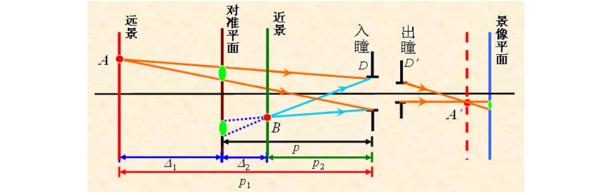

**朱文强 081730109**

# 孔径光阑、视场光阑和景深

## 一、实验目的

1. 深入理解孔径光阑（入、出瞳），视场光阑（入、出窗）及景深的概念
2. 学会确定孔径光阑，视场光阑及测量景深的方法

## 二、实验原理

>理想光学系统可以对任意大的物体范围以任意宽的光束进行完善成像，实际光学系统不可能为无限大，进入系统的光线将受到光学元件有限的通光口径的限制。任何一个光学系统对光束都包含两个基本限制对入射的光束大小的限制和对成像范围的限制。如照相系统中常采用的光圈$（F）$这一术语，指的就是对光束的一种限制，改变光圈的大小可以控制进入系统的光能，配合速度来满足接收器所需的曝光量。又如，照相机中的接收器的边界框（如$135$胶片，$1/3〞CCD$ 等 ）也是对光束的一种限制，聚焦在胶片框或 $CCD$ 靶面外的像点将不能获得图像。光束的限制不仅决定了光学系统的光束宽度和像的大小，而且还决定了光学系统对物体细节的分辨力和系统的景深，同时对系统的像差也有很大影响。

1. 光阑

    1. 孔径光阑

        光学系统中用于限制轴上点成像光束大小的光阑称为孔径光阑，如照相机中的可调光圈就是该系统的孔径光阑。孔径光阑的大小决定成像面上的照度。在光学系统中，描述成像光束大小的参量称为孔径，系统对近距离物体成像时，其孔径大小用孔径角 $U$ 表示，对无限远物体成像时，孔径大小用孔径高度 $h$ 表示。
    
    2. 视场光阑

        光学系统中用于限制成像范围大小的光阑称为视场光阑，如照相机中的底片框就是系统的视场光阑。光学系统中描述成像范围大小的参量称为视场，系统对近距离物体成像时，视场的大小一般用物体的高度 $y$ 表示，对远距离物体成像时，视场大小用视场角表示。

    3. 渐晕光阑

        为了改善轴外点的成像质量或减小部分光学元件的横向尺寸，对轴外点的成像光束刻意产生部分限制作用的光阑叫渐晕光阑。

    4. 消杂光光阑

        消杂光光阑用来限制一些非成像光线，如镜头表面、金属表面以及镜筒内壁反射或散射所产生的杂散光，它们通过系统后将在像面上产生杂光背景，破坏像的对比度和清晰度

2. 孔径光阑的确定方法、入瞳和出瞳
   
    
   
    孔径光阑的确定原则为:将系统中各光阑分别经其前面的光学元件成像于系统的物空间,
    其中对轴上点张角最小的那个像所对应的光阑即为孔径光阑。要说明的两点: (1) 光学系统孔径光阑与系统和物平面位置有关。 (2) 当物(像)位于无穷远时，在物(像)空间比较张
    角变为比较光阑的像的大小。

    孔径光阑通过其前面光学系统所成的像称为入瞳，它决定进入系统光束的大小，入瞳是
    物面上所有各点发出的光束的共同入口；

    孔径光阑通过它后面光学系统所成的像称为出瞳，决定从系统出射光束的大小，出瞳是
    物面上各点发出光束经整个光学系统以后从最后一个光孔出射的共同出口。

3. 视场光阑、入窗和出窗

    视场光阑一般位于像面或物面上，有时也设置在系统成像过程中的某个中间实像面上，
    这样物或像的大小直接受视场光阑口径的限制，口径以外的部分将被阻挡而不能成像，系统成像的范围有着非常清晰的边界。如：显微系统中的分划板就是视场光阑，照相系统中的底片也是视场光阑。

    视场光阑经前面的光组在物空间所成的像称为入射窗；视场光阑经后面的光组在像空间所成的像称为出射窗； 入射窗与物面重合，出射窗与像面重合。出射窗是入射窗经整个系
    统所成的像。

    当视场光阑与物面或像面都不重合时，造成轴上点和轴外点成像光束大小不同的现象称为
    渐晕，因此使得轴外物点的成像光线因逐渐减弱而显现出没有清晰的视场边界

4. 光学系统的景深

    理论上，只有共轭的物平面才能在像平面上成清晰像，其他物点所成的像均为弥散斑。但当此斑对眼睛的张角小于眼睛的最小分辨角 1’时，人眼看起来仍为一点。此时，该弥散
    斑可认为是空间点在平面上的像。

    远景指在景象平面上能够成“清晰”像的最远的平面；近景指在景象平面上能够成“清晰”像的最近的平面。远景深度为远景到对准面的距离;近景深度为近景到对准面的距离。景深为远景和近景之间的距离。

    

    $\Large{\Delta_1 = p_1-p = \frac{p^2Z'}{2af'-pZ'}}$

    $\Large{\Delta_2 = p - p_2 = \frac{p^2Z'}{2af'+pZ'}}$

    $\Large{\Delta = \Delta_1+\Delta_2 = \frac{4af'p^2Z'}{4a^2f'^2-p^2Z'^2}}$

    式中，$a$ 为入瞳半径，$f’$ 为系统焦距。

    当景象平面上的弥散斑大小 $Z’$ 规定后，景深与系统的入瞳直径，焦距和对准平面的距离有关。焦距越小，入瞳直径越小，景深越大；拍摄距离越远，景深越大。 远景深度大于近景深度，它们并非对称于对准平面。

## 三、实验内容

1. 对各种光学元器件进行等高同轴调节
2. 设计光路确定孔径光阑位置
3. 确定视场光阑位置
4. 改变视场光阑大小，观测成像范围的变化
5. 改变孔径光阑大小，观测成像面上的照度变化
6. 测量景深

光路图：

- 孔径光阑

    $\alpha_1=\arctan\frac{0.3}{7.11}=2.416^o$

    $\alpha_2=\arctan\frac{1}{13.9}=4.114^o$

    所以孔径光阑为$L_2$透镜

- 视场光阑位于中央实像面即图中$47.61cm$处

- 视场光阑缩小时，成像范围变小

- 孔径光阑缩小时，像面照度减弱

- 景深

    近景：$68.9cm$
    
    远景：$70.91cm$
