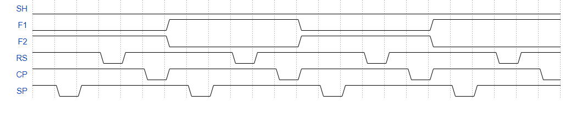

*stuID Name*
----

# 线阵CCD

## 实验目的

1. 掌握用双踪迹示波器观测二相线阵 $CCD$ 驱动脉冲的频率、幅度、周期和相位关系的测量方法。

2. 通过测量线阵 $CCD$ 驱动脉冲的时序和相位关系，掌握二相线阵 $CCD$ 的基本工作原理。

3. 通过测量典型线阵 $CCD$ 的输出信号和驱动脉冲的相位关系，掌握线阵 $CCD$ 基本特征。

4. 通过对典型线阵 $CCD$ 在不同驱动频率和不同积分时间下的输出信号测量，进一步掌握线阵 $CCD$ 的有关特性，掌握积分时间的意义，以及驱动频率和积分时间对 $CCD$ 输出信号的影响。理解线阵 $CCD$ 器件的“溢出”效应。

5. 掌握实验仪 $YHCCD－IV$ 的基本操作和功能。

## 实验原理

- 线阵 $CCD$ 的基本工作原理

    一个完整的 $CCD$ 器件由光敏单元、转移栅、移位寄存器及一些辅助输入、输出电路组
    成。$CCD$ 工作时，在设定的积分时间内由光敏单元对光信号进行取样，将光的强弱转换为
    各光敏单元的电荷多少。取样结束后各光敏元电荷由转移栅转移到移位寄存器的相应单元
    中。移位寄存器在驱动时钟的作用下，将信号电荷顺次转移到输出端。将输出信号接到示波
    器、图象显示器或其它信号存储、处理设备中，就可对信号再现或进行存储处理。由于 $CCD$
    光敏元可做得很小（约 $10um$），所以它的图象分辨率很高。

## 实验装置

1. 双踪迹同步示波器（带宽 $20MHz$ 以上）一台。

2. 线阵 $CCD$ 多功能实验仪 $YHCCD－IV$（基本型）一台。

   

## 实验内容
### 一、SH F1 F2 RS CP SP时序图：

### 二、驱动频率和积分时间测量
#### 1、驱动频率测量

| 驱动频率 | 项目        | $F1$    | $F2$    | $RS$    |
| -------- | ----------- | ------- | ------- | ------- |
|          | 周期($us$)  | $8$     | $8$     | $4$     |
| 0档      | 频率($KHz$) | $125$   | $125$   | $250$   |
|          | 幅度($V$)   | $3.68$  | $3.6$   | $4.8$   |
|          | 周期($us$)  | $16$    | $16$    | $8$     |
| 1档      | 频率($KHz$) | $62.5$  | $62.5$  | $125$   |
|          | 幅度($V$)   | $3.92$  | $3.92$  | $4.8$   |
|          | 周期($us$)  | $32$    | $32$    | $16$    |
| 2档      | 频率($KHz$) | $31.25$ | $31.25$ | $62.5$  |
|          | 幅度($V$)   | $3.84$  | $4.08$  | $4.8$   |
|          | 周期($us$)  | $64$    | $63$    | $32$    |
| 3档      | 频率($KHz$) | $15.6$  | $13.63$ | $31.25$ |
|          | 幅度($V$)   | $4.16$  | $4.16$  | $4.8$   |

   

#### 2、积分时间测量

| 驱动频率 $0$ 档 |              | 驱动频率 $1$ 档 |              | 驱动频率 $2$ 档 |              | 驱动频率 $3$ 档 |              |
| :-------------: | :----------: | :-------------: | :----------: | :-------------: | :----------: | :-------------: | :----------: |
|  积分时间(档)   | FC周期($ms$) |  积分时间(档)   | FC周期($ms$) |  积分时间(档)   | FC周期($ms$) |  积分时间(档)   | FC周期($ms$) |
|      $00$       |   $11.77$    |      $00$       |   $23.54$    |      $00$       |   $47.10$    |      $00$       |   $94.20$    |
|      $02$       |   $13.31$    |      $02$       |   $27.65$    |      $02$       |   $55.28$    |      $02$       |   $110.5$    |
|      $04$       |   $15.87$    |      $04$       |   $31.74$    |      $04$       |   $63.48$    |      $04$       |   $126.9$    |
|      $06$       |   $17.92$    |      $06$       |   $35.84$    |      $06$       |   $71.66$    |      $06$       |   $143.3$    |
|      $07$       |   $18.94$    |      $07$       |   $37.88$    |      $07$       |   $75.76$    |      $07$       |   $151.5$    |
|      $09$       |   $20.99$    |      $09$       |   $41.98$    |      $09$       |   $83.96$    |      $09$       |   $167.9$    |
|      $11$       |   $23.02$    |      $11$       |   $46.06$    |      $11$       |   $92.14$    |      $11$       |   $180.2$    |
|      $13$       |   $25.08$    |      $13$       |   $50.16$    |      $13$       |   $100.3$    |      $13$       |   $200.6$    |
|      $15$       |   $27.12$    |      $15$       |   $54.26$    |      $15$       |   $108.5$    |      $15$       |   $217.0$    |

#### 4.CCD输出信号的测量

(3) 打开仪器顶部盖板，注意室内要避免强光进入仪器内部。缩小镜头光圈，观测 UG 的波形变化

- 缩小光圈，$U_G$幅度下降

(4) 保持$CH_1$探头不变，增加积分时间，用$CH_2$探头分别测量$U_G$,$U_R$和$U_B$信号，观察其三者之间的幅度差异。
  
- 增加积分时间，信号幅度上升，且幅度$U_G>U_R>U_B$

(5) 调节示波器扫描速度，展开 $SH$ 信号，观测 $SH$ 波形和 $CCD$ 输出波形之间的相位关系。

- $CCD$ 的输出波形与$SH$信号同步。$SH$为低电平的时刻$CCD$才有信号输出

(6) 保持示波器的设置不变，观测 $FC$ 信号和 $CCD$ 输出波形之间的关系。

- $FC$与$CCD$输出波形相位同步，周期相同

(7) 打开实验仪盖板，将实验仪测量片 $A$ 插入测量片夹，适当开大镜头光圈，通过示波器观测 $CCD$ 输出波形的变化。

- 换成$A$ 片后，信号占空比变大

#### 5.驱动频率和  CCD 输出测量  

(7)继续调节驱动频率至“2”档和“3”档，观测输出信号 UG 的变化。并做相应记录。

- 调节驱动频率至2，3档，发现$U_G$幅度上升

#### 6.积分时间与输出信号测量

(2) 积分时间从“00”—“31”之间输出信号的变化情况
  
- 调节积分时间逐渐增大，输出信号低电平部分变宽。驱动频率降低，信号周期变小

## 思考题

1. 解释为什么驱动频率对积分有影响？
  
   - 线阵CCD的积分时间是两个SH脉冲的间隔时间，而SH脉冲的频率是受限于转移寄存器的驱动时间，并受复位时间影响

2. 解释为什么在入射光不变的情况下，积分时间会对输出信号有影响？这对CCD的应用有何指导意义？
  
   - 在入射光不变的情况下，在CCD输出信号饱和之前，积分时间与输出信号强度成正比。在应用中，可以采用增加积分时间的方法实现对微弱光信号的探测。
