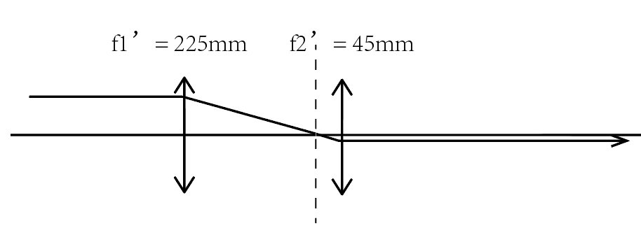
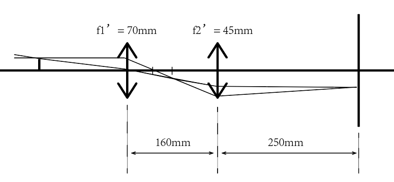

**081730109 朱文强**

# 组装望远镜和显微镜

## 一，实验目的

1. 了解透镜成像规律，掌握望远镜、显微镜系统的成像原理。
2. 根据几何光学原理、透镜成像规律和实验参数要求，设计望远镜、显微镜的光路，提出光学元件选用方案，并通过光路调整，达到显微和望远镜的实验要求，从而掌握显微镜和望远镜技术。

## 二，实验原理

1. 望远镜的结构和成像原理

    望远镜是用来观察远距离目标的目视光学仪器，通常是物镜$L_1$和目镜$L_2$组成，如图 1.1 所示，物镜的作用是将无穷远物体发出的光经会聚后在它的像方焦面上生成一倒立实像，然后经目镜把实像放大，因此实像同时位于目镜的物方焦面内侧，用望远镜观察不同位置的物体时，只须调节物镜和目镜的相对位置，使中间实像落在目镜物方焦面上，这就是望远镜的“调焦”，一般测量望远镜除物镜和目镜可在镜筒中作相对移动外，在目镜物焦方面上还附有叉丝或标尺分划格，如图 1.2 所示。因此在使用望远镜时，首先应调节目镜，直到能清晰地看到叉丝为止，然后调目镜和叉丝整体（即目镜筒）与物镜之间的距离即对被观察物调焦。

    
<image src = '1.png'><image src = '2.png'>

    

    对于望远镜来说，除了满足以上物像位置的要求外，它的视角放大率必须大于 1。对于目视光学仪器的视角放大率 $M$，定义为眼睛通过仪器观察时，物体的像对人眼的张角$\omega'$的正切与眼睛直接观察物体时，物体对眼睛的张角$\omega$的正切之比。由于物方和像方都位于无穷远处，这个放大率就是系统本身的像方视场角与物方视场角的正切之比：$M = \frac{\tan \omega'}{\tan \omega}$

    望远镜系统主要有两种情况，一种是具有正光焦度目镜，即目镜$L_2$是会聚透镜的系统，称为开普勒望远镜，如图 1.1 所示；另一种是具有负光焦度目镜，即目镜$L_2$是发散透镜的系统，称为伽利略望远镜。实际应用的几乎都是开普勒望远镜。

    对于开普勒望远镜，有$M = \frac{\tan \omega'}{\tan\omega} = -\frac{f_1'}{f_2'}$公式中的负号表示开普勒望远镜成倒像。若要使$M$的绝对值大于1，则应有$f_1'>f_2'$

2. 显微镜的成像原理

    显微镜是用来观察近距离微小目标或目标的微观结构的目视光学仪器，其主光学系统是由物镜和目镜两个共轴光学系统组成，图 1.3 即为显微镜的成像原理图。物体 $r$ 首先经过物镜在目镜的物方焦平面上生成一个倒立的放大实像$r'$，再经过目镜放大成正立像$1''$于无穷远处或明视距离处，供眼睛观察。由于显微镜目镜的成像光束是被物镜限制了的，因此眼睛观察时必须有一个固定的位置。

    
<image src = '3.png'>

    

    显微镜的总放大率为物镜线放大率$M_0$和目镜视角放大率$M_e$的乘积。这里$M_0 = -\frac{\Delta}{f_1'}$,$M_e = \frac{250}{f_2'}$。式中 $\Delta = \overline{F_0F_e}$为物镜和目镜之间的光学间隔，亦称为光学筒长； $f_1'$为物镜的焦距，$f_2'$为目镜的焦距。因此，显微镜的总放大率 M 为：$M = -\frac{250*\Delta}{f_2'f_1'}$

    显然，显微镜的放大率与光学筒长成正比，与物镜和目镜的焦距成反比，且$M<0$即对物体成倒像。

    显微镜的物镜和目镜各有数只组成一套，通常物镜有四只，倍率分别为 4，10，40 100，都装在镜筒下面的物镜旋转器上，可以通过旋转方便地选用。目镜通常有三只，倍率分别为 5，10 和 15，是插入式的。这样，总共可以获得自低倍到高倍的 12 种倍率。物镜和目镜的倍率一般分别标注在物镜和目镜的镜筒上。显微镜的目镜和物镜的支承面之间的距离 $L$ 称为显微镜的机械筒长。由图 1.3 可知$L = f_1'+\Delta+f_2'$
    
    大量生产的生物显微镜的机械筒长都是按标准值设计的，此标准各国不同，一般160～190 mm 之间。我国标准为生产 160 mm

## 三、实验装置

光学平台、带调节架的底座、透镜（焦距不等）、激光光源、白屏、微尺、毫米尺、带底座的米尺

## 四、实验内容

1. 自组望远镜
   
    1. 在坐标纸上按合适的比例画出组装的望远镜成像光路图
    2. 从两个透镜（焦距分别为 45 mm，225 mm）中选择一个作物镜，另一个作目镜，在光具座上组装望远镜，并进行调焦观察。
    3. 将装有物镜、目镜的二维架装在三维平移底座上，置于光学平台上，按照光路图组成开普勒望远镜，向约 3 m 远处的标尺调焦，并对准两个红色指标间的“E”字（距离$d_1=5 cm$）。
    4. 用另一只眼睛直接注视标尺，经适应性练习，在视觉系统获得被望远镜发大的和直观的标尺的叠加像，再测出放大的红色指标内直观标尺的长度$d_2$
    5. 求出望远镜的测量放大率$d_2/d_1$并与理论值比较。
    6. 对结果进行误差分析。

2. 自组显微镜

    1. 在坐标纸上按合适的比例画出组装的显微镜成像光路图。
    2. 从两凸透镜（焦距分别为 45 mm，34 mm）中选择一个作物镜，一个作目镜。两镜相距 250 mm 固定镜筒长。沿米尺移动靠近光源的微尺 M1（1/10 分划板），使在目镜中能观察到清晰的放大微尺像
    3. 在目镜之后 25 mm 处放置观察屏，微调微尺的位置，消除视差，使在观察屏上能观察到清晰的微尺像。
    4. 利用游标卡尺固定 30 mm 的长度，读出未放大的 30 mm 长度内所包含的 M1 的格数α 。
    5. 算出显微镜的测量放大率$M = \frac{30\times10}{\alpha}$并与理论值比较。
    6. 对结果进行误差分析
---

1. 自组望远镜

    

    $d_2 = 72.5-39.7 = 32.8cm$

    $M = \frac{32.8}{5} = 6.56$

    $理论放大倍率M_{std} = 5$，误差为：$\frac{6.56-5}{5}\times100\% = 31.2\%$

2. 自组显微镜

    

    $M =- \frac{0.5/2}{0.1} = -2.5$

    $理论放大率M_{std} = -\frac{250}{f_2'}\cdot \frac{\Delta}{f_1'} = -3.57$，误差为：$\frac{3.57-2.5}{3.57}\times 100\% = 29.97\%$

---
## 五，思考题

1. 根据透镜成象规律，怎样用最简单方法区别凸透镜和凹透镜？

    物体与透镜相距较近时，用眼睛透过凸透镜观察到的像是放大的，透过凹透镜观察到的像是缩小的。

