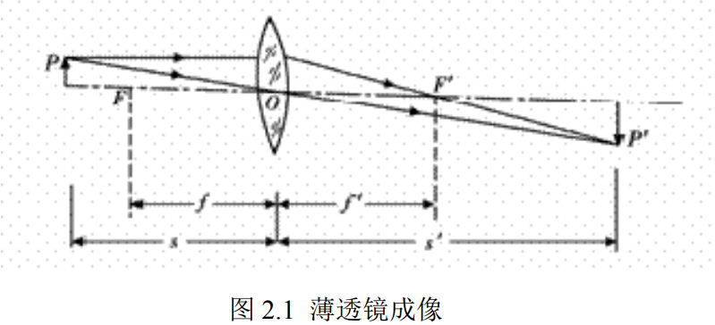
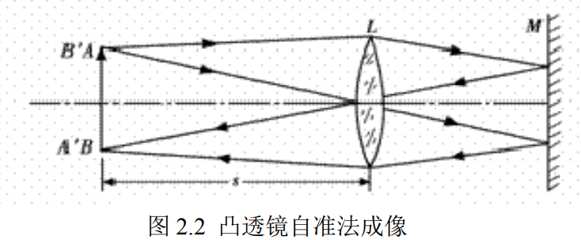
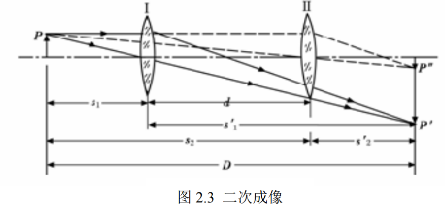
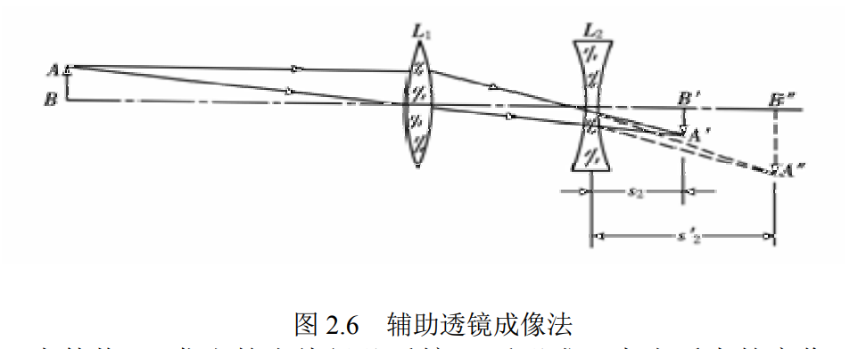
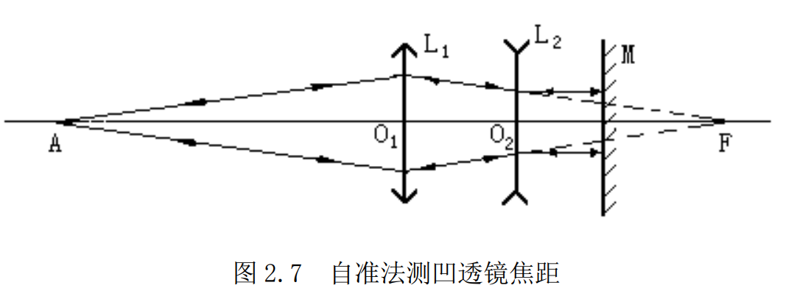

*朱文强 081730109*

# 薄透镜焦距的测定

## 一、实验目的

- 学会测量透镜焦距的几种方法。
- 掌握简单光路的分析和光学元件等高共轴调节的方法。
- 进一步熟悉数据记录和处理方法。
- 熟悉光学实验的操作规则。

## 二、实验原理

#### 凸透镜

1. 利用物距像距法求焦距：

   

当透镜的厚度远比其焦距小的多时，这种透镜称为薄透镜。在近轴光线的条件下，薄透镜成
像的规律可表示为：

$\Large\frac{f'}{s'}+\frac{f}{s}=1$

当将薄透镜置于空气中时，则焦距

$\Large{f'=-f=\frac{s's}{s-s'}}$

1. 自准直法

    

    如图 2.2 所示，在待测透镜 $L$ 的一侧放置被光源照明的 $1$ 字形物屏 $AB$，在另一侧放一平面反射镜 $M$，移动透镜(或物屏)，当物屏 $AB$ 正好位于凸透镜之前的焦平面时，物屏 $AB$ 上任一点发出的光线经透镜折射后，将变为平行光线，然后被平面反射镜反射回来。再经透镜折射后，仍会聚在它的焦平面上，即原物屏平面上，形成一个与原物大小相等方向相反的倒立实像 $A′B′$。此时物屏到透镜之间的距离，就是待测透镜的焦距，即$f=s$

    由于这个方法是利用调节实验装置本身使之产生平行光以达到聚焦的目的，所以称之为自准法，该法测量误差在 1%～5%之间。

3. 共轭法

    

    物距像距法、粗略估测法、自准法都因透镜的中心位置不易确定而在测量中引进误差，为避免这一缺点，可取物屏和像屏之间的距离 $D$ 大于 4 倍焦距$(4f)$，且保持不变，沿光轴方向移动透镜，则必能在像屏上观察到二次成像。如图 2.3 所示，设物距为 $s_1$ 时，得放大的倒立实像；物距为 $s_2$ 时，得缩小的倒立实像，透镜两次成像之间的位移为 $d$,根据透镜成像公式$(2.2)$，将

    $\Large\epsilon_1=-\epsilon_2'=-(D-d)/2$

    $\Large\epsilon_1'=-\epsilon_2=(D+d)/2$

    代入式$(2.2)$即得$\Large f'=\frac{D^2-d^2}{4D}$

    可见，只要在光具座上确定物屏、像屏以及透镜二次成像时其滑座边缘所在位置，就可较准确的求出焦距  $f'$ 。这种方法毋须考虑透镜本身的厚度，测量误差可达到 $1\%$。

### 凹透镜

1. 辅助透镜成像法

    

    如图 $2.6$ 所示，先使物 $AB$ 发出的光线经凸透镜 $L_1$后形成一大小适中的实像 $A′B′$，然后在$L_1$和 $A′B′$之间放入待测凹透镜 $L_2$，就能使虚物 $A′B′$产生一实像 $A″B″$。分别测出 $L_2$到 $A′B′$和 $A″B″$之间距离 $s_2$ 、 $s_2'$ ，根据式$(2.2)$即可求出 $L_2$的像方焦距$f_2'$

2. 自准法 

    

    如图 $2.7$ 所示，$L_1$为凸透镜，$L_2$为凹透镜，$M$ 为平面反射镜，调节凹透镜的相对位置，直到物屏上出现和物大小相等的倒立实像，记下凹透镜的位置 $X_2$。再拿掉凹透镜和平面镜，则物经凸透镜后在某点处成实像（此时物和凸透镜不能动），记下这一点的位置 $X_3$，则凹透镜的焦距 $f=-|X_3-X_2|$。
## 三、实验仪器

光具座，凸透镜，凹透镜，光源，物屏，平面反射镜，水平尺和滤光片等。

## 四、实验步骤与内容

1. 光具座上各光学元件同轴等高的调节：
2. 测量凸透镜焦距
3. 测量凹透镜的焦距
   

## 五、数据处理

1. 测量凸透镜焦距

    **物距像距法：** 
    
    物屏位置 $X_0=cm$ 透镜位置 $X_1=  35 cm$

    | 次数 $n$ | 像屏位置 $X_2$ | $V_n=\vert X_2-X_1\vert$ |  $f$   | $\Delta f$ |
    | :------: | :------------: | :----------------------: | :----: | :--------: |
    |   $1$    |       60       |            25            | 10.465 |
    |   $2$    |      59.5      |           24.5           | 10.376 |   0.465    |
    |   $3$    |      60.5      |           25.5           | 10.552 |
    |  平均值  |       60       |            25            | 10.465 |

    $f=        10.465       cm$  
    $E_f=   4.65\%$

    **自准法：**

    物屏位置 $X_0=  17cm$            单位：$cm$

    | 次数$n$ | 凸透镜位置$X(左\rightarrow 右)$ | 凸透镜位置$X(右\rightarrow 左)$ | $X$的平均值 | $f_n=\vert X-X_0\vert$ | $\Delta f$ |
    | :-----: | :-----------------------------: | :-----------------------------: | :---------: | :--------------------: | :--------: |
    |    1    |               30                |               30                |     30      |           13           |            |
    |    2    |              30.2               |              30.4               |    30.3     |          13.3          |    3.18    |
    |    3    |              30.1               |              30.4               |    30.25    |         13.25          |            |
    | 平均值  |              30.1               |              30.3               |    30.18    |         13.18          |            |
    
    $f=        13.18        ㎝$  
    $E_f=  31.8 \%$

    **共轭法：**
    
     物屏位置 $X_0=  17 cm$  像屏位置 $X_3 = 67    cm$     $D=\vert X_3-X_0 \vert =  50   cm$    单位：$cm$

    | 次数 $n$ | 透镜位置 $X$ | 透镜位置 $X_2$ | $d=\vert X_2-X_1\vert$ | $f=(D^2-d^2)/4D$ | $\Delta f$ |
    | :------: | :----------: | :------------: | :--------------------: | :--------------: | :--------- |
    |   $1$    |     31.5     |      51.6      |          20.1          |     10.4799      |            |
    |   $2$    |     31.2     |      51.7      |          20.5          |     10.3987      | 0.4396     |
    |   $3$    |     31.3     |      51.6      |          20.3          |     10.4396      |            |
    |  平均值  |     31.3     |      51.6      |          20.3          |     10.4396      |            |

    $f=        10.4396        ㎝$  
    $E_f=   4.396\%$

2. 测量凹透镜焦距

    **辅助透镜成像法：** 
    
    $A′B′$位置 $X_0$=58.9$cm$

    | 次数 $n$ | 凹透镜位置 $X_2$ | $A′′B′′$位置 |   $f$    | $\Delta f$ |
    | :------: | :--------------: | :----------: | :------: | :--------: |
    |   $1$    |       53.9       |     64.4     | -9.5455  |
    |   $2$    |       53.9       |     64.1     | -9.8077  |   0.5019   |
    |   $3$    |       53.1       |     64.4     | -11.9164 |
    |  平均值  |       53.6       |     64.3     | -10.5019 |

    $f=        -10.5019        cm$  
    $E_f= 5.019\%$

    **自准法：** 

    | 次数 $n$ | 凹透镜位置 左$\rightarrow$右 | 凹透镜位置 右$\rightarrow$左 | 平均  | F 点位置 左$\rightarrow$右 | F 点位置 右$\rightarrow$左 | 平均  | $f_n$ | $\Delta f$ |
    | :------: | :--------------------------: | :--------------------------: | :---: | :------------------------: | :------------------------: | :---: | :---: | :--------: |
    |   $1$    |              41              |             40.2             | 40.6  |            60.4            |            60.8            | 60.6  |  -20  |            |
    |   $2$    |              40              |             39.7             | 39.9  |            60.1            |            60.7            | 60.4  | -20.5 |    10.4    |
    |   $3$    |             39.5             |             39.5             | 39.5  |            60.2            |            60.3            | 60.2  | -20.7 |            |
    |  平均值  |             40.2             |             39.8             |  40   |            60.2            |            60.6            | 60.4  | -20.4 |            |

    $f=        -20.4        ㎝$  
    $E_f=   104\%$