**stuID Name**

# 透镜像差的观测

## 一、实验目的

通过实验观察球面像差、色像差、彗星、像散、畸变等像差的形成。每种像差，使用不同的仪器或自制的投影片来使其成像，最后再测量成像的位置，并使用数字相机将成像的图像拍摄下来。

## 二、实验原理

实际的光学系统，只有在近轴区域以很小的孔径角成像时才是完善的。如果一个光学系统的成像仅限于近轴区域是没有什么实际意义的，因为进入的光能量太少，分辨率很低。因此，任何光学系统都具有一定的孔径和视场，而且成像光束多是复色光，在这些情况下用近轴光学理论来研究光学系统成像就不合适了，必须采用精确的三角光线追迹公式进行光线计算。用近轴光线追迹公式进行光线计算得出的像点(理想像点)与在不同孔径下用精确的三角追迹公式进行光线计算得出的像点之间往往并不重合，这个差别称为像差。像差的大小反映了光学系统质量的优劣。

像差分单色光像差和复色光像差两大类。单色像差又有轴上点像差和轴外点像差之分，轴上点单色像差只有球差一种，轴外点单色像差有球差、慧差、像散、像面弯曲、畸变。复色光像差有轴向色差和垂轴色差两种。

1. 球差

    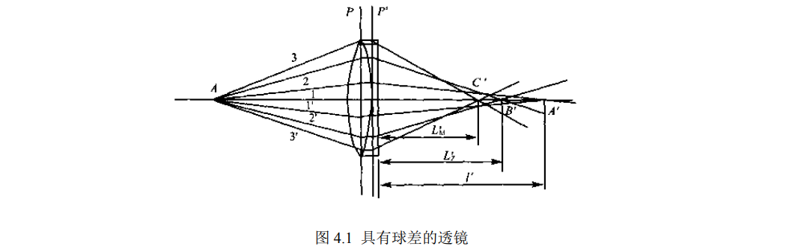

    球差是由光学系统的口径面引起的，也就是说，球差是光学系统口径的函数。如图 $4.1$ 所示，由轴上物点 $A$ 发出近轴光线 $1$ 和 $1’$，经光学系统后交轴上 $A’$；由 $A$ 点发出的上、下边缘光线 $3$ 和 $3’$ 经过光学系统后交轴上于 $C’$ 点；由 $A$ 点发出的上、下带光线 $2$ 和 $2’$ 经过光学系统后交光轴于 $B’$ 点。即不同高度的光线交于不同的点，得到的不是一个完善的像点，而是一个边缘模糊而对称的圆斑-弥散圆。球差是轴上点唯一的单色像差，可在沿轴方向和垂轴方向度量，分别称为轴向球差和垂轴球差。如果某一光线的像方后截距用 $L’$ 表示，像方孔径角用 $U’$ 表示，近轴光线的像方截距用 $l'$ 表示。则轴向球差为：

    $\Large\delta L'=L'-l'$

    垂轴球差就是由轴向球差引起的弥散圆的半径

    $\Large\Delta y'=\delta L'\cdot\tan U'$

    球差的存在使图像变模糊，对比度降低，从而降低了系统的分辨率。因此，光学系统的球差通常是要校正的。单透镜自身不能校正球差，在正常情况下，正透镜产生负球差，而负透镜产生正球差，因此将正负透镜组合起来就能使球差得到校正。

2. 彗差

    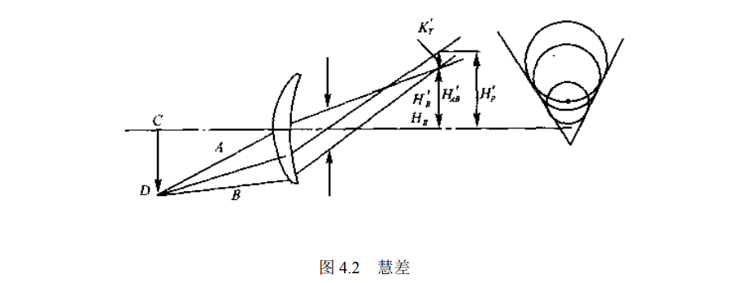

    慧差是轴外物点发出宽光束通过光学系统后，不会聚在一点，而呈彗星状图形的一种相对主光线失对称的像差，如图 $4.2$。具体地说，在轴外物点发出的光束中，对称于主光线的一对光线经光学系统后，失去对主光线的对称性，使交点不再位于主光线上，对整个光束而言，与理想像面相截形成一彗星状光斑的一种非轴对称性像差。慧差通常用子午面上和弧矢面上对称于主光线的各对光线，经系统后的交点相对于主光线的偏离来度量，分别称为子午彗差和弧矢彗差。慧差既是孔径的函数，又是视场的函数。当系统存在彗差时，物方一点的像成为彗星状弥散斑，损害了像的清晰度，使成像质量降低。

3. 像散和像面弯曲

    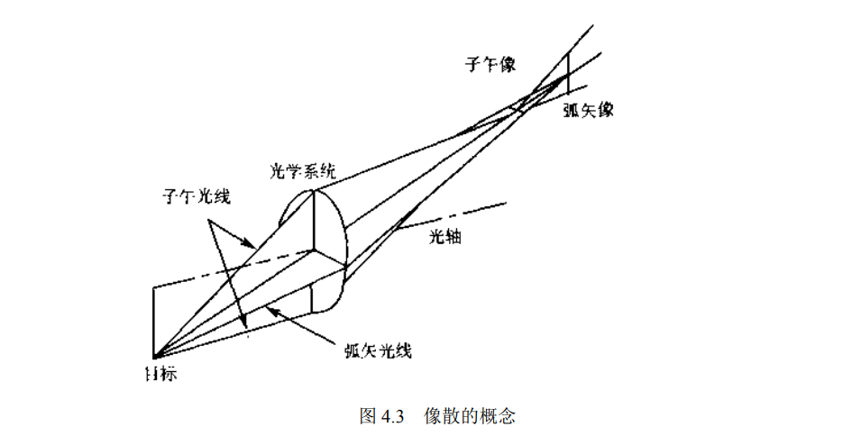

    像散使轴外物点用细光束成像时形成两条相互垂直且间隔一定距离的短线像的一种非对称像差。如图 $4.3$ 所示，轴外物点发出细光束，经光学系统后其像点不再是一个点。在子午焦点处所成的像是一条垂直子午面的短线 $t$，称为子午焦线。在弧矢焦点处所成的像是一条垂直弧矢面的短线$s$，称为弧矢焦线。这两条短线不相交而且互相垂直且间隔一定距离。两条短线间的沿光轴方向的距离表示像散的大小。像散是物点远离光轴时的像差，且随视场的增大而迅速增大。

    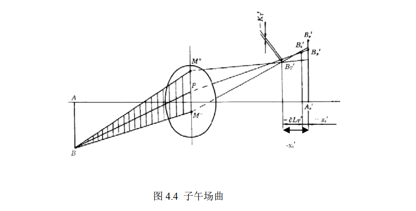

    场曲是像面弯曲的简称。场曲是物平面形成曲面像的一种像差。子午面内主光线 $BP$ 周围的细光束的聚交点 $B_t’$ 到理想像平面的轴向距离称为细光束的子午场曲 $x_t’$， 主光线两侧的一个子午光线对（具有相同孔径高的两条光线）的聚交点 $B_T’$，$B_T’$ 到理想像平面的轴向距离称为宽光束的子午场曲 $x_T’$；弧矢面内主光线 $BP$ 周围的细光束的聚交点 $B_s’$ 到理想像平面的轴向距离为细光束的弧矢场曲 $x_s’$， 主光线两侧的一个弧矢光线对（具有相同孔径高的两条光线）的聚交点 $B_S’$，$B_S’$到理想像平面的轴向距离称为宽光束的弧矢场曲 $x_T’$。 光学系统存在场曲时不能使一个较大的平面上的各点同时在同一像面上成清晰的像。中心清晰则边缘模糊，边缘清晰则中心模糊。如图 $4.4$。

4. 畸变

    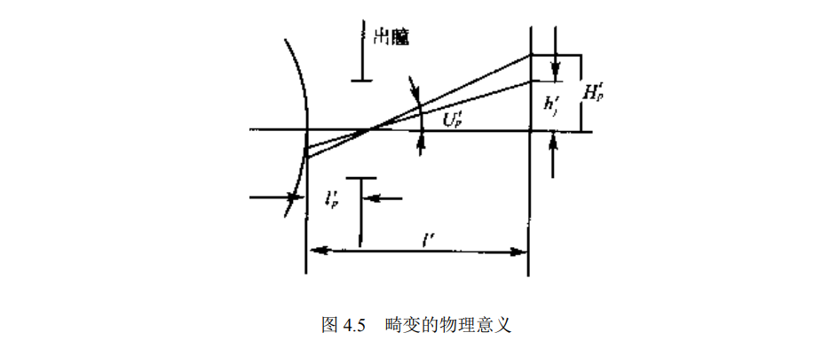

    畸变也是一种轴外像差，而且是轴外细光束的像差。它是轴外点主光线在像面上交点的高度同近轴 (理想) 像高之差。由轴外点追迹一条主光线，求出在近轴像面上的截点高度$H'_p$ ,再求出同一物点在同一视场下的近轴像高$h'_j$ ，二者之差就是光学系统在该视场下的畸变值，图 $4.5$ 表示出畸变的物理意义。畸变与孔径没有关系，它只是视场的函数。畸变随视场的增加而增加。一个正方形通过光学系统成像就不是一个规则的正方形。图 $4.6(a)$ 是个待成像的正方形，通过光学系统成像后，由于光学系统的畸变，而且畸变随视场而变化，因此所成的像就不再是正方形了，可能会出现两种情况，其中一种如图 $4.6(b)$ 所示，视场边缘的像高小于理想像高，这样的畸变为负值，称为桶形畸变。只一种情况是视场边缘的像高大于理想像高，畸变为正值，称为枕形畸变，如图 $4.6(c)$ 所示

    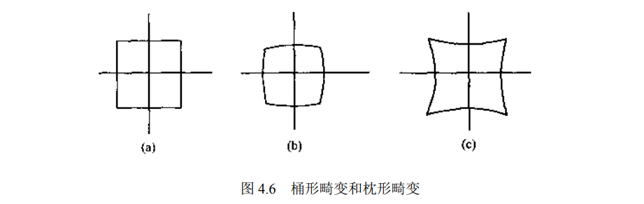

    畸变和其他像差不一样，一般像差造成点像的弥散圆扩散，使图像模糊，对比度降低，导致分辨率降低。而畸变则不同，它既不影响图像的清晰度，也不降低系统的分辨率，它只是使图像的大小和形状发生某些变化。因此对于不作测量用的光学系统、对畸变的要求并不很高，如照相物镜，电影和电视物镜．只要畸变控制在使人眼不易觉察的程度就可以了，通常在 $3％~5\%$以内。对于望远系统．由于视场角不大，畸变并不严重，不必特意校正它。对畸变要求最严格的是测量仪器和航摄设备，如用作测绘用的航天或航空摄影物镜，各种测量显微镜、检测仪器、大地测量经纬仪等均要求校正畸变，通常需要控制在 $0.5\%$以内。

5. 色差

    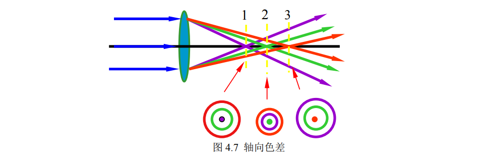

    光学系统大多是白光成像。白光是由各种不同波长的单色光组成的。光学材料对不同波长的折射率不同，白光经光学系统第一表面折射后各种色光被分开，在光学系统内以各自的光路传播，造成各色光之间成像位置和大小的差异，在像面上形成弥散圆。复色光成像时，由于不同色光而引起的像差称为色差。色差又分为轴向色差和垂轴色差。
    不同波长的光焦距不同，像的位置不同。在 1,2,3 三截面上形成的光环半径不同。

    由于光学系统中介质对不同波长光线折射率不同，造成理想像点的位置亦不同。按色光的波长由短到长，它们的像点离开透镜由近及远地排列在光轴上，这种现象称为轴向色差。表示 $F$ 光和 $C$ 光两种波长的近轴像距。$F$ 光和 $C$ 光的近轴位置色差（近轴轴向色差）可表示为：

    $\Large \Delta l'_{FC}=l'_F=l'_c$

    对于白光成像系统，轴向色差是要校正的。校正的波长范围根据使用情况而定，对目视和一般照相系统，对 $F$ 光和 $C$ 光消色差。

    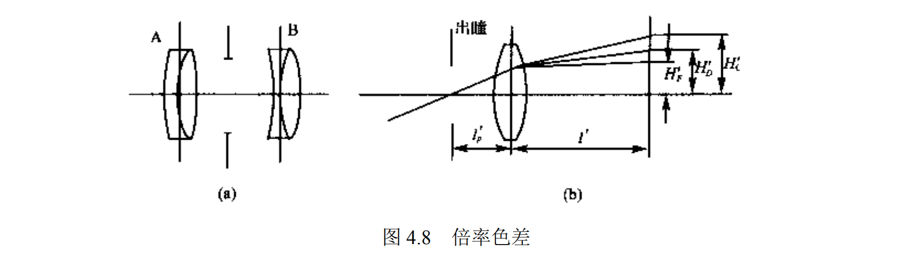

    由于光学材料对不同色光的折射率不同，因而使得光学系统对不同色光有不同的焦距,因而放大率也不等，因此不同色光有不同的像高，这就是倍率色差。

    倍率色差的计算方法是通过入瞳中心追迹长波长光和短波长光的轴外物点的主光线(对目视系统为 $F$ 和 $C$ 线)，求出最后在近轴像面的截点高度 $H'_F, H'_C$ ，如图 $8$ 所示。其垂轴色差的表达式为：

    $\Large \Delta y'_{FC}=y'_F-y'_C$

    倍率色差将使轴外点的像扩散为一个彩虹，其结果是降低对比度和分辨率，通常是不允许存在的。由于倍率色差是放大率随折射率的变化，不同的视场其放大率也不同，因此它既是折射率的函数，又是视场的函数。

---

## 三、实验步骤与实验结果、分析讨论

1. 球面像差之观察

    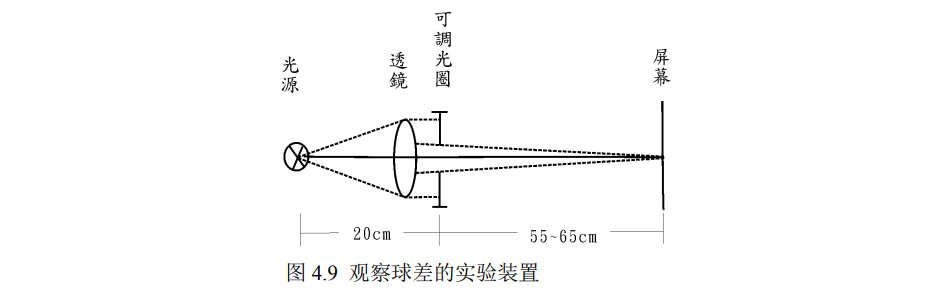

    1.  利用光具座，架设实验装置如图 4.9：

        将可调圆孔光阑置于成像透镜后，使中间部分光线通过，成像于屏幕上，记录成像位置。并比较不加可调圆孔光阑时成像位置的差异。

        结果： 

        物距：$25.21cm$

        理论像距：$cm$

        |          | 加可调光圈 | 不加加可调光圈 |
        | :------: | :--------: | :------------: |
        | 成像位置 | $48.90cm$  |   $48.71cm$    |

    2.  将可调光圈分别换成图 $4.10$ 投影片 $a、b$，使仅剩透镜中心或周围部分光线透过，分别成像于屏幕上，记录成像位置，并利用数字相机拍摄成像结果。比较以上两者成像位置之差距，并讨论之：

        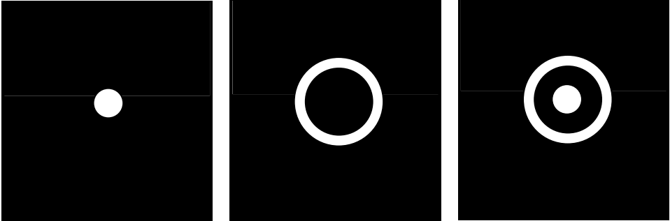

    |          | 投影片$a$ | 投影片$b$ | 投影片$c$ |
    | :------: | :-------: | :-------: | :-------: |
    | 成像位置 | $48.8cm$  | $48.6cm$  | $48.9cm$  |
    | 成像结果 |           |           |           |

2. 彗差的观察

    1. 安排实验装置如图 4.12：在光源前加一聚光透镜，使其形成近似平行光束。
    2. 将平行光入射到一透镜，并将此透镜旋转 $10^o ~ 40^o$，在其焦平面观察成像图，并利用数字相机拍摄成像结果

        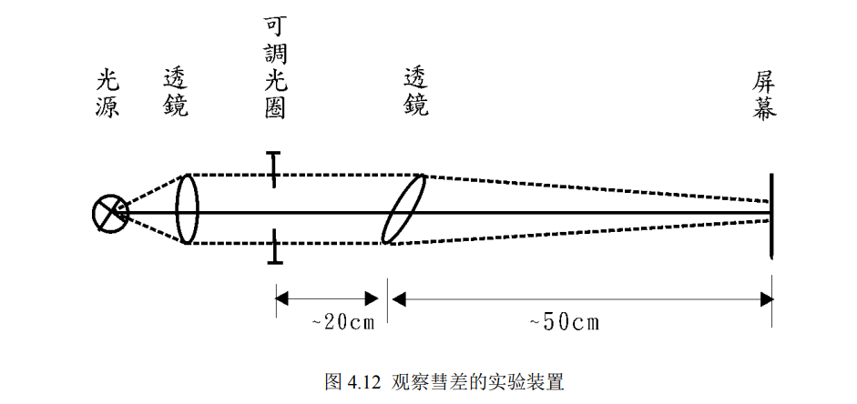

        观察成像结果

        透镜旋转后逐渐出现彗星状像斑   

3. 像散的观察

    1. 安排实验装置如图 4.13：旋转透镜约 $30^o$，移动屏障位置，观察并记录$” F ”$字中横向线条和纵向线条之清晰位置是否相同？试解释之

        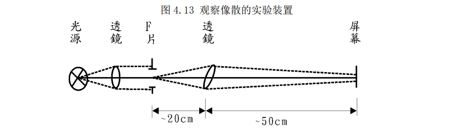

        |        |   横线    |   竖线   |   差距   |
        | :----: | :-------: | :------: | :------: |
        | $0^o$  | $71.5cm$  | $71.5cm$ |  $0cm$   |
        | $30^o$ | $70.91cm$ | $69.3cm$ | $1.61cm$ |

4. 畸变的观察

    1. 安排实验装置如图 4.15，置一网状片于平行聚光透镜之后
    2. 在成像透镜之前与之后分别置放可调光圈，观察成像图，并利用数字相机摄影记录。 

        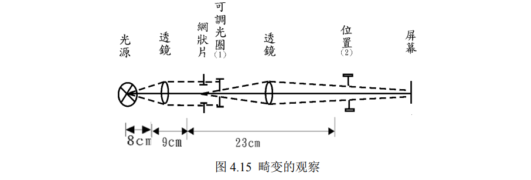

        | 光圈置放 | 成像透镜之前 | 成像透镜之后 |
        | :------: | :----------: | :----------: |
        | 光圈位置 |  $25.95cm$   |   $36.2cm$   |
        | 畸变种类 |    正畸变    |    负畸变    |
        | 成像结果 |     桶形     |     枕形     |