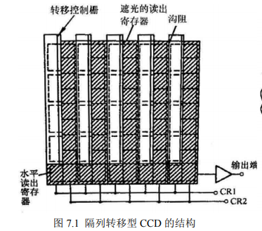
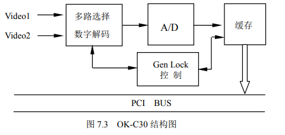
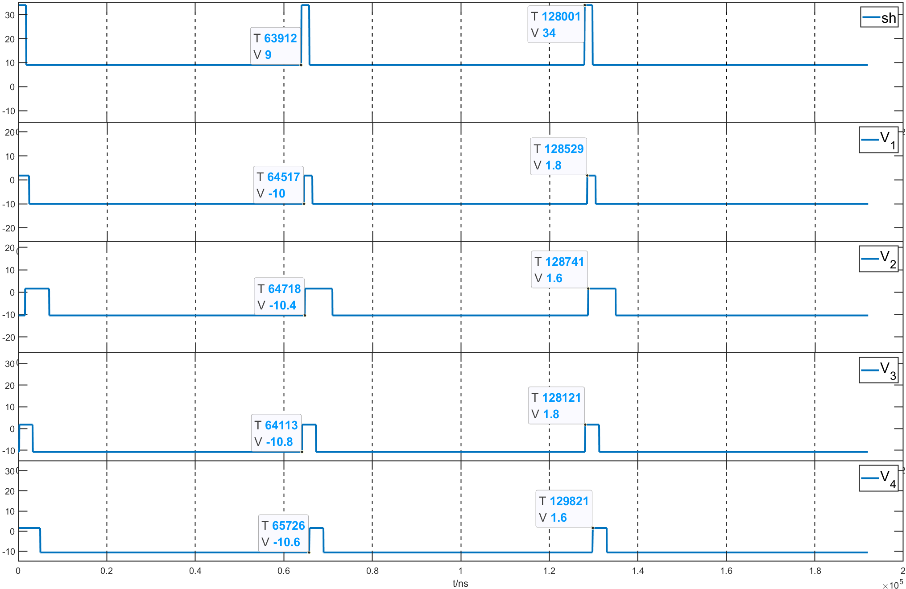
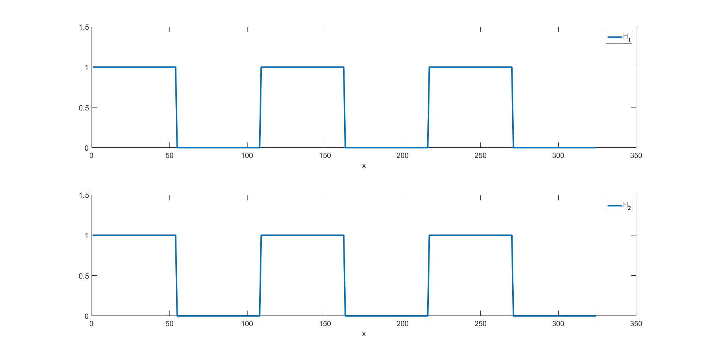

*朱文强  081730109*

# 面阵CCD

## 一，实验目的

1. 理解和掌握隔列转移型面阵 CCD 的基本工作原理。
2. 掌握面阵 CCD 的各路驱动脉冲波形和各路驱动脉冲的功能。
3. 掌握面阵 CCD 输出的视频信号与 PAL 电视制式。
4. 理解如何利用面阵 CCD 的图像数据采集卡采集复合视频信号进入计算机，并对视频信号进行适当的数据处理，达到会运用典型图像卡采集和处理图像的目的。

## 二，实验原理

1. 面阵CCD原理

    面阵 CCD 是二维的图象传感器，它可以直接将二维图象转变为视频信号输出。按照一定的方式将一维线型 CCD 的光敏单元和移位寄存器排列成二维阵列，即可以构成面阵 CCD。由于排列方式不同，面阵 CCD 常有四种基本类型：帧转移型、隔列转移型、线转移型和全帧转移型等。

    隔列转移型面阵 CCD 的结构如图 7.1 所示。它的象敏单元（图中虚线方块）呈二维排列，每列象敏单元被遮光的读出寄存器及沟阻隔开，象敏单元与读出寄存器之间又有转移控制栅。由图可见，每一象敏单元对应于两个遮光的读出寄存器单元（图中斜线表示被遮蔽,斜线部位的方块为读出寄存器单元）。读出寄存器与象敏单元的另一侧被沟阻隔开。由于每列象敏单元均被读出寄存器所隔，所以，这种面阵 CCD 称为隔列转移型 CCD。图中最下面的部分是二相时钟脉冲 CR1、CR2 驱动的水平读出寄存器和输出放大器。

    

2. K-C30 图像采集卡
   OK-C30 图像卡的节本结构如图 7.3 所示，它由多路选择数字解码器将输入的视频图像信号送到A/D转换器进行模数转换，转换成的数字图像信号通过 PCI 总线送入计算机内存。这些逻辑功能均在同步控制器的控制下完成。

   

## 三，实验装置

1. 面阵 CCD 实验仪一台。
2. 双踪迹（或四踪迹）同步示波器一台。
3. OK-C30 彩色、黑白两用图像采集卡一块。
4. 586以上机型计算机一台。要求计算机具用支持新的PCI规范的PCI插槽；内存大于16MB；显示卡具有 PCI 总线卡的速度相应和实时显示的性能，建议选用 S3 系列的 VGA 卡，例如：S364V+、MS-4415 系列显示卡；显示卡的帧存应不小于 2MB。

## 四，实验内容

1. $sh,V_1,V_2,V_3,V_4$波形图

    

2. $H_1,H_2$ 波形图

    

    $H_1,H_2$ 波形相同

3. 场正程时长：$18.3ms$

    场逆程时长：$1.64ms$

    行正程时长：$53.2us$

    行逆程时长：$10.5us$