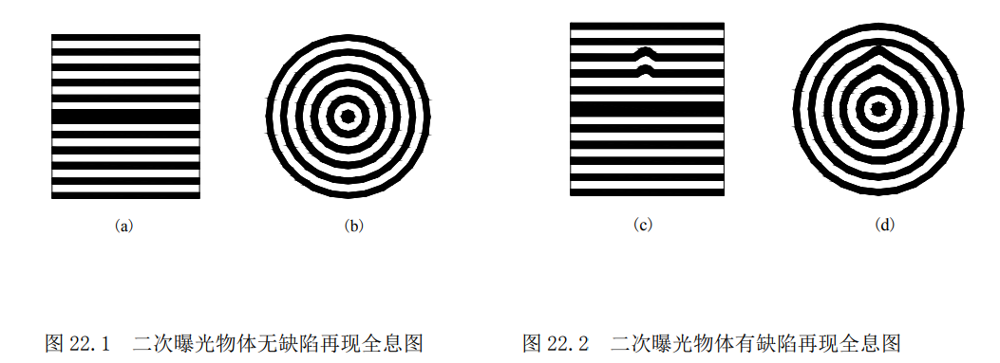
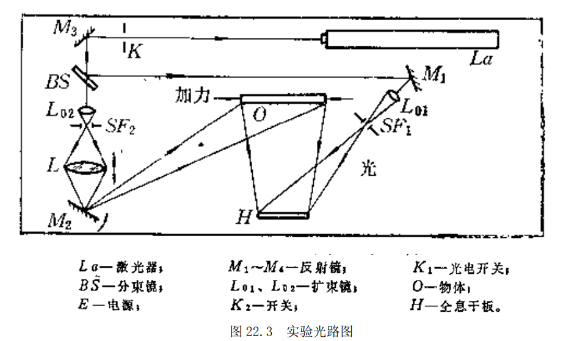

**081730109 朱文强**

# 全息无损检测
*指导老师：杨玉娥*
## 实验目的

1. 掌握二次曝光法、实时观察法检测物体表面及内部缺陷的基本原理
2. 了解全息无损检验中的一些特殊的试验技术，如加载方法的选择，条纹控制技术，缺陷的定量分析及实时观察法中的光强匹配问题.

## 实验原理

无损检测是指在材料或产品缺陷的检验过程中不需要破坏或明显改变被测元件的一种检测方法。通常这种检验的目的是要确定元件中存在的裂缝，空隙，脱胶，脱层，砂眼，残余应力等缺陷的为位置和尺寸。

全息照相术可以准确地记录物光波的振幅和位相，再现时又能够得到逼真的原物体的虚像或其共轭像。这个虚像是被摄物体的波前再现。全息无损检测就是对物体变形前后的两状态的波前进行比较，根据再现时物体像表面上形成的干涉条纹来判定缺陷的位置和大小。全息无损检验通常采用二次曝光法。它是先拍摄一张待检物体在原始状态（未加载）下的全息图，然后通过一定的加载方式使物体发生微量形变，并在同一张全息干板上进行第二次曝光，记录变形后的物体的全息图。全息干板经常规处理后用原参考光再现，可以看到物体像上附加有一组干涉条纹。该干涉条纹是物体形变前后两列物光产生干涉形成的。当被检验物体表米娜无缺陷时，干涉条纹呈现有规则的变化，例如是艰巨大致相等的平行条纹或是一组同心圆（如图一）。这种有规律的条纹是由于物体均匀形变而引起的，一般称为背景条纹。但是，当被检验物体内部或表面存在缺陷时，则在物体表面的相应位置上会出现干涉条纹的异常情况，条纹的走向不再是均匀变化，而出现突变（如图二）。这种条纹称为特征条纹。

全息无损检验通常采用实时观察法，和二次曝光法。

1. 实时观察法是把记录有待测物体的初始像信息的全息图精确复位，然后按照原光路再现，这样可以在全息图的透射光中看到物体上重叠着它的再现像。实际上，由于干板不可能瓦努乔安复位或乳胶收缩，不加载时，仍能在物体表面上看到一些粗大的条纹。当对物体加载时，通过全息图可实时观察条纹的变化，从而可以判断缺陷的位置和大小。采用实时法，可以不必拍摄一系列的二次曝光全息图，通过实时观察还可以较准确地掌握加载量和时机，以确定缺陷的位置和大小。此法方便可靠，可以提高效率。在实时法全息无损检测中，为了防止漏检，常常需要对物体加以较大的载荷，以便使缺陷对应的表面产生突变。这样，物体的整个表面也产生了较大的变形，干涉条纹也随之变密，缺陷则常常会被掩盖。此时，可以采用条纹控制技术，将密集的条纹展宽，以便观察缺陷的位置和大小。此外，当家测大尺寸物体时，由于物体表面形变不均，而条纹间距又反比于受理范围直接的四次方，有些部位的条纹可能太密，用肉眼无法看清缺陷造成的扰动。这时，可以采用分区扫描的办法分别展宽各区域的条纹，以便搜索缺陷的位置和大小。条纹展宽的方法是：在实时观察中，稍微改变物光路中聚光镜 L 的轴向位置或通过摆动条纹控制反射镜M2 改变物光的照射方向，以使物光波前的方位有一微小改变，从而使物体波前与再现像波前较好地重合，使整个物体表面上的干涉条纹变宽。
2. 二次曝光法是先对初始状态（未加载）的待检物体拍摄一张三维全息图，然后在光路不变的情况下对物体加载使其产生变形，在同一干板上再曝光一次。这样，物体在两种状态下的信息就记录在同一块全息干板上。全息图再现时，两列物光波产生干涉，于是在再现的物体像上就出现了干涉条纹。加载方法有很多，要根据备件物体的状态来决定。在全息无损检测中一般常用的加载方法有机械加力法，加热法，压差加载法等等。机械加力法是通过简单的拉伸，压缩，弯曲或施加点载荷的方式使物体变形，适用于各种复合材料的裂变实验。加热法一般是用红外灯，电吹风，电热器，微波烘烤等对被检验物体加热，是指产生热变形，这种方法简单可行。压差加载法是使物体内外产生一定的压力差，从而使之承受载荷。产生压力差的方法有表面真空室吸附法，真空室法和内部充气法。表面真空吸附法是将被检物体作为真空室的一壁，使其两表面产生压力差，适用于材料本身抗弯强度较高，表面平直的物体。真空室法是将物体周围密封后置于一真空室中，利用材料内部残留的空气与真空室间的压力差，灵敏地显露内部缺陷。内部充气法是利用加压系统对物体内部充以几个到上百个大气压，使其产生弹性形变。本实验中采用的是加热法和真空室法。

## 实验装置

1. 仪器的组成和结构
   全息防震平台，激光器，反射镜（若干），分束镜，干板架， 全息干板，照度计。
2. 实验光路
   

## 实验内容及步骤
   1. 将激光器输出的光升到与曝光定时器、分束镜 $BS$、反射镜 $M_1$、$M_2$、$M_3$、物体 $O$、干版 $H$调至等高。 
   2. 按光路图排光路。先排参考光路，在 $M_3$与 $H$ 之间加扩束镜，使扩束的光束直径正好落在干版上，测量参光光程。 
   3. 排物光光路，使物光光程等于参考光光程相等，，若不等，可前后移动 $L_{o1}$或 $L_{o2}$。扩束越大，光强越小，反之越大。然后加入扩束镜。 
   4. 在 $H$ 处放一块毛玻璃，用照度计测量挡住参考光量物光，记下数值；再挡住物光，量参考光，记下数值。让物光与参考光光强之比在 1：2～1：5 之间，夹角在 20°～50°之间。
   5. 选择适当的加载方法。本实验用蜂窝板为待检物体，加载方式为加热法和真空室加压法。
   6. 光路排好后，检查各光具座的稳定性（如螺钉是否拧紧，磁座是否吸住等）。检查后关掉曝光定时器开关，装上干版（底片）稳定 2～3 分钟进行第一次曝光（即物体在静止，没加任何外力的光波）。曝光时间以物体反光强弱，激光器的功率大小而定。
   7. 实时法检测：对未加载的物体拍摄一张全息图，在原地经显影，定影等常规处理后。等晾干后，观察物体表面条纹，并加载荷。当条纹最清晰时，为最佳加载量。
   8. 二次曝光法检测：换上一块未经曝光的全息干板，在最佳加载下进行第一次曝光，然后在再去掉载荷进行第二次曝光，得到二次曝光全息图。将处理好的全息干版放在干版架上，挡住物光，用原参考光进行照明。在原物体上会看到衍射条纹，物体有缺陷的地方，记录下缺陷的大小与衍射条纹的位置。
## 实验数据
因光路调整问题未能观察到百叶窗状条纹。