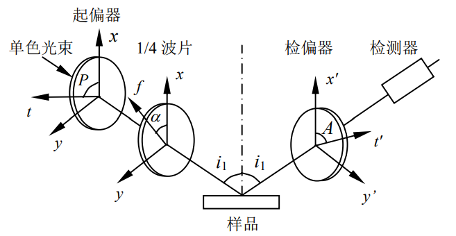

1. 光在单层介质薄膜上的反射和折射
   光是一种电磁波，且是横波。电场强度 $\overrightarrow{E}$和磁场强度 $\overrightarrow{H}$与光的传播方向构成一个右旋的正交三矢族。与光的强度、频率、位相等参量一样，偏振态也是光的基本量之一。如果已知入射光束的偏振态，当测得通过某薄膜后的出射光偏振态，就能确定该薄膜影响系统光学性能的某些物理量，如折射率、薄膜厚度等。
2. 椭偏参数$ψ$ 和 $Δ$
   设 $i_1$ 为光的入射角，$i_2$和 $i_3$ 分别为在上界面和下界面上的折射角。根据折射定律有$n_1\sin i_1=n_2\sin i_2=n_3\sin i_3$
   考虑光从空气中入射到薄膜上，则 $n_1=1$。在上界面任意两束相邻的反射光，如 $A$ 点的反射光(1)与 $B$ 点的反射光(2)，其光程差（是否有半波损失取决于 $n_2$和 $n_3$ 的关系）$\chi=n_2(AC+CB)-AD$
   因为$AC=CB=\frac{d}{\cos i_2}$,$AD=AB\sin i_1=2d\sin i_1\cdot \tan i_2$,所以：$\chi=\frac{2n_2d}{\cos i_2}-2d\sin i_1\cdot \tan i_2=2n_2d\cos i_2$
   则任意相邻两束反射光之间的位相差$2\delta=\frac{2\pi}{\lambda}\chi=\frac{4\pi}{\lambda}n_2d\cos i_2=\frac{4\pi d}{\lambda}\sqrt{n_2^2-n_1^2\sin^2i_1}$
   式中，$λ$ 为真空中的波长，$d$ 和 $n_2$为介质膜的厚度和折射率。
3. $\chi$和$\Delta$的物理意义
   用复数形式表示入射光和反射光的 $p$ 和 $s$ 分量，即$E_{ip}=|E_{ip}|e^{i\theta_{ip}},E_{is}=|E_{is}|e^{i\theta_{is}},E_{rp}=|E_{rp}|e^{i\theta_{rp}},E_{rs}=|E_{rs}|e^{i\theta_{rs}}$式中各绝对值为相应电矢量的振幅，各$θ$ 值为相应界面处的位相。
   $\tan \chi\cdot e^{i\Delta}=\frac{|E_{rp}|}{|E_{rs}|}\frac{|E_{is}|}{|E_{ip}|}e^{i[(\theta_{rp}-\theta_{rs})-(\theta_{ip}-\theta_{is})]}$
   比较等式两端即可得$\tan \chi=\frac{|E_{rp}||E_{is}|}{|E_{rs}||E_{ip}|}$,$\Delta=(\theta_{rp}-\theta_{rs})-(\theta_{ip}-\theta_{is})$
   参量$ψ$ 与反射前后 $p$ 和 $s$ 分量的振幅比有关，参量 $Δ$ 与反射前后 $p$ 和 $s$ 分量的位相差有关。可见，$ψ$ 和 $Δ$ 直接反映了光在反射前后偏振态的变化。这样若测得入射光和反射光中两分量的振幅比和相位差，则可求得椭偏参数$ψ$ 和 $Δ$。
4. 等幅椭偏入射光的获得
   椭圆偏振仪（简称椭偏仪）的光路原理如图所示。氦氖激光器发出波长为 $632. 8nm$ 的自然光，先后通过起偏器、$1/4$ 波片入射在待测薄膜样品上，反射光通过检偏器射入光电检测器。在坐标系中，$x$ 轴和 $x'$ 轴均在入射面内且分别与入射光束或反射光束的传播方向垂直，而 $y$ 和 $y'$轴则垂直于入射面。如前所述，$p$ 和 $s$ 分别代表平行和垂直于入射面的二个方向，因此 $x$ 轴和 $x'$ 轴分别对应于入射光和反射光的 $p$ 方向，$y$ 轴和 $y'$轴分别对应于入射光和反射光的 $s$ 方向。图中，$t$ 代表起偏器的偏振化方向，与 $x$ 轴夹角为 $P$；$t^{'}$ 代表检偏器的偏振化方向，与 $x'$ 轴夹角为 $A$；$f$ 代表 $1/4$ 波片的快轴方向。
   
5. 反射光的消光检测
   当波片快轴方向 $f$ 取$π /4$ 时,有：
   $$\begin{cases}
       \tan \chi&=\frac{|E_{rp}|}{|E_{rs}|}\\
       \Delta&=(\theta_{rp}-\theta_{rs})-(2P-\frac{\pi}{2})
   \end{cases}$$
   只要使 $1/4$ 波片的快轴 $f$ 与 $x$ 轴的夹角为$π /4$（或$－π /4$），然后测出检偏器消光时起偏器和检偏器方位角（$P_1$, $A_1$）,（$P_2$, $A_2$），便可求出对应的$（ψ，Δ）$，从而解出$（n_2，d）$。实际上$（n_2，d）$与$（ψ，Δ）$的函数关系式是比较复杂的，一般将$（n_2，d）$和$（ψ，Δ）$的关系制成数值表或列线图而求得 $n_2$和 $d$ 值，编制数值表的工作通常由计算机来完成。目前日益广泛地采用计算机直接处理数据。