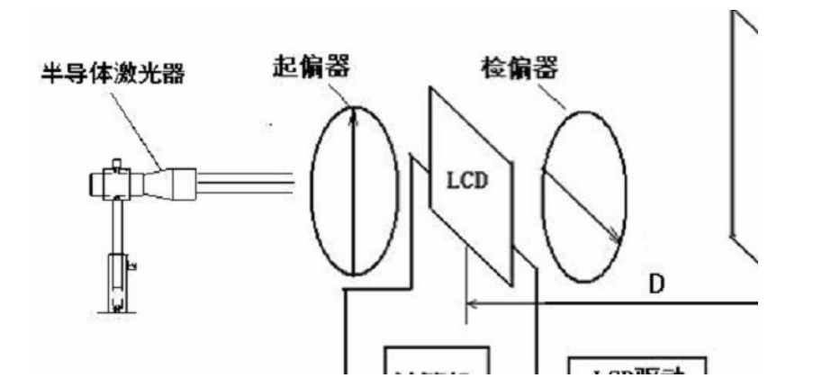

**081730109 朱文强**

# 泰伯效应实验
*指导老师：兰秀风*
## 实验目的

1. 学习液晶光阀系统的工作原理和实验搭建方法，并手动调试液晶光阀系统；
2. 学习如何使用液晶光阀，在光路中加载需要的物体信息；
3. 学习泰伯效应的原理，观察光栅自成像现象，观察不同位置的光栅衍射图样。
4. 利用本实验装置的测量泰伯距离，进而求出液晶光阀单个像素的尺寸。

## 实验原理

泰伯效应是指当光波经过周期性物体（如光栅）衍射后，在周期性物体后面特定距离处，会出现物体的衍射自成像。为了方便起见，我们假设这个周期性物体为朗奇光栅 $G_1$，周期为 $p$。所谓朗奇光栅，是指在一个周期内，其通光部分 $a$ 和不通光部分 $b$ 长度相等。

$$a = b = \frac{p}{2}$$

通光部分的透过率 $t=1$。则以傅里叶级数表示其振幅通过率函数为：

$$g_1(x) = \Sigma_{n=-\infin}^{n=+\infin}A_n\exp(\frac{i2\pi}{p}nx)$$

1. 平面波入射的泰伯效应
   对于平面波，令 $R\rightarrow \infin$,则有：$I(x,y,d)=C_0+C_1\cos(2\pi\frac{\lambda d}{2p^2})\cos(\frac{2\pi}{p}x+d\sin\alpha)+O(x)$
   当满足$2\pi\frac{\lambda d}{2p^2}=m\pi,m=0,\pm1,\pm2,\cdot \cdot \cdot$时:$\cos(2\pi\frac{\lambda d}{2p^2})=\pm1$

   则光波的光强分布的周期为 $p$，和原物体相同。此时的衍射像为和原物周期相同的清晰像，称为原光栅 $G_1$的泰伯像。对应的距离$d=\frac{mp^2}{\lambda},m=0,\pm1,\pm2,\cdot\cdot\cdot$
   当 $m$ 为偶数时，对应的为正像；当 $m$ 为奇数时，对应的像为负像。相邻两像之间的距离为:$d_0=\frac{p^2}{\lambda}$称为泰伯距离。
2. 分数泰伯效应
   另外，在光栅后分数泰伯距离处：$d=\frac{d_0}{n},n=2,3,\cdot\cdot\cdot$
   衍射光场的分布也有一定的特殊性，$u(x,d=\frac{d_0}{n})=\frac{\exp(ikd)}{i\lambda d}\Sigma_{-\infin}^{+\infin}C(L,n)t_0(x-\frac{Ld}{n})$
   可见，$u(x,d=\frac{d_0}{n})$由一组函数的和构成，且该函数$C(L,n)t(x_0)$在 $x$ 方向上按照$\frac{Ld}{n}$这个因素变化。从这个公式看出可以通过系数$C(L,n)$来描述所有衍射图像，研究$C(L,n)$的性质有助于分数泰伯距离处的光场性质研究。
## 实验装置和操作方法
1. 实验仪器
   泰伯效应实验系统的仪器如下图所示:
   
   主要仪器设备包括:
   1. 出射平行光的 $650nm$ 的半导体激光器
   2. 液晶光阀 $LCD$ 及连接排线；
   3. 液晶光阀控制电箱及电源线；
   4. 起偏器及检偏器各一；
   5. $CCD/CMOS$ 相机及数据线；
   6. 视频分频器及数据线；
   7. 导轨、滑座等支撑部件。
2. 实验步骤
   1. 搭建和调试液晶光阀实验系统
      1. 打开激光器电源，取下导轨上除了液晶盒以外的所有器件（底座可以保留），调整激光器的方向及支杆高度使得光束照射液晶光阀像面的中心，同时保持光束与导轨平行。液晶盒沿导轨移动时，光斑应该打在液晶盒近似同一位置。
      2. 在光路放入起偏器和检偏器，由于激光器出射为偏振光，旋转起偏器使出射光达到最强（粗略）
      3. 取下液晶盒，旋转检偏器，使检偏器后出射光强近似最小。然后仔细微调检偏器，使出射光强最小。
      4. 在起偏器和检偏器中间插入液晶盒，将液晶盒数据排线和控制电箱相连。起偏器和检偏器尽量靠近液晶盒。将电脑主机显卡或者主板的视频 $VGA$ 信号输出，用 $VGA$ 连接线和 $VGA$ 分频器相连。$VGA$ 分频器就是将一路视频信号，分成两路或者四路的器件。显卡视频信号和$VGA$ 分频器的输入端相连，分频器一路输出端连接显示器，另一路输出端连接液晶光阀控制电箱。这样，显示器上和液晶光阀上视频信号相同，就可以通过显示器检测液晶光阀上的图形。
      5. 设置电脑图像的分辨率为 $1024x768$，设置刷新率为 $60Hz$。这时显示器图像和液晶光阀上同步。
      6. 选择不同的图形显示，通过白纸等放在检偏器后观察观察光路中的图像是否和显示器图形相同。检测液晶光阀工作状态。如不能正常显示，按一下控制电箱的“复位”按钮，看是否恢复正常。如还不能回复正常，一般是数据连接的问题。检查从液晶盒一直到主板的连接线，看哪里有接触不良的问题。
   2. 使用液晶光阀在光路中加载光栅
      液晶光阀上的图像是由电脑控制的，所以为了方便起见，我们编写一个小程序，来生成朗奇光栅图像。然后将该图像全屏显示，在液晶光阀上就可以显示朗奇光栅了。近平面光束通过液晶光阀，就将光栅图像加载到了光路中。
## 实验数据
$\lambda=650nm$
|                         |                                     | 第一次测量 | 第二次测量 | 第三次测量 |
| ----------------------- | ----------------------------------- | ---------- | ---------- | ---------- |
|                         | $d_1$                               | $114.5$    | $113.3$    | $86.5$     |
| 泰伯像位置（$cm$）      | $d_2$                               | $115.9$    | $130.9$    | $103$      |
|                         | $d_3$                               | $117.5$    | $132$      | $108$      |
| 泰伯距离$d_0(cm)$       | $d_0=\frac{d_3-d_1}{2}$             | $1.5$      | $9.35$     | $10.75$    |
| 条纹宽度                | $N$                                 | $7$        | $8$        | $9$        |
| 单个像素尺寸$（\mu m）$ | $p_0=\frac{\sqrt{\lambda d_0}}{2N}$ | $22.3$     | $48.7$     | $46.4$     |
| 像素平均值              | $\overline{p_0}$                    | $偏差过大$ | $47.6$     